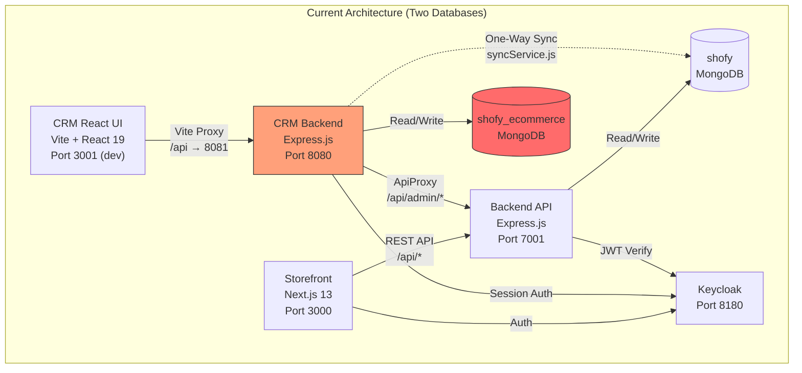
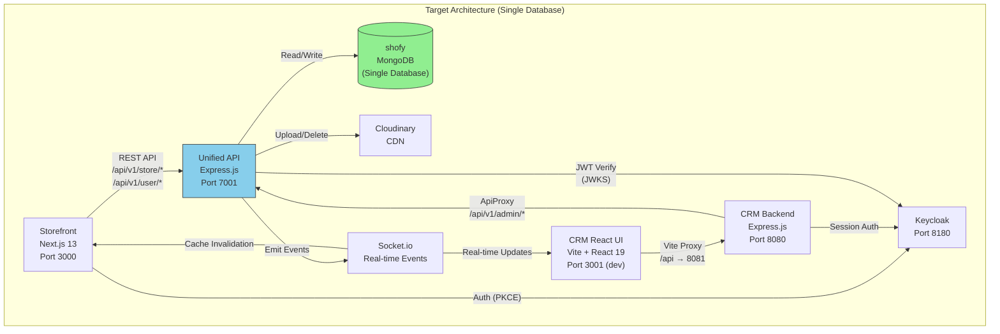
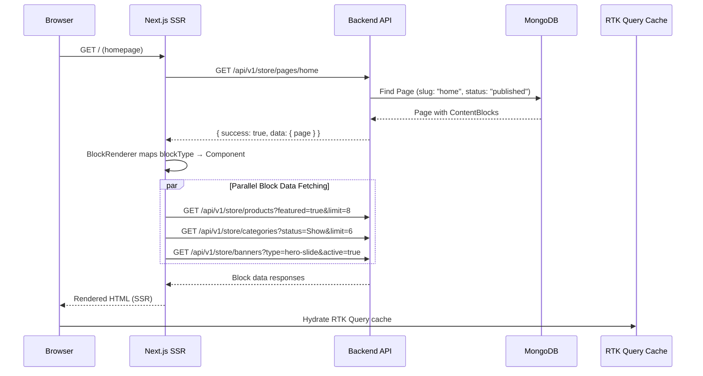
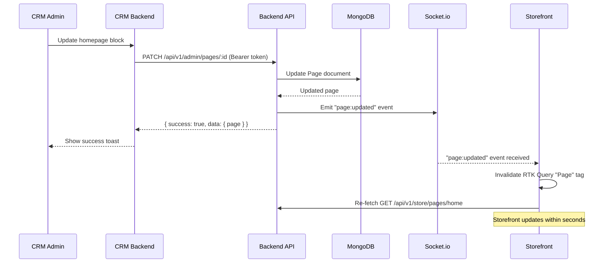
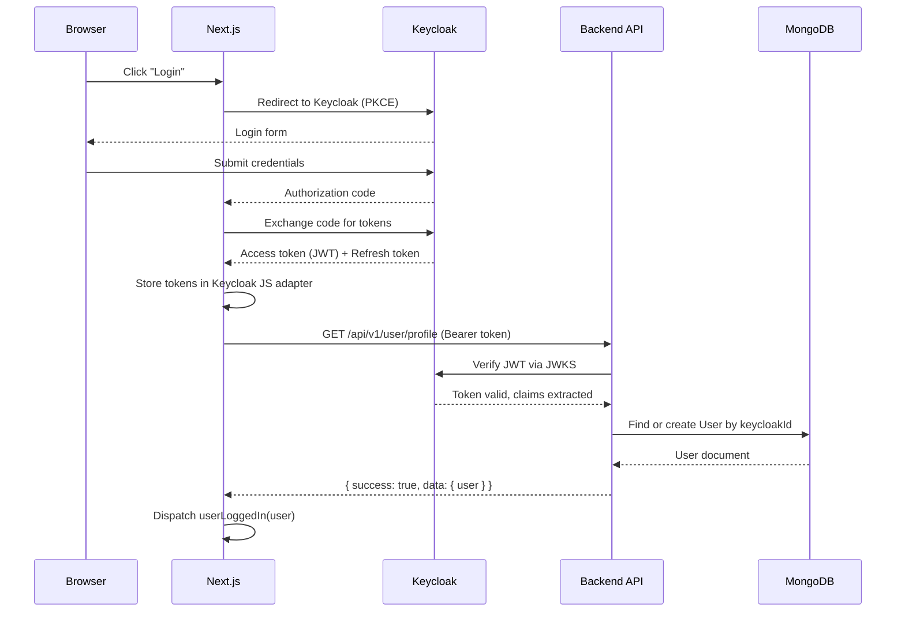

# Shofy E-Commerce Platform — Comprehensive Redesign Plan

> **Version:** 1.0  
> **Date:** 2026-03-20  
> **Author:** Architecture Team  
> **Status:** Draft — Pending Review

---

## Table of Contents

1. [Executive Summary](#1-executive-summary)
2. [Current State Analysis](#2-current-state-analysis)
3. [Target Architecture](#3-target-architecture)
4. [API Endpoint Specification](#4-api-endpoint-specification)
5. [CRM Admin Panel — Page Inventory](#5-crm-admin-panel--page-inventory)
6. [Storefront — Page Inventory](#6-storefront--page-inventory)
7. [Migration Strategy](#7-migration-strategy)
8. [Implementation Phases](#8-implementation-phases)
9. [Risk Assessment & Mitigations](#9-risk-assessment--mitigations)
10. [Tech Stack Summary](#10-tech-stack-summary)

---

## 1. Executive Summary

This document presents a comprehensive redesign plan for the **Shofy e-commerce platform**, transforming it from a template-based storefront with fragile dual-database synchronization into a **unified, CMS-driven, multi-vendor marketplace**.

### The Problem

The current architecture suffers from 13 critical pain points:

1. **Two separate MongoDB databases** (`shofy` and `shofy_ecommerce`) connected by a one-way sync service that is fragile, introduces data inconsistencies, and adds operational complexity.
2. **100% hardcoded storefront content** — homepage hero sliders, featured products, blog posts, navigation menus, footer links, and announcement bars are all embedded directly in React components with no admin control.
3. **No CMS capabilities** — the CRM admin panel only manages CRUD for products, categories, orders, and users. There is no way to edit homepage layout, navigation, blog content, banners, SEO metadata, or theme settings.
4. **No multi-vendor support** — the platform is single-seller only with no vendor onboarding, product ownership, order splitting, or payout management.
5. **Stripe payment removed** — only Cash on Delivery (COD) is supported; all Stripe code is commented out.
6. **Client-side filtering at scale** — shop and search pages fetch the entire product catalog via `GET /api/product/all` and filter/sort/paginate in JavaScript, which will not scale.
7. **Wishlist/compare are localStorage-only** — lost on device change, no server-side persistence for logged-in users.
8. **Blog is fully static** — 19 hardcoded entries in a local data file, no API integration.
9. **No review moderation** — reviews are auto-published with no admin approval workflow.
10. **No email template management** — transactional emails are hardcoded in the backend.
11. **No analytics beyond basic counts** — the CRM dashboard shows totals but lacks trends, revenue analysis, and vendor performance.
12. **Inconsistent API response formats** — different controllers return `{ status: "success" }`, `{ success: true }`, or bare objects.
13. **CRM models partially duplicate backend models** — the CRM has its own Product, Category, Order, User schemas that diverge from the backend schemas in subtle but bug-causing ways (e.g., status enums differ, sku/slug confusion in sync).

### The Solution

The redesign eliminates the dual-database architecture in favor of a **single MongoDB database** accessed by both the backend API and the CRM (via its existing proxy pattern). The sync service is retired entirely.

The CRM gains comprehensive **content management capabilities**: a visual homepage builder with 14 configurable block types, a drag-and-drop menu editor, a rich-text blog CMS, banner/announcement management with scheduling and targeting, theme settings, and email template editing.

The storefront becomes **fully dynamic** — every piece of content is fetched from the API, driven by admin configuration. Product listing moves to **server-side pagination and filtering**. The blog, navigation, homepage, and all promotional content are CMS-driven.

New features include **multi-vendor marketplace** support, **server-side wishlists**, **review moderation**, **payment gateway integration** (VNPay, MoMo, bank transfer alongside COD), **shipping tracking**, and a **comprehensive analytics dashboard**.

### Approach

The redesign is divided into **5 implementation phases over approximately 28 weeks**, delivering value incrementally:

| Phase | Weeks | Focus | Key Deliverables |
|-------|-------|-------|-----------------|
| 1 | 1–4 | Foundation | Single database, new models, API v1 routes, eliminate sync |
| 2 | 5–10 | CMS Engine | Homepage builder, menu editor, blog CMS, banners, theme settings |
| 3 | 11–16 | E-commerce Core | Server-side product filtering, checkout improvements, wishlists, review moderation |
| 4 | 17–22 | Advanced Features | Multi-vendor, analytics dashboard, email templates, payment gateways |
| 5 | 23–28 | Polish | Performance optimization, SEO, testing, deployment, documentation |

### Constraints Honored

- **MongoDB** retained as the database (no PostgreSQL migration)
- **Three-repo structure** preserved (Backend API, CRM, Storefront)
- **Bootstrap 5** retained for storefront styling
- **Ant Design 6** retained for CRM UI
- **Keycloak** retained for authentication
- **i18n (EN/VI)** retained with i18next
- **CRM proxy pattern** preserved (CRM → Backend API via Keycloak tokens)

---

## 2. Current State Analysis

### 2.1 Storefront Architecture (Frontend — Next.js 13, Pages Router)

**Framework:** Next.js 13.2.4 with Pages Router (`src/pages/`), React 18.2.0
**Port:** 3000 (or 3001 via `PORT=3001`)
**State Management:** Redux Toolkit with RTK Query for server state, 8 Redux slices for UI state
**Auth:** Keycloak (check-sso, PKCE, auto-refresh), syncs with MongoDB user profile
**i18n:** i18next + react-i18next with browser language detection (EN/VI)
**Styling:** Bootstrap 5 + custom SCSS organized in `public/assets/scss/`

**34+ Pages Inventory:**

| Category | Pages | Data Source |
|----------|-------|-------------|
| Home | 4 variants (`index`, `home-2`, `home-3`, `home-4`) | **Hardcoded** — static component imports, inline data arrays |
| Shop | `shop`, `shop-right-sidebar`, `shop-hidden-sidebar`, `shop-category` | RTK Query (`GET /api/product/all`) + **client-side** filtering |
| Product | `product-details/[id]`, 3 variants (countdown, swatches, video) | RTK Query (`GET /api/product/single-product/:id`) |
| Cart/Checkout | `cart`, `checkout` | Redux cart slice; checkout is **protected** (Keycloak) |
| User | `profile`, `order/[id]` | RTK Query (user orders); **protected** |
| Blog | `blog`, `blog-grid`, `blog-list`, `blog-details/[id]` | **Hardcoded** — local data file, no API |
| Utility | `wishlist`, `compare`, `coupon`, `search`, `contact`, `404` | localStorage (wishlist/compare), RTK Query (coupons) |
| Auth | `login`, `register` | Keycloak redirect shims |

**Redux Store Shape:**
- `auth` — `{user, authenticated}` synced from Keycloak provider
- `cart` — `{cart_products[], orderQuantity, cartMiniOpen}` persisted to localStorage
- `wishlist` — `{wishlist[]}` persisted to localStorage
- `compare` — `{compareItems[]}` persisted to localStorage
- `coupon` — `{coupon_info}` persisted to localStorage
- `order` — `{shipping_info, stripe_client_secret}` persisted to localStorage
- `productModal` — `{productItem, isModalOpen}` for quick view
- `shopFilter` — `{filterSidebar}` for mobile filter panel

**RTK Query Endpoints (13):**
- Auth: `getUserProfile`, `updateProfile`
- Products: `getAllProducts`, `getProductType`, `getOfferProducts`, `getPopularProductByType`, `getTopRatedProducts`, `getProduct`, `getRelatedProducts`
- Categories: `addCategory`, `getShowCategory`, `getProductTypeCategory`
- Brands: `getActiveBrands`
- Reviews: `addReview`
- Coupons: `getOfferCoupons` (10-min cache)
- Orders: `createPaymentIntent` (DISABLED), `saveOrder`, `getUserOrders`, `getUserOrderById`

**Custom Hooks (5):**
- `useCartInfo` — computes cart quantity and total
- `useCheckoutSubmit` — complex checkout flow (COD only, Stripe commented out)
- `useSearchFormSubmit` — search with productType filter
- `useSticky` — sticky header on scroll > 80px
- `usePagination` — commented out, not in use

**Layout Structure:**
- `Wrapper` — loads localStorage state on mount, renders ProductModal + ToastContainer
- `Header` — sticky header with: top bar (free shipping text, language selector), category menu, search form, cart/wishlist/compare icons with badges, cart mini sidebar
- `Footer` — company links, contact info, newsletter, social links
- Navigation menu items are **hardcoded** in `menus.jsx`: Home, Shop, Coupons, Contact, Blog

### 2.2 CRM Architecture

#### Legacy EJS Panel (being replaced)
- Express.js server-rendered with EJS templates
- Bootstrap 5 + Chart.js
- No authentication middleware
- Located in `crm/views/` and `crm/public/js/`

#### New React UI (active replacement)
**Stack:** Vite + React 19.2.4 + TypeScript + Ant Design 6.3.3 + TanStack React Query 5 + Zustand 5 + Recharts 3
**Dev Port:** 3001 (proxies `/api` to 8081)
**Production:** Served as SPA from CRM Express server (port 8080)

**Current Pages (5):**

| Page | Path | Features |
|------|------|----------|
| Dashboard | `/` | 4 stat cards, sync panel (30s refetch), revenue line chart, order status pie chart, recent 5 orders, low-stock products (qty ≤ 10) |
| Products | `/products` | Table (image, title, category, price, quantity, status), filters (search, category cascader, status), add/edit modal with form, view modal, delete with popconfirm |
| Categories | `/categories` | Table (image, name, productType tag, product count, status), filters (search, status, productType), add/edit modal with sub-category Form.List, Cloudinary image upload |
| Orders | `/orders` | Table (order#, customer, items preview, amount, payment, status, date), filters (search, status, payment status, payment method), status dropdown update, detail modal with order items table |
| Users | `/users` | Table (avatar, name, email, role tag, status badge, email verified, last login), filters (search, role, status, email verified), add/edit modal with address fields, view modal with last 5 orders |

**Architecture:** CRM Express backend acts as proxy layer — all API calls go through `ApiProxy` which forwards to Backend API (`http://localhost:7001/api/admin/*`) with Keycloak session tokens attached as Bearer auth.

**State Management:**
- Zustand: sidebar collapsed state only
- TanStack React Query: all data fetching with 5-min stale time, 1 retry

### 2.3 API Architecture

#### Backend API (Express.js, Port 7001)

**Entry Point:** `index.js` — Express + HTTP Server + Socket.io
**Security:** Helmet, mongo-sanitize, CORS (localhost:3000/3001/8080/8081), rate limiting (200/15min global, 20/15min payments)
**Auth:** Keycloak RS256 JWT via JWKS, auto-creates MongoDB user on first login

**Route Groups (14 route files, 60+ endpoints):**

| Prefix | Auth | Purpose |
|--------|------|---------|
| `/api/user` | Keycloak JWT | User profile (get, update) |
| `/api/product` | Mixed | Product CRUD + public queries (by type, offers, popular, top-rated, related, stock-out) |
| `/api/category` | Mixed | Category CRUD + public queries (show, by productType) |
| `/api/brand` | Mixed | Brand CRUD + active brands |
| `/api/order` | Keycloak JWT | Order creation (COD only), listing, status update |
| `/api/coupon` | Mixed | Coupon CRUD |
| `/api/review` | Keycloak JWT | Add review (validates purchase), delete |
| `/api/user-order` | Keycloak JWT | User's orders, dashboard analytics |
| `/api/cloudinary` | Admin | Image upload/delete via Cloudinary |
| `/api/admin` | Admin | Staff CRUD (creates Keycloak users) |
| `/api/admin/products` | Admin | Paginated product management with stats |
| `/api/admin/categories` | Admin | Paginated category management with stats, tree |
| `/api/admin/orders` | Admin | Paginated order management with stats, complex filters |
| `/api/admin/users` | Admin | Paginated user management with stats |

**Socket.io Events:** `product:created/updated/deleted`, `category:created/updated/deleted`, `order:created/updated/deleted`, `user:created/updated/deleted`, plus `*:refresh` events

#### CRM API (Express.js, Port 8080)

**Auth:** Keycloak session middleware (`keycloak.protect()`)
**Pattern:** All API routes proxy to Backend via `ApiProxy` with Keycloak Bearer token
**Routes:** `/api/products`, `/api/categories`, `/api/orders`, `/api/users` (all proxy to `/api/admin/*`), `/api/sync` (sync service endpoints)

### 2.4 Database Schema (Current)

**Two databases:** `shofy` (backend) and `shofy_ecommerce` (CRM)

| Model | Collection | Key Fields | Notes |
|-------|-----------|------------|-------|
| User | `users` | keycloakId, name, email, password(optional), role(user/admin), status(active/inactive/blocked), reviews[] | Backend default status: "active"; CRM default: "inactive" |
| Admin | `admins` | keycloakId, name, email, role(Admin/Super Admin/Manager/CEO), status(Active/Inactive) | Separate from User model |
| Products | `products` | title, slug, img, imageURLs[{color,img,sizes}], price, discount, quantity, brand{name,id}, category{name,id}, productType, parent, children, status, featured, sellCount, reviews[] | Parent/children are strings (flat category reference) |
| Category | `categories` | parent(unique string), children[string], productType, products[], status(Show/Hide), featured | Flat structure — no nested tree |
| Brand | `brands` | name(unique), logo, status(active/inactive), products[] | No slug, no featured |
| Order | `orders` | user(ref), cart[], shipping info, paymentMethod, invoice(auto-increment from 1000), status(pending/processing/delivered/cancel) | Backend has 4 statuses; CRM has 6 |
| Review | `reviews` | userId(ref), productId(ref), rating(1-5), comment | No moderation, auto-published |
| Coupon | `coupons` | couponCode, discountPercentage, minimumAmount, productType, startTime, endTime, status | No usage tracking, no display rules |

### 2.5 Pain Points & Technical Debt

| # | Pain Point | Impact | Severity |
|---|-----------|--------|----------|
| 1 | **Dual-database sync** — One-way sync via `syncService.js` with schema divergences (status defaults, field mappings, sku/slug confusion) | Data inconsistency, operational complexity, silent bugs | Critical |
| 2 | **Hardcoded homepage** — 4 home page variants with inline data arrays and static image imports | Zero admin control over storefront appearance | Critical |
| 3 | **No CMS** — CRM limited to CRUD on 4 entity types | Admin cannot manage content, menus, blog, banners, SEO | Critical |
| 4 | **Client-side product filtering** — `GET /api/product/all` fetches entire catalog, JS filters in browser | Will not scale beyond ~1000 products | High |
| 5 | **Static blog** — 19 hardcoded entries in `blog-data.js` | Cannot create/edit/publish blog content | High |
| 6 | **Hardcoded navigation** — Menu items embedded in `menus.jsx` | Cannot change nav without code deploy | High |
| 7 | **No multi-vendor** — Single seller only | Cannot onboard vendors, no marketplace capability | High |
| 8 | **No payment gateways** — Stripe removed, COD only | Limits payment options, reduces conversion | High |
| 9 | **localStorage-only wishlist/compare** — Lost on device change | Poor UX for logged-in users | Medium |
| 10 | **No review moderation** — Auto-published | Spam/abuse risk | Medium |
| 11 | **Inconsistent API responses** — Different controllers use different response shapes | Frontend must handle multiple formats | Medium |
| 12 | **No email templates** — Hardcoded transactional emails | Cannot customize without code changes | Medium |
| 13 | **Schema divergences** — CRM and backend models differ in subtle ways | Silent data corruption during sync | Critical |

---

## 3. Target Architecture

### 3.1 System Architecture Diagram

#### Current Architecture



**Problems visible in diagram:**
- Two databases with one-way sync (red) — source of data inconsistency
- CRM has its own models duplicating backend models
- Sync service adds latency and failure points
- No direct path for CRM to read from the production database

#### Target Architecture



**Improvements:**
- Single database (green) — no sync needed, no data inconsistency
- CRM reads/writes through the same API as the storefront
- Socket.io provides real-time cache invalidation to both frontends
- Versioned API (`/api/v1/`) with clear route separation
- CDN integration for media assets

#### Request Flow Diagrams

**Storefront Content Request:**


**CRM Admin → Storefront Update Flow:**


**Keycloak Authentication Flow:**


---

### 3.2 Unified API Design

### 3.2.1 Overview

The redesigned Shofy platform consolidates all HTTP surfaces onto a single Express.js API server running on port 7001. The current architecture has three separate network actors — the backend, the CRM's own Express server on port 8080, and the CRM-to-frontend sync service — with overlapping resource routes that are inconsistently secured. The unified design eliminates the CRM's independent server: the CRM admin panel becomes a React SPA that speaks directly to this API. The one-way MongoDB sync service is retired; the single backend database (`shofy`) becomes the authoritative store for all data.

### 3.2.2 Versioning Approach

All new routes are prefixed with `/api/v1/`. The unversioned `/api/*` routes that currently exist remain mounted as backward-compatibility aliases during the migration window. They are documented as deprecated at the HTTP level with a `Deprecation: true` and `Sunset: <date>` response header. No behavior change is introduced to the legacy routes; they simply proxy to the corresponding `/api/v1/` handler internals.

```
Current (retained, deprecated)         New canonical path
-----------------------------------------------------
GET  /api/product/all                   GET  /api/v1/store/products
GET  /api/admin/products                GET  /api/v1/admin/products
POST /api/order/saveOrder               POST /api/v1/user/orders
POST /api/cloudinary/add-img            POST /api/v1/admin/media/upload
GET  /api/user-order/dashboard-amount   GET  /api/v1/admin/analytics/dashboard
...
```

The legacy alias layer is removed once the CRM SPA and the Next.js storefront have been migrated and the `Sunset` date passes. No version is introduced after v1 until a genuine breaking change requires it.

### 3.2.3 Route Group Architecture

The five route groups reflect distinct client contexts, security surfaces, and deployment-level rate-limit profiles:

```
/api/v1/auth/*     — Token exchange, refresh, logout (Keycloak callback handling)
/api/v1/store/*    — Public storefront (no auth, or optional auth for personalisation)
/api/v1/user/*     — Authenticated customer self-service
/api/v1/vendor/*   — Vendor self-service (new role, requires vendor realm role)
/api/v1/admin/*    — Back-office panel (admin / manager / staff realm roles)
```

Each group is mounted in `index.js` and can independently carry a rate-limit middleware instance. The groups are Express `Router` instances, making it straightforward to apply group-level middleware at a single attachment point.

```js
// Conceptual mount order in index.js
app.use('/api/v1/auth',   authLimiter,    authRoutes);
app.use('/api/v1/store',  storeLimiter,   storeRoutes);
app.use('/api/v1/user',   verifyToken,    userLimiter,   userRoutes);
app.use('/api/v1/vendor', verifyToken,    authorization('vendor'),  vendorRoutes);
app.use('/api/v1/admin',  verifyToken,    authorization('admin','manager','staff'), adminRoutes);
```

`verifyToken` is intentionally applied at the router-group attachment point for `user`, `vendor`, and `admin`, so individual route files within those groups do not re-specify it. Exceptions (e.g., a public stats endpoint inside the admin group) override with explicit `allowPublic` middleware.

### 3.2.4 Rate Limiting Strategy

Three limiter instances are defined globally in `index.js` and shared by reference across route mounts:

| Limiter          | Window    | Max requests | Applied to                                       |
|------------------|-----------|--------------|--------------------------------------------------|
| `globalLimiter`  | 15 min    | 200          | Every route (default, already present)           |
| `authLimiter`    | 15 min    | 10           | `/api/v1/auth/*`                                 |
| `paymentLimiter` | 15 min    | 20           | `POST /api/v1/user/orders` (checkout)            |
| `uploadLimiter`  | 15 min    | 30           | `POST /api/v1/admin/media/*`                     |
| `storeLimiter`   | 15 min    | 300          | `/api/v1/store/*` (higher, CDN-facing)           |

All limiters use `express-rate-limit` with `standardHeaders: true` and `legacyHeaders: false`. The `X-RateLimit-Limit`, `X-RateLimit-Remaining`, and `X-RateLimit-Reset` headers are returned on every response. When a limit is exceeded the response body is:

```json
{
  "success": false,
  "error": {
    "code": "RATE_LIMIT_EXCEEDED",
    "message": "Too many requests. Please retry after the reset time.",
    "details": { "retryAfter": 847 }
  }
}
```

### 3.2.5 Standardised Response Envelope

Every endpoint that returns data uses the following envelope. Controllers are responsible for wrapping their payloads; a shared `respond()` utility in `utils/respond.js` enforces the shape.

### Success — single resource

```json
{
  "success": true,
  "data": { ... },
  "message": "Product retrieved successfully"
}
```

### Success — collection with pagination

```json
{
  "success": true,
  "data": [ ... ],
  "message": "Products retrieved successfully",
  "pagination": {
    "page": 2,
    "limit": 20,
    "totalItems": 183,
    "totalPages": 10,
    "hasNextPage": true,
    "hasPrevPage": true
  }
}
```

### Error

```json
{
  "success": false,
  "error": {
    "code": "PRODUCT_NOT_FOUND",
    "message": "No product exists with the given identifier.",
    "details": { "id": "6620abc123" }
  }
}
```

The `code` field is a SCREAMING_SNAKE_CASE string drawn from the error catalog defined in Section 5 (not included in this document). The `message` field is always safe to surface to end users. The optional `details` object carries field-level validation errors or additional debugging context.

**Current state gap:** The existing codebase returns inconsistent shapes (`{ status: "success", data }`, `{ success: true, data }`, raw objects with no envelope). The migration plan standardises these shapes in a single pass when routes are ported to `/api/v1/`.

### 3.2.6 Pagination Design

All collection endpoints that may return more than one page accept the following query parameters:

| Parameter | Type    | Default | Description                                        |
|-----------|---------|---------|----------------------------------------------------|
| `page`    | integer | 1       | 1-based page number                                |
| `limit`   | integer | 20      | Items per page, capped at 100                      |
| `sortBy`  | string  | varies  | Field name to sort by                              |
| `sortOrder` | enum  | `desc`  | `asc` or `desc`                                    |

The `pagination` block in the response envelope is present on every collection response regardless of whether the result fits on one page. This lets clients build pagination controls without conditional logic.

Cursor-based pagination is reserved for high-cardinality real-time feeds (e.g., an admin activity log with millions of rows). For those endpoints an additional `cursor` query parameter replaces `page`, and the response returns `nextCursor` instead of `totalPages`.

### 3.2.7 Filter and Search Parameters

Product list endpoints — the most frequently filtered resource — accept:

| Parameter    | Description                                    |
|--------------|------------------------------------------------|
| `category`   | Category slug or ID                            |
| `brand`      | Brand slug or ID                               |
| `minPrice`   | Numeric minimum, inclusive                     |
| `maxPrice`   | Numeric maximum, inclusive                     |
| `color`      | Color name string                              |
| `size`       | Size string                                    |
| `productType`| Product type string                            |
| `vendor`     | Vendor ID (for multi-vendor filtering)         |
| `featured`   | `true` / `false`                               |
| `status`     | `in-stock`, `out-of-stock`, `discontinued`     |
| `search`     | Full-text search string                        |
| `tag`        | Tag string                                     |

All filter parameters are optional. Multiple values for the same parameter are accepted as comma-separated strings (`color=red,blue`) or repeated query keys (`color=red&color=blue`).

### 3.2.8 Content Negotiation and Compression

All responses are `application/json; charset=utf-8`. The API does not support XML or other content types. Request bodies must carry `Content-Type: application/json`. `express.json({ limit: '100kb' })` enforces the body size limit; file uploads go through `multipart/form-data` on the dedicated media endpoints.

Response compression is handled by `compression` middleware (gzip / brotli) applied globally, exempt from `multipart/form-data` upload endpoints.

### 3.2.9 CORS Policy

Allowed origins are configured from environment variables and include:

- `STORE_URL` (Next.js storefront, default `http://localhost:3000`)
- `ADMIN_URL` (CRM SPA, default `http://localhost:8080`)
- `http://localhost:3001` (development alt port)

`credentials: true` is required because the CRM SPA uses cookie-based Keycloak sessions that forward as `Authorization` headers. All other cross-origin consumers must supply `Authorization: Bearer <token>` in the request header.

### 3.2.10 Security Headers

`helmet()` is already present. The redesign adds explicit configuration for the following headers:

| Header                    | Value                                                |
|---------------------------|------------------------------------------------------|
| `Content-Security-Policy` | `default-src 'none'; frame-ancestors 'none'`         |
| `X-Content-Type-Options`  | `nosniff`                                            |
| `X-Frame-Options`         | `DENY`                                               |
| `Strict-Transport-Security` | `max-age=63072000; includeSubDomains` (production) |
| `Referrer-Policy`         | `strict-origin-when-cross-origin`                    |

### 3.2.11 Socket.io Real-Time Events

Socket.io remains on the same HTTP server. The event namespace contract is unchanged; the events are emitted by controllers at the same points as today. The authentication middleware on Socket.io connections already uses Keycloak RS256 JWT verification.

The following events are emitted by backend controllers and consumed by the CRM SPA and the storefront's RTK Query cache invalidation layer:

| Event                | Payload              | Consumers              |
|----------------------|----------------------|------------------------|
| `product:created`    | full product object  | CRM, storefront        |
| `product:updated`    | full product object  | CRM, storefront        |
| `product:deleted`    | `{ _id }`            | CRM, storefront        |
| `products:refresh`   | none                 | storefront             |
| `category:created`   | full category object | CRM, storefront        |
| `category:updated`   | full category object | CRM, storefront        |
| `category:deleted`   | `{ _id }`            | CRM                    |
| `categories:refresh` | none                 | storefront             |
| `order:created`      | full order object    | CRM                    |
| `order:updated`      | full order object    | CRM                    |
| `order:deleted`      | `{ _id }`            | CRM                    |
| `orders:refresh`     | none                 | CRM                    |
| `user:created`       | safe user object     | CRM                    |
| `user:updated`       | safe user object     | CRM                    |
| `user:deleted`       | `{ _id }`            | CRM                    |
| `users:refresh`      | none                 | CRM                    |

### 3.2.12 Backward Compatibility Aliases (Migration Period)

The following legacy mount paths are kept alive during migration. Each one is a thin Express middleware that calls `next()` after rewriting `req.url` to the canonical v1 path:

```
/api/product         → /api/v1/store/products  (except write operations → /api/v1/admin/products)
/api/category        → /api/v1/store/categories (reads) / /api/v1/admin/categories (writes)
/api/brand           → /api/v1/store/brands (reads) / /api/v1/admin/brands (writes)
/api/coupon          → /api/v1/store/coupons (reads) / /api/v1/admin/coupons (writes)
/api/order           → /api/v1/user/orders
/api/user-order      → /api/v1/user/orders + /api/v1/admin/analytics
/api/review          → /api/v1/user/reviews
/api/user            → /api/v1/user/profile
/api/cloudinary      → /api/v1/admin/media
/api/admin           → /api/v1/admin/staff
/api/admin/products  → /api/v1/admin/products
/api/admin/categories→ /api/v1/admin/categories
/api/admin/orders    → /api/v1/admin/orders
/api/admin/users     → /api/v1/admin/users
```

CRM routes (`/api/products`, `/api/categories`, `/api/orders`, `/api/users`, `/api/sync`) are retired immediately once the CRM SPA migration is complete. They are not aliased into v1 because they had no authentication and represented a security gap.

### 3.2.13 Health and Observability Endpoints

```
GET  /health                  — liveness probe (no auth): returns 200 + uptime
GET  /api/v1/admin/health     — readiness probe (admin auth): returns DB connection status, queue depths
```

These are outside the rate limit middleware to avoid interfering with load-balancer health checks.

---

### 3.3 Database Schema Reference

#### Overview

The unified database consolidates two previously separate MongoDB databases (`shofy` for the backend API and `shofy_ecommerce` for the CRM) into a single database named `shofy_unified`. All 8 existing models are preserved and extended; 7 new models are added to support CMS, vendor marketplace, server-side wishlist, audit logging, and multi-language content.

**Database:** `shofy_unified`
**Total collections:** 15

---

#### 3.3.1 User (Updated)

Collection: `users`

This model is the canonical source for all customer and vendor identity. The CRM previously maintained a parallel `users` collection in `shofy_ecommerce` with its own auth fields (`confirmationToken`, `passwordResetToken`, bcrypt pre-save hook, `comparePassword` method). Those fields now live in a single schema. The backend's `shofy.users` collection is the migration source of truth because it contains all active customer sessions.

| Field | Type | Required | Default | Description |
|-------|------|----------|---------|-------------|
| `_id` | ObjectId | Auto | — | MongoDB primary key |
| `keycloakId` | String | No | — | Keycloak SSO external identifier; sparse unique index |
| `name` | String | Yes | — | Full display name; min 3, max 100 chars |
| `email` | String | Yes | — | Validated email; unique, lowercase, trimmed |
| `password` | String | No | — | bcrypt hash; absent for OAuth-only accounts |
| `role` | String | Yes | `"user"` | Enum: `user`, `admin`, `vendor` |
| `status` | String | Yes | `"inactive"` | Enum: `active`, `inactive`, `blocked` |
| `imageURL` | String | No | — | Profile avatar URL; validator.isURL enforced |
| `phone` | String | No | — | Contact phone number |
| `address` | String | No | — | Legacy single-string address (kept for backward compat) |
| `shippingAddress` | String | No | — | Legacy shipping address string (kept for backward compat) |
| `bio` | String | No | — | Short user biography |
| `contactNumber` | String | No | — | Mobile phone; validator.isMobilePhone enforced |
| `dateOfBirth` | Date | No | — | User date of birth |
| `gender` | String | No | — | Enum: `male`, `female`, `other` |
| `emailVerified` | Boolean | No | `false` | Whether the email address has been confirmed |
| `lastLogin` | Date | No | — | Timestamp of most recent successful login |
| `confirmationToken` | String | No | — | Random hex token for email verification flow |
| `confirmationTokenExpires` | Date | No | — | Expiry for confirmationToken (1 day) |
| `passwordChangedAt` | Date | No | — | Set when password is changed; used to invalidate old JWTs |
| `passwordResetToken` | String | No | — | Hashed token for password reset flow |
| `passwordResetExpires` | Date | No | — | Expiry for passwordResetToken (10 minutes) |
| `reviews` | ObjectId[] | No | `[]` | Refs to Reviews documents authored by this user |
| `addresses` | Address[] | No | `[]` | Structured address book (subdocument array, see below) |
| `vendorProfile` | VendorProfile | No | — | Only populated when `role === "vendor"` (subdocument, see below) |
| `createdAt` | Date | Auto | — | Mongoose timestamps |
| `updatedAt` | Date | Auto | — | Mongoose timestamps |

**Address subdocument:**

| Field | Type | Required | Default | Description |
|-------|------|----------|---------|-------------|
| `label` | String | No | `"home"` | User-defined label, e.g. "home", "office" |
| `fullName` | String | Yes | — | Recipient full name |
| `phone` | String | Yes | — | Recipient phone number |
| `address` | String | Yes | — | Street line |
| `city` | String | Yes | — | City |
| `state` | String | No | — | State or province |
| `country` | String | Yes | — | Country |
| `zipCode` | String | Yes | — | Postal code |
| `isDefault` | Boolean | No | `false` | Whether this is the default shipping address |

**VendorProfile subdocument:**

| Field | Type | Required | Default | Description |
|-------|------|----------|---------|-------------|
| `storeName` | String | Yes (if vendor) | — | Public store display name |
| `storeSlug` | String | Yes (if vendor) | — | URL-safe slug; unique across vendors |
| `storeLogo` | String | No | — | Store logo URL |
| `storeBanner` | String | No | — | Store banner image URL |
| `storeDescription` | String | No | — | Markdown or plain text store description |
| `commissionRate` | Number | No | `10` | Platform commission percentage (0–100) |
| `bankInfo` | Object | No | — | Mixed object; encrypted at application layer |
| `verificationStatus` | String | No | `"pending"` | Enum: `pending`, `approved`, `rejected`, `suspended` |

**Indexes:**

```
{ email: 1 }                        — unique
{ keycloakId: 1 }                   — unique, sparse
{ status: 1 }
{ role: 1, status: 1 }
{ "vendorProfile.storeSlug": 1 }    — unique, sparse
{ createdAt: -1 }
```

**Relationships:**

- `reviews[]` → `reviews` collection (ObjectId ref `Reviews`)
- `vendorProfile` (inline subdocument — no separate collection)
- `addresses` (inline subdocument array — no separate collection)

**What's New vs Migrated:**

- Migrated: All fields present in `backend/model/User.js` (`keycloakId`, `name`, `email`, `password`, `role`, `status`, `imageURL`, `phone`, `address`, `shippingAddress`, `bio`, `contactNumber`, `reviews`)
- Migrated from CRM `models/User.js`: `confirmationToken`, `confirmationTokenExpires`, `passwordChangedAt`, `passwordResetToken`, `passwordResetExpires`, bcrypt pre-save hook, `comparePassword` method
- Migrated from sync service `FrontendUserSchema`: `emailVerified`, `lastLogin`, `dateOfBirth`, `gender`
- Added: `addresses[]` subdocument array (structured address book replacing the flat `address`/`shippingAddress` strings)
- Added: `vendorProfile` subdocument (only relevant when `role === "vendor"`)
- Modified: `role` enum extended from `["user", "admin"]` to `["user", "admin", "vendor"]`

---

#### 3.3.2 Admin (Unchanged)

Collection: `admins`

The Admin model remains a separate collection from User. CRM staff accounts authenticate separately and are not merged into the User collection to preserve a clear privilege boundary.

| Field | Type | Required | Default | Description |
|-------|------|----------|---------|-------------|
| `_id` | ObjectId | Auto | — | MongoDB primary key |
| `keycloakId` | String | No | — | Keycloak SSO external identifier; sparse unique index |
| `name` | String | Yes | — | Admin full name |
| `email` | String | Yes | — | Unique, lowercase |
| `image` | String | No | — | Avatar URL |
| `address` | String | No | — | Street address |
| `country` | String | No | — | Country |
| `city` | String | No | — | City |
| `phone` | String | No | — | Contact phone |
| `status` | String | No | `"Active"` | Enum: `Active`, `Inactive` |
| `role` | String | Yes | `"Admin"` | Enum: `Admin`, `Super Admin`, `Manager`, `CEO` |
| `joiningDate` | Date | No | — | Employment start date |
| `createdAt` | Date | Auto | — | Mongoose timestamps |
| `updatedAt` | Date | Auto | — | Mongoose timestamps |

**Indexes:**

```
{ email: 1 }       — unique
{ keycloakId: 1 }  — unique, sparse
{ role: 1 }
{ status: 1 }
```

**What's New vs Migrated:**

- Fully migrated from `backend/model/Admin.js` — no field changes

---

#### 3.3.3 Product (Updated)

Collection: `products`

The backend model (`backend/model/Products.js`) and CRM model (`crm/models/Product.js`) are structurally identical except that the CRM model relaxes several `required` constraints. The unified model adopts the backend's stricter validation. The sync service's `FrontendProductSchema` added `colors`, `rating`, `finalPrice`, and `shipping` fields — these are absorbed into the unified model as computed or optional fields.

| Field | Type | Required | Default | Description |
|-------|------|----------|---------|-------------|
| `_id` | ObjectId | Auto | — | MongoDB primary key |
| `id` | String | No | — | Legacy string alias for `_id`; kept for backward compat with sync service |
| `sku` | String | No | — | Global stock-keeping unit |
| `barcode` | String | No | — | EAN/UPC barcode value |
| `img` | String | Yes | — | Primary image URL; validator.isURL enforced |
| `title` | String | Yes | — | Product title; min 3, max 200 chars |
| `slug` | String | No | — | URL-safe slug; auto-generated from title; unique sparse |
| `unit` | String | Yes | — | Selling unit label (e.g., "pcs", "kg", "pair") |
| `description` | String | Yes | — | Long-form product description |
| `videoId` | String | No | — | YouTube video ID for product demo |
| `price` | Number | Yes | — | Base price; min 0 |
| `discount` | Number | No | `0` | Discount percentage; min 0 |
| `quantity` | Number | Yes | — | Total inventory count; min 0 |
| `status` | String | Yes | `"in-stock"` | Enum: `in-stock`, `out-of-stock`, `discontinued` |
| `featured` | Boolean | No | `false` | Whether this product appears in featured sections |
| `sellCount` | Number | No | `0` | Cumulative units sold; min 0 |
| `productType` | String | Yes | — | Logical grouping tag (lowercase); e.g. "electronics" |
| `parent` | String | Yes | — | Category parent name (string denormalization; kept for backward compat) |
| `children` | String | Yes | — | Category children name (string denormalization; kept for backward compat) |
| `brand` | Object | Yes | — | Inline brand snapshot: `{name: String, id: ObjectId ref Brand}` |
| `category` | Object | Yes | — | Inline category snapshot: `{name: String, id: ObjectId ref Category}` |
| `vendor` | ObjectId | No | — | Ref to `users` collection; only set for vendor-listed products |
| `imageURLs` | ImageURL[] | No | `[]` | Color-variant image groups (subdocument array, see below) |
| `variants` | Variant[] | No | `[]` | Structured SKU-level variants with dedicated stock (see below) |
| `tags` | String[] | No | `[]` | Searchable tag array |
| `sizes` | String[] | No | `[]` | Available sizes at product level (legacy; prefer variant-level) |
| `additionalInformation` | Mixed[] | No | `[]` | Freeform key-value specs array |
| `offerDate` | Object | No | — | Flash sale window: `{startDate: Date, endDate: Date}` |
| `reviews` | ObjectId[] | No | `[]` | Refs to Reviews documents for this product |
| `weight` | Number | No | — | Weight in grams |
| `dimensions` | Object | No | — | Package dimensions: `{length, width, height}` all Numbers in cm |
| `shipping` | Object | No | — | Shipping config subdocument (see below) |
| `seo` | Object | No | — | SEO metadata subdocument (see below) |
| `createdAt` | Date | Auto | — | Mongoose timestamps |
| `updatedAt` | Date | Auto | — | Mongoose timestamps |

**ImageURL subdocument (existing, unchanged):**

| Field | Type | Required | Default | Description |
|-------|------|----------|---------|-------------|
| `color.name` | String | No | — | Human-readable color name |
| `color.clrCode` | String | No | — | Hex or CSS color code |
| `img` | String | No | — | Image URL for this color variant |
| `sizes` | String[] | No | `[]` | Sizes available in this color variant |

**Variant subdocument (new):**

| Field | Type | Required | Default | Description |
|-------|------|----------|---------|-------------|
| `sku` | String | Yes | — | Variant-level SKU; unique within the product |
| `color.name` | String | No | — | Color name |
| `color.clrCode` | String | No | — | Hex or CSS color code |
| `size` | String | No | — | Size label (e.g., "M", "42", "1TB") |
| `price` | Number | Yes | — | Variant-specific price; overrides product base price |
| `stock` | Number | Yes | `0` | Variant-specific stock count |
| `images` | String[] | No | `[]` | Image URLs specific to this variant |

**Shipping subdocument (new):**

| Field | Type | Required | Default | Description |
|-------|------|----------|---------|-------------|
| `freeShipping` | Boolean | No | `false` | Whether this product ships free |
| `shippingCost` | Number | No | `0` | Fixed shipping cost if not free |
| `estimatedDelivery` | String | No | — | Human-readable delivery estimate (e.g., "3–5 business days") |

**SEO subdocument (new):**

| Field | Type | Required | Default | Description |
|-------|------|----------|---------|-------------|
| `metaTitle` | String | No | — | Page title for search engines; max 70 chars |
| `metaDescription` | String | No | — | Meta description; max 160 chars |
| `metaKeywords` | String[] | No | `[]` | Meta keywords array |
| `ogImage` | String | No | — | Open Graph share image URL |

**Indexes:**

```
{ slug: 1 }                          — unique, sparse
{ productType: 1 }
{ "brand.id": 1 }
{ "category.id": 1 }
{ vendor: 1 }                        — sparse
{ status: 1 }
{ featured: 1 }
{ price: 1 }
{ sellCount: -1 }
{ "offerDate.endDate": 1 }           — sparse, used for flash-sale queries
{ tags: 1 }
{ title: "text", description: "text", tags: "text" }  — full-text search
{ createdAt: -1 }
```

**Relationships:**

- `brand.id` → `brands` collection (ObjectId ref `Brand`)
- `category.id` → `categories` collection (ObjectId ref `Category`)
- `vendor` → `users` collection (ObjectId ref `User`)
- `reviews[]` → `reviews` collection (ObjectId ref `Reviews`)

**What's New vs Migrated:**

- Migrated: All fields from `backend/model/Products.js` (`id`, `sku`, `img`, `title`, `slug`, `unit`, `imageURLs`, `parent`, `children`, `price`, `discount`, `quantity`, `brand`, `category`, `status`, `reviews`, `productType`, `description`, `videoId`, `additionalInformation`, `tags`, `sizes`, `offerDate`, `featured`, `sellCount`)
- Added: `vendor` (ObjectId ref to User — for marketplace multi-vendor support)
- Added: `variants[]` subdocument array (structured SKU-level variant tracking with individual stock)
- Added: `seo` subdocument (`metaTitle`, `metaDescription`, `metaKeywords`, `ogImage`)
- Added: `weight` (Number, grams)
- Added: `dimensions` object (`length`, `width`, `height`)
- Added: `shipping` subdocument (`freeShipping`, `shippingCost`, `estimatedDelivery`)
- Added: `barcode` (String)
- Absorbed from sync service `FrontendProductSchema`: `shipping` (was a flat Number, now a subdocument)

---

#### 3.3.4 Category (Updated)

Collection: `categories`

Both the backend (`backend/model/Category.js`) and CRM (`crm/models/Category.js`) models are structurally identical. The sync service's `FrontendCategorySchema` adds `name`, `slug`, and `sortOrder` fields. The unified model adopts all of these plus a self-referential tree structure to replace the flat `parent`/`children` string design.

| Field | Type | Required | Default | Description |
|-------|------|----------|---------|-------------|
| `_id` | ObjectId | Auto | — | MongoDB primary key |
| `parent` | String | Yes | — | Legacy top-level category name (string); kept for backward compat; unique |
| `children` | String[] | No | `[]` | Legacy subcategory name strings; kept for backward compat |
| `name` | String | No | — | Canonical display name (equals `parent` at root level) |
| `slug` | String | No | — | URL-safe unique slug; auto-generated; unique |
| `img` | String | No | — | Category image URL |
| `icon` | String | No | — | Icon class name or URL |
| `productType` | String | Yes | — | Product type tag (lowercase) for storefront filtering |
| `description` | String | No | — | Category description |
| `status` | String | No | `"Show"` | Enum: `Show`, `Hide` |
| `featured` | Boolean | No | `false` | Whether this category appears in featured showcases |
| `sortOrder` | Number | No | `0` | Manual display ordering weight |
| `products` | ObjectId[] | No | `[]` | Refs to Products in this category |
| `parentCategory` | ObjectId | No | — | Self-ref for tree structure; null at root level |
| `ancestors` | Ancestor[] | No | `[]` | Materialized path array for efficient tree queries (see below) |
| `level` | Number | No | `0` | Depth in tree; 0 = root, 1 = subcategory, 2 = sub-subcategory |
| `createdAt` | Date | Auto | — | Mongoose timestamps |
| `updatedAt` | Date | Auto | — | Mongoose timestamps |

**Ancestor subdocument (new):**

| Field | Type | Required | Default | Description |
|-------|------|----------|---------|-------------|
| `_id` | ObjectId | Yes | — | Ancestor document ID |
| `name` | String | Yes | — | Ancestor display name |
| `slug` | String | Yes | — | Ancestor slug |

**Indexes:**

```
{ parent: 1 }                  — unique (preserved for backward compat)
{ slug: 1 }                    — unique, sparse
{ parentCategory: 1 }          — sparse
{ productType: 1 }
{ status: 1 }
{ featured: 1 }
{ level: 1 }
{ sortOrder: 1 }
{ "ancestors._id": 1 }
```

**Relationships:**

- `products[]` → `products` collection (ObjectId ref `Products`)
- `parentCategory` → `categories` collection (self-reference ObjectId ref `Category`)

**What's New vs Migrated:**

- Migrated: `parent`, `children`, `img`, `productType`, `description`, `products`, `status` from both backend and CRM models
- Migrated: `featured` from backend model
- Migrated from sync service `FrontendCategorySchema`: `name`, `slug`, `sortOrder`
- Added: `icon` (String — icon class name or URL)
- Added: `parentCategory` (ObjectId self-ref — for multi-level tree)
- Added: `ancestors[]` subdocument array (materialized path for O(1) ancestor queries)
- Added: `level` (Number — tree depth counter)

---

#### 3.3.5 Brand (Updated)

Collection: `brands`

| Field | Type | Required | Default | Description |
|-------|------|----------|---------|-------------|
| `_id` | ObjectId | Auto | — | MongoDB primary key |
| `name` | String | Yes | — | Brand name; unique, trimmed, max 100 chars |
| `slug` | String | No | — | URL-safe unique slug; auto-generated from name |
| `logo` | String | No | — | Logo image URL; validator.isURL enforced |
| `description` | String | No | — | Brand description |
| `email` | String | No | — | Contact email; validator.isEmail enforced |
| `website` | String | No | — | Brand website URL; validator.isURL enforced |
| `location` | String | No | — | Geographic location or HQ city |
| `status` | String | No | `"active"` | Enum: `active`, `inactive` |
| `featured` | Boolean | No | `false` | Whether this brand appears in featured brand showcases |
| `sortOrder` | Number | No | `0` | Manual display ordering weight |
| `products` | ObjectId[] | No | `[]` | Refs to Products belonging to this brand |
| `createdAt` | Date | Auto | — | Mongoose timestamps |
| `updatedAt` | Date | Auto | — | Mongoose timestamps |

**Indexes:**

```
{ name: 1 }       — unique
{ slug: 1 }       — unique, sparse
{ status: 1 }
{ featured: 1 }
{ sortOrder: 1 }
```

**Relationships:**

- `products[]` → `products` collection (ObjectId ref `Products`)

**What's New vs Migrated:**

- Migrated: `name`, `logo`, `description`, `email`, `website`, `location`, `status`, `products` from `backend/model/Brand.js`
- Added: `slug` (String, unique — for SEO-friendly brand URLs)
- Added: `featured` (Boolean — for brand showcase sections)
- Added: `sortOrder` (Number — for manual ordering)

---

#### 3.3.6 Order (Updated)

Collection: `orders`

The backend model (`backend/model/Order.js`) and CRM model (`crm/models/Order.js`) diverge slightly: the CRM model adds `orderStatus` (a second parallel status field), `deliveryDate`, `tax`, and `paymentStatus` as loose strings. The unified model consolidates these into a single status enum and adds comprehensive tracking and payment gateway fields.

| Field | Type | Required | Default | Description |
|-------|------|----------|---------|-------------|
| `_id` | ObjectId | Auto | — | MongoDB primary key |
| `user` | ObjectId | Yes | — | Ref to User who placed the order |
| `orderNumber` | String | No | — | Human-readable unique order reference (e.g., "ORD-20260001"); auto-generated |
| `invoice` | Number | No | — | Legacy auto-incremented numeric invoice number starting at 1000; preserved for backward compat |
| `cart` | Mixed[] | No | `[]` | Cart snapshot array (freeform objects captured at order time) |
| `name` | String | Yes | — | Customer name at time of order |
| `email` | String | Yes | — | Customer email at time of order |
| `contact` | String | Yes | — | Customer phone at time of order |
| `address` | String | Yes | — | Shipping street address |
| `city` | String | Yes | — | Shipping city |
| `country` | String | Yes | — | Shipping country |
| `zipCode` | String | Yes | — | Shipping postal code |
| `subTotal` | Number | Yes | — | Sum of line items before shipping and discount |
| `shippingCost` | Number | Yes | — | Shipping cost charged |
| `discount` | Number | Yes | `0` | Coupon or promotional discount applied |
| `tax` | Number | No | `0` | Tax amount (migrated from CRM model) |
| `totalAmount` | Number | Yes | — | Final charged amount |
| `shippingOption` | String | No | — | Shipping method label selected by customer |
| `orderNote` | String | No | — | Customer-provided order notes |
| `status` | String | No | `"pending"` | Enum: `pending`, `confirmed`, `processing`, `shipped`, `delivered`, `cancelled` |
| `paymentMethod` | String | Yes | — | Enum: `COD`, `Card`, `stripe`, `paypal` |
| `paymentStatus` | String | No | `"unpaid"` | Enum: `unpaid`, `paid`, `refunded`, `partially-refunded` |
| `paymentGateway` | String | No | — | Enum: `stripe`, `paypal`, `cod`, `bank-transfer` |
| `transactionId` | String | No | — | Payment gateway transaction or charge ID |
| `paidAt` | Date | No | — | Timestamp when payment was confirmed |
| `refundedAt` | Date | No | — | Timestamp of refund processing |
| `refundAmount` | Number | No | `0` | Total amount refunded |
| `cardInfo` | Object | No | — | Stripe card details snapshot (last4, brand, expiry) |
| `paymentIntent` | Object | No | — | Full Stripe PaymentIntent object snapshot |
| `trackingNumber` | String | No | — | Carrier tracking number |
| `carrier` | String | No | — | Shipping carrier name (e.g., "FedEx", "DHL") |
| `trackingUrl` | String | No | — | Direct link to carrier tracking page |
| `shippedAt` | Date | No | — | Timestamp when order was handed to carrier |
| `deliveredAt` | Date | No | — | Timestamp when order was confirmed delivered |
| `estimatedDelivery` | Date | No | — | Expected delivery date communicated to customer |
| `splitOrders` | ObjectId[] | No | `[]` | Refs to child Order documents in multi-vendor split |
| `parentOrder` | ObjectId | No | — | Ref to parent Order document (for vendor sub-orders) |
| `items` | OrderItem[] | No | `[]` | Structured line items with vendor ref (see below) |
| `createdAt` | Date | Auto | — | Mongoose timestamps |
| `updatedAt` | Date | Auto | — | Mongoose timestamps |

**OrderItem subdocument (new):**

| Field | Type | Required | Default | Description |
|-------|------|----------|---------|-------------|
| `product` | ObjectId | Yes | — | Ref to Product |
| `vendor` | ObjectId | No | — | Ref to User (vendor); null for platform-sold products |
| `title` | String | Yes | — | Product title snapshot at time of order |
| `sku` | String | No | — | SKU snapshot at time of order |
| `image` | String | No | — | Product image URL at time of order |
| `price` | Number | Yes | — | Unit price at time of order |
| `quantity` | Number | Yes | — | Quantity ordered |
| `color` | String | No | — | Selected color variant |
| `size` | String | No | — | Selected size variant |
| `subtotal` | Number | Yes | — | `price * quantity` |
| `vendorCommission` | Number | No | — | Platform commission amount for this line |

**Indexes:**

```
{ user: 1 }
{ orderNumber: 1 }            — unique, sparse
{ invoice: 1 }                — unique, sparse
{ status: 1 }
{ paymentStatus: 1 }
{ paymentMethod: 1 }
{ createdAt: -1 }
{ "items.vendor": 1 }         — sparse
{ trackingNumber: 1 }         — sparse
{ parentOrder: 1 }            — sparse
```

**Relationships:**

- `user` → `users` collection (ObjectId ref `User`)
- `items[].product` → `products` collection (ObjectId ref `Products`)
- `items[].vendor` → `users` collection (ObjectId ref `User`)
- `splitOrders[]` → `orders` collection (self-reference)
- `parentOrder` → `orders` collection (self-reference)

**What's New vs Migrated:**

- Migrated: `user`, `cart`, `name`, `email`, `contact`, `address`, `city`, `country`, `zipCode`, `subTotal`, `shippingCost`, `discount`, `totalAmount`, `shippingOption`, `cardInfo`, `paymentIntent`, `paymentMethod`, `orderNote`, `invoice` from `backend/model/Order.js`
- Migrated from CRM `crm/models/Order.js`: `tax`, `paymentStatus`, `deliveryDate` (renamed `deliveredAt`)
- Merged: `status` and `orderStatus` from CRM model into a single expanded enum (`pending`, `confirmed`, `processing`, `shipped`, `delivered`, `cancelled`); removed the redundant `status` field with the 4-value enum
- Added: `orderNumber` (String — human-readable order reference with auto-generation)
- Added: `paymentGateway` enum (`stripe`, `paypal`, `cod`, `bank-transfer`)
- Added: `transactionId`, `paidAt`, `refundedAt`, `refundAmount` (payment gateway tracking)
- Added: `trackingNumber`, `carrier`, `trackingUrl`, `shippedAt`, `estimatedDelivery` (shipment tracking)
- Added: `items[]` subdocument array (structured line items replacing the freeform `cart` array; `cart` kept for backward compat)
- Added: `splitOrders[]` and `parentOrder` (multi-vendor order splitting)

---

#### 3.3.7 Coupon (Updated)

Collection: `coupons`

| Field | Type | Required | Default | Description |
|-------|------|----------|---------|-------------|
| `_id` | ObjectId | Auto | — | MongoDB primary key |
| `title` | String | Yes | — | Coupon display title |
| `logo` | String | Yes | — | Coupon logo or badge image URL |
| `couponCode` | String | Yes | — | Redemption code; unique, uppercase enforced at application layer |
| `discountPercentage` | Number | Yes | — | Percentage discount to apply (0–100) |
| `minimumAmount` | Number | Yes | — | Minimum cart subtotal required for redemption |
| `productType` | String | Yes | — | Product type this coupon applies to |
| `startTime` | Date | No | — | When the coupon becomes active |
| `endTime` | Date | Yes | — | When the coupon expires |
| `status` | String | No | `"active"` | Enum: `active`, `inactive` |
| `usageLimit` | Number | No | — | Maximum total redemptions allowed; null means unlimited |
| `usageCount` | Number | No | `0` | Running total of times this coupon has been redeemed |
| `perUserLimit` | Number | No | `1` | Maximum redemptions per individual user |
| `usedBy` | UsedBy[] | No | `[]` | Usage history per user (see subdocument below) |
| `applicableProducts` | ObjectId[] | No | `[]` | If set, coupon only applies to these specific products |
| `applicableCategories` | ObjectId[] | No | `[]` | If set, coupon only applies to products in these categories |
| `excludedProducts` | ObjectId[] | No | `[]` | Products explicitly excluded from this coupon |
| `displayRules` | Object | No | — | Storefront display configuration (see subdocument below) |
| `createdAt` | Date | Auto | — | Mongoose timestamps |
| `updatedAt` | Date | Auto | — | Mongoose timestamps |

**UsedBy subdocument (new):**

| Field | Type | Required | Default | Description |
|-------|------|----------|---------|-------------|
| `userId` | ObjectId | Yes | — | Ref to User who redeemed the coupon |
| `usedAt` | Date | Yes | — | Timestamp of redemption |

**DisplayRules subdocument (new):**

| Field | Type | Required | Default | Description |
|-------|------|----------|---------|-------------|
| `showOnBanner` | Boolean | No | `false` | Display coupon in site-wide announcement banners |
| `showOnCheckout` | Boolean | No | `true` | Display coupon suggestion on checkout page |
| `showOnProductPage` | Boolean | No | `false` | Display coupon on applicable product pages |
| `targetPages` | String[] | No | `[]` | Specific page slugs where coupon is promoted |

**Indexes:**

```
{ couponCode: 1 }                  — unique
{ status: 1 }
{ endTime: 1 }
{ productType: 1 }
{ "usedBy.userId": 1 }
{ applicableCategories: 1 }        — sparse
{ applicableProducts: 1 }          — sparse
```

**Relationships:**

- `applicableProducts[]` → `products` collection (ObjectId ref `Products`)
- `applicableCategories[]` → `categories` collection (ObjectId ref `Category`)
- `excludedProducts[]` → `products` collection (ObjectId ref `Products`)
- `usedBy[].userId` → `users` collection (ObjectId ref `User`)

**What's New vs Migrated:**

- Migrated: `title`, `logo`, `couponCode`, `discountPercentage`, `minimumAmount`, `productType`, `startTime`, `endTime`, `status` from `backend/model/Coupon.js`
- Added: `usageLimit` (Number — global redemption cap)
- Added: `usageCount` (Number — running counter)
- Added: `perUserLimit` (Number — per-user redemption cap)
- Added: `usedBy[]` subdocument array (full audit trail of who used the coupon and when)
- Added: `applicableProducts[]` (product-level targeting)
- Added: `applicableCategories[]` (category-level targeting)
- Added: `excludedProducts[]` (product-level exclusions)
- Added: `displayRules` subdocument (storefront display configuration)

---

#### 3.3.8 Review (Updated)

Collection: `reviews`

| Field | Type | Required | Default | Description |
|-------|------|----------|---------|-------------|
| `_id` | ObjectId | Auto | — | MongoDB primary key |
| `userId` | ObjectId | Yes | — | Ref to User who wrote the review |
| `productId` | ObjectId | Yes | — | Ref to Product being reviewed |
| `rating` | Number | Yes | — | Star rating; min 1, max 5 |
| `comment` | String | No | — | Review text body |
| `images` | String[] | No | `[]` | URLs of images attached to the review |
| `status` | String | No | `"pending"` | Enum: `pending`, `approved`, `rejected` |
| `isVerifiedPurchase` | Boolean | No | `false` | Whether the reviewer has a confirmed order for this product |
| `helpful` | Object | No | — | Helpfulness voting (see subdocument below) |
| `adminReply` | Object | No | — | Admin/vendor response (see subdocument below) |
| `createdAt` | Date | Auto | — | Mongoose timestamps |
| `updatedAt` | Date | Auto | — | Mongoose timestamps |

**Helpful subdocument (new):**

| Field | Type | Required | Default | Description |
|-------|------|----------|---------|-------------|
| `count` | Number | No | `0` | Number of "helpful" votes |
| `users` | ObjectId[] | No | `[]` | User IDs who marked this review helpful (deduplication) |

**AdminReply subdocument (new):**

| Field | Type | Required | Default | Description |
|-------|------|----------|---------|-------------|
| `text` | String | No | — | Reply text body |
| `repliedAt` | Date | No | — | Timestamp of reply |
| `repliedBy` | ObjectId | No | — | Ref to Admin who replied |

**Indexes:**

```
{ productId: 1 }
{ userId: 1 }
{ productId: 1, userId: 1 }    — compound; enforce one review per user per product at app layer
{ status: 1 }
{ rating: 1 }
{ isVerifiedPurchase: 1 }
{ createdAt: -1 }
```

**Relationships:**

- `userId` → `users` collection (ObjectId ref `User`)
- `productId` → `products` collection (ObjectId ref `Products`)
- `adminReply.repliedBy` → `admins` collection (ObjectId ref `Admin`)
- `helpful.users[]` → `users` collection (ObjectId ref `User`)

**What's New vs Migrated:**

- Migrated: `userId`, `productId`, `rating`, `comment` from `backend/model/Review.js`
- Added: `status` (enum: `pending`, `approved`, `rejected`; default `pending` — reviews require moderation before display)
- Added: `isVerifiedPurchase` (Boolean — set to true when review creation validates an existing Order)
- Added: `helpful` subdocument (`count`, `users[]` — upvote tracking with deduplication)
- Added: `adminReply` subdocument (`text`, `repliedAt`, `repliedBy` — admin or vendor response thread)
- Added: `images[]` (String array — photo reviews)

---

#### 3.3.9 SiteSetting (New)

Collection: `sitesettings`

Singleton document. The application enforces `findOne()` semantics; creation of a second document is prevented at the application layer. All storefront-wide configuration lives here, replacing hardcoded values scattered across frontend components.

| Field | Type | Required | Default | Description |
|-------|------|----------|---------|-------------|
| `_id` | ObjectId | Auto | — | MongoDB primary key |
| `siteName` | String | Yes | `"Shofy"` | Site display name |
| `siteDescription` | String | No | — | Site tagline or meta description |
| `logo` | String | No | — | Main logo URL |
| `favicon` | String | No | — | Favicon URL |
| `ogImage` | String | No | — | Default Open Graph share image URL |
| `theme` | Object | No | — | Visual theme configuration (see subdocument below) |
| `contact` | Object | No | — | Contact information (see subdocument below) |
| `shipping` | Object | No | — | Global shipping defaults (see subdocument below) |
| `payment` | Object | No | — | Payment gateway configuration (see subdocument below) |
| `seo` | Object | No | — | Global SEO defaults (see subdocument below) |
| `maintenance` | Object | No | — | Maintenance mode configuration (see subdocument below) |
| `i18n` | Object | No | — | Internationalization settings (see subdocument below) |
| `createdAt` | Date | Auto | — | Mongoose timestamps |
| `updatedAt` | Date | Auto | — | Mongoose timestamps |

**Theme subdocument:**

| Field | Type | Required | Default | Description |
|-------|------|----------|---------|-------------|
| `primaryColor` | String | No | `"#0989FF"` | Primary brand color hex |
| `secondaryColor` | String | No | `"#821F40"` | Secondary brand color hex |
| `accentColor` | String | No | `"#F57F17"` | Accent color hex |
| `fontFamily` | String | No | `"Jost"` | CSS font family name |
| `headerStyle` | String | No | `"default"` | Enum: `default`, `transparent`, `colored`, `minimal` |
| `footerStyle` | String | No | `"default"` | Enum: `default`, `minimal`, `dark`, `light` |

**Contact subdocument:**

| Field | Type | Required | Default | Description |
|-------|------|----------|---------|-------------|
| `email` | String | No | — | Primary contact email |
| `phone` | String | No | — | Primary contact phone |
| `address` | String | No | — | Physical address |
| `socialLinks` | SocialLink[] | No | `[]` | Array of `{platform: String, url: String}` |

**Shipping subdocument:**

| Field | Type | Required | Default | Description |
|-------|------|----------|---------|-------------|
| `freeShippingThreshold` | Number | No | `0` | Order total above which shipping is free |
| `defaultShippingCost` | Number | No | `0` | Fallback shipping cost |
| `enabledMethods` | String[] | No | `[]` | Active shipping method keys |

**Payment subdocument:**

| Field | Type | Required | Default | Description |
|-------|------|----------|---------|-------------|
| `enabledGateways` | String[] | No | `["stripe", "cod"]` | Active payment gateway keys |
| `currency` | String | No | `"USD"` | ISO 4217 currency code |
| `currencySymbol` | String | No | `"$"` | Display currency symbol |

**SEO subdocument:**

| Field | Type | Required | Default | Description |
|-------|------|----------|---------|-------------|
| `defaultTitle` | String | No | — | Fallback page title template |
| `defaultDescription` | String | No | — | Fallback meta description |
| `defaultKeywords` | String[] | No | `[]` | Fallback meta keywords |
| `googleAnalyticsId` | String | No | — | GA4 measurement ID (e.g., "G-XXXXXXXX") |
| `facebookPixelId` | String | No | — | Meta Pixel ID |

**Maintenance subdocument:**

| Field | Type | Required | Default | Description |
|-------|------|----------|---------|-------------|
| `isEnabled` | Boolean | No | `false` | When true, storefront returns maintenance page |
| `message` | String | No | — | Message shown to visitors during maintenance |

**i18n subdocument:**

| Field | Type | Required | Default | Description |
|-------|------|----------|---------|-------------|
| `defaultLanguage` | String | No | `"en"` | BCP 47 language tag for default locale |
| `supportedLanguages` | String[] | No | `["en", "vi"]` | All supported locale codes |

**Indexes:**

```
{ siteName: 1 }    — for the singleton lookup
```

---

#### 3.3.10 Page (New)

Collection: `pages`

CMS-managed pages for the storefront. Replaces hardcoded homepage sections and enables non-technical editors to build landing pages through a block-based system.

| Field | Type | Required | Default | Description |
|-------|------|----------|---------|-------------|
| `_id` | ObjectId | Auto | — | MongoDB primary key |
| `title` | String | Yes | — | Internal page title |
| `slug` | String | Yes | — | URL path segment; unique (e.g., `"home"`, `"summer-sale"`) |
| `type` | String | Yes | — | Enum: `home`, `landing`, `custom` |
| `status` | String | No | `"draft"` | Enum: `draft`, `published`, `archived` |
| `blocks` | ContentBlock[] | No | `[]` | Ordered array of content blocks (see subdocument below) |
| `seo` | Object | No | — | Page-level SEO: `{metaTitle, metaDescription, ogImage}` |
| `publishedAt` | Date | No | — | Timestamp of first publication |
| `createdBy` | ObjectId | No | — | Ref to Admin who created the page |
| `updatedBy` | ObjectId | No | — | Ref to Admin who last updated the page |
| `createdAt` | Date | Auto | — | Mongoose timestamps |
| `updatedAt` | Date | Auto | — | Mongoose timestamps |

**ContentBlock subdocument:**

| Field | Type | Required | Default | Description |
|-------|------|----------|---------|-------------|
| `blockType` | String | Yes | — | Enum: `hero-slider`, `featured-products`, `category-showcase`, `banner-grid`, `promo-section`, `testimonials`, `newsletter`, `custom-html`, `product-carousel`, `brand-showcase`, `countdown-deal`, `text-block`, `image-gallery`, `video-section` |
| `title` | String | No | — | Block heading text |
| `subtitle` | String | No | — | Block subheading text |
| `order` | Number | Yes | — | Display order within the page; lower number renders first |
| `settings` | Mixed | No | `{}` | Flexible block-type-specific configuration object |
| `isVisible` | Boolean | No | `true` | Whether this block is rendered |
| `visibleFrom` | Date | No | — | Block becomes visible after this date |
| `visibleUntil` | Date | No | — | Block stops being visible after this date |

**Indexes:**

```
{ slug: 1 }          — unique
{ type: 1 }
{ status: 1 }
{ createdBy: 1 }
{ publishedAt: -1 }
```

**Relationships:**

- `createdBy` → `admins` collection (ObjectId ref `Admin`)
- `updatedBy` → `admins` collection (ObjectId ref `Admin`)

---

#### 3.3.11 Menu (New)

Collection: `menus`

Navigation menu definitions managed by the CRM. The frontend renders these dynamically instead of using hardcoded arrays in `src/layout/headers/header-com/menus.jsx`.

| Field | Type | Required | Default | Description |
|-------|------|----------|---------|-------------|
| `_id` | ObjectId | Auto | — | MongoDB primary key |
| `name` | String | Yes | — | Internal menu name; unique |
| `slug` | String | Yes | — | Machine-readable identifier; unique |
| `location` | String | Yes | — | Enum: `header-main`, `header-top`, `footer-main`, `footer-secondary`, `mobile-nav` |
| `items` | MenuItem[] | No | `[]` | Ordered array of menu items (see subdocument below) |
| `status` | String | No | `"active"` | Enum: `active`, `inactive` |
| `isDefault` | Boolean | No | `false` | Whether this is the default menu for its location |
| `createdAt` | Date | Auto | — | Mongoose timestamps |
| `updatedAt` | Date | Auto | — | Mongoose timestamps |

**MenuItem subdocument (recursive, max 3 levels):**

| Field | Type | Required | Default | Description |
|-------|------|----------|---------|-------------|
| `label` | String | Yes | — | Display label in English |
| `labelVi` | String | No | — | Display label in Vietnamese |
| `type` | String | Yes | — | Enum: `link`, `page`, `category`, `product`, `custom` |
| `url` | String | No | — | Absolute or relative URL (used when `type === "link"` or `"custom"`) |
| `target` | String | No | `"_self"` | Enum: `_self`, `_blank` |
| `reference` | Object | No | — | `{model: Enum["Page","Category","Product"], id: ObjectId}` — the referenced document |
| `icon` | String | No | — | Icon class name or URL |
| `image` | String | No | — | Thumbnail image URL for mega-menus |
| `children` | MenuItem[] | No | `[]` | Nested menu items (same structure, max 2 levels deep) |
| `order` | Number | No | `0` | Sort order within the parent's `items` array |
| `isVisible` | Boolean | No | `true` | Whether this item is rendered |

**Indexes:**

```
{ name: 1 }       — unique
{ slug: 1 }       — unique
{ location: 1 }
{ status: 1 }
{ location: 1, isDefault: 1 }
```

---

#### 3.3.12 Banner (New)

Collection: `banners`

Manages all promotional content — announcement bars, popup modals, hero slides, category headers, and inline promotional banners.

| Field | Type | Required | Default | Description |
|-------|------|----------|---------|-------------|
| `_id` | ObjectId | Auto | — | MongoDB primary key |
| `title` | String | Yes | — | Internal admin title |
| `type` | String | Yes | — | Enum: `announcement-bar`, `popup`, `hero-slide`, `promotional-banner`, `category-banner` |
| `content` | Object | No | — | Display content (see subdocument below) |
| `scheduling` | Object | No | — | Date-based activation rules (see subdocument below) |
| `targeting` | Object | No | — | Audience targeting rules (see subdocument below) |
| `position` | String | No | — | Enum: `top`, `bottom`, `modal`, `inline` |
| `priority` | Number | No | `0` | Higher number renders before lower in same position |
| `status` | String | No | `"inactive"` | Enum: `active`, `inactive`, `scheduled` |
| `dismissible` | Boolean | No | `true` | Whether the user can close/dismiss this banner |
| `analytics` | Object | No | — | Impression and click counters (see subdocument below) |
| `createdAt` | Date | Auto | — | Mongoose timestamps |
| `updatedAt` | Date | Auto | — | Mongoose timestamps |

**Content subdocument:**

| Field | Type | Required | Default | Description |
|-------|------|----------|---------|-------------|
| `text` | String | No | — | Main display text |
| `textVi` | String | No | — | Vietnamese display text |
| `buttonText` | String | No | — | CTA button label |
| `buttonTextVi` | String | No | — | Vietnamese CTA button label |
| `buttonUrl` | String | No | — | CTA button destination URL |
| `image` | String | No | — | Desktop image URL |
| `imageMobile` | String | No | — | Mobile-optimized image URL |
| `backgroundColor` | String | No | — | CSS background color value |
| `textColor` | String | No | — | CSS text color value |

**Scheduling subdocument:**

| Field | Type | Required | Default | Description |
|-------|------|----------|---------|-------------|
| `startDate` | Date | No | — | When the banner becomes active |
| `endDate` | Date | No | — | When the banner deactivates |
| `isAlwaysActive` | Boolean | No | `false` | When true, ignores startDate/endDate |

**Targeting subdocument:**

| Field | Type | Required | Default | Description |
|-------|------|----------|---------|-------------|
| `pages` | String[] | No | `[]` | Page slugs where this banner should display; empty means all pages |
| `userSegments` | String[] | No | `[]` | Enum values: `new`, `returning`, `logged-in`; empty means all users |

**Analytics subdocument:**

| Field | Type | Required | Default | Description |
|-------|------|----------|---------|-------------|
| `impressions` | Number | No | `0` | Times banner was shown |
| `clicks` | Number | No | `0` | Times CTA button was clicked |
| `dismissals` | Number | No | `0` | Times banner was dismissed |

**Indexes:**

```
{ type: 1 }
{ status: 1 }
{ priority: -1 }
{ "scheduling.startDate": 1 }
{ "scheduling.endDate": 1 }
{ "targeting.pages": 1 }
```

---

#### 3.3.13 BlogPost (New)

Collection: `blogposts`

| Field | Type | Required | Default | Description |
|-------|------|----------|---------|-------------|
| `_id` | ObjectId | Auto | — | MongoDB primary key |
| `title` | String | Yes | — | Post title in English |
| `slug` | String | Yes | — | URL-safe slug; unique |
| `excerpt` | String | No | — | Short summary; max 300 chars |
| `content` | String | Yes | — | Full post body as HTML from rich text editor |
| `featuredImage` | String | No | — | Hero/thumbnail image URL |
| `author` | ObjectId | Yes | — | Ref to Admin who authored the post |
| `category` | String | No | — | Blog category label |
| `tags` | String[] | No | `[]` | Searchable tag array |
| `status` | String | No | `"draft"` | Enum: `draft`, `published`, `archived` |
| `featured` | Boolean | No | `false` | Whether this post is highlighted in blog sections |
| `views` | Number | No | `0` | Page view counter |
| `publishedAt` | Date | No | — | Timestamp of first publication |
| `seo` | Object | No | — | `{metaTitle, metaDescription, ogImage}` |
| `i18n` | Object | No | — | Vietnamese translations (see subdocument below) |
| `createdAt` | Date | Auto | — | Mongoose timestamps |
| `updatedAt` | Date | Auto | — | Mongoose timestamps |

**i18n subdocument:**

| Field | Type | Required | Default | Description |
|-------|------|----------|---------|-------------|
| `titleVi` | String | No | — | Vietnamese post title |
| `excerptVi` | String | No | — | Vietnamese excerpt |
| `contentVi` | String | No | — | Vietnamese full content HTML |

**Indexes:**

```
{ slug: 1 }          — unique
{ author: 1 }
{ status: 1 }
{ featured: 1 }
{ category: 1 }
{ tags: 1 }
{ publishedAt: -1 }
{ title: "text", excerpt: "text", content: "text", tags: "text" }  — full-text search
```

**Relationships:**

- `author` → `admins` collection (ObjectId ref `Admin`)

---

#### 3.3.14 Wishlist (New)

Collection: `wishlists`

Server-side wishlist per user. Replaces the current `localStorage`-based `wishlist_items` key in the frontend. Enables wishlist persistence across devices and sessions.

| Field | Type | Required | Default | Description |
|-------|------|----------|---------|-------------|
| `_id` | ObjectId | Auto | — | MongoDB primary key |
| `user` | ObjectId | Yes | — | Ref to User who owns this wishlist; one document per user enforced |
| `products` | WishlistItem[] | No | `[]` | Wishlist product entries (see subdocument below) |
| `createdAt` | Date | Auto | — | Mongoose timestamps |
| `updatedAt` | Date | Auto | — | Mongoose timestamps |

**WishlistItem subdocument:**

| Field | Type | Required | Default | Description |
|-------|------|----------|---------|-------------|
| `product` | ObjectId | Yes | — | Ref to Product |
| `addedAt` | Date | No | — | Timestamp when product was added to wishlist |

**Indexes:**

```
{ user: 1 }                    — unique (enforces one wishlist per user)
{ "products.product": 1 }
```

**Relationships:**

- `user` → `users` collection (ObjectId ref `User`); unique compound enforces singleton per user
- `products[].product` → `products` collection (ObjectId ref `Products`)

---

#### 3.3.15 EmailTemplate (New)

Collection: `emailtemplates`

Editable email templates managed through the CRM. Replaces hardcoded email strings sent through `nodemailer` in the backend `utils/` folder.

| Field | Type | Required | Default | Description |
|-------|------|----------|---------|-------------|
| `_id` | ObjectId | Auto | — | MongoDB primary key |
| `name` | String | Yes | — | Human-readable template name; unique |
| `slug` | String | Yes | — | Machine-readable identifier; unique |
| `type` | String | Yes | — | Enum: `order-confirmation`, `order-shipped`, `order-delivered`, `order-cancelled`, `welcome`, `password-reset`, `vendor-application`, `vendor-approved`, `low-stock-alert` |
| `subject` | String | Yes | — | Email subject line (English) |
| `subjectVi` | String | No | — | Email subject line (Vietnamese) |
| `body` | String | Yes | — | Email body HTML (English); supports `{{variable}}` merge tags |
| `bodyVi` | String | No | — | Email body HTML (Vietnamese) |
| `variables` | String[] | No | `[]` | Available merge tag names (e.g., `["orderNumber", "customerName"]`) |
| `status` | String | No | `"active"` | Enum: `active`, `inactive` |
| `isDefault` | Boolean | No | `false` | Whether this is the system default for its type |
| `createdAt` | Date | Auto | — | Mongoose timestamps |
| `updatedAt` | Date | Auto | — | Mongoose timestamps |

**Indexes:**

```
{ name: 1 }       — unique
{ slug: 1 }       — unique
{ type: 1 }
{ status: 1 }
{ type: 1, isDefault: 1 }
```

---

#### 3.3.16 ActivityLog (New)

Collection: `activitylogs`

Admin audit trail for compliance and debugging. Documents all create, update, delete, and auth events performed by admins, vendors, and system processes.

| Field | Type | Required | Default | Description |
|-------|------|----------|---------|-------------|
| `_id` | ObjectId | Auto | — | MongoDB primary key |
| `actor` | Object | Yes | — | Who performed the action (see subdocument below) |
| `action` | String | Yes | — | Enum: `create`, `update`, `delete`, `login`, `logout`, `export`, `import`, `sync`, `status-change` |
| `resource` | Object | Yes | — | What was acted upon (see subdocument below) |
| `details` | Mixed | No | `{}` | Freeform context; for `update` actions, stores `{before: {}, after: {}}` diff |
| `ipAddress` | String | No | — | Request IP address |
| `userAgent` | String | No | — | Request User-Agent string |
| `timestamp` | Date | Yes | `Date.now` | When the action occurred; also used for TTL expiry |
| `createdAt` | Date | Auto | — | Mongoose timestamps (`createdAt` === `timestamp` for this model) |

**Actor subdocument:**

| Field | Type | Required | Default | Description |
|-------|------|----------|---------|-------------|
| `id` | ObjectId | Yes | — | Actor's document ID |
| `name` | String | Yes | — | Actor's name at time of action (denormalized) |
| `role` | String | Yes | — | Actor's role at time of action (denormalized) |
| `type` | String | Yes | — | Enum: `admin`, `system`, `vendor` |

**Resource subdocument:**

| Field | Type | Required | Default | Description |
|-------|------|----------|---------|-------------|
| `type` | String | Yes | — | Enum: `product`, `category`, `order`, `user`, `vendor`, `page`, `menu`, `banner`, `blog`, `setting`, `coupon`, `email-template` |
| `id` | ObjectId | No | — | Resource document ID (null for collection-level actions like `import`) |
| `name` | String | No | — | Resource name at time of action (denormalized) |

**Indexes:**

```
{ timestamp: 1 }                    — TTL index, expireAfterSeconds: 7776000 (90 days)
{ "actor.id": 1 }
{ "actor.type": 1 }
{ action: 1 }
{ "resource.type": 1 }
{ "resource.id": 1 }
{ timestamp: -1 }                   — for descending time-ordered queries
{ "actor.id": 1, timestamp: -1 }    — compound for per-actor history
```

---

#### Cross-Collection Reference Summary

| From Collection | Field | To Collection | Cardinality |
|-----------------|-------|---------------|-------------|
| `users` | `reviews[]` | `reviews` | one-to-many |
| `users` | `vendorProfile.storeSlug` | (inline) | — |
| `products` | `brand.id` | `brands` | many-to-one |
| `products` | `category.id` | `categories` | many-to-one |
| `products` | `vendor` | `users` | many-to-one |
| `products` | `reviews[]` | `reviews` | one-to-many |
| `categories` | `products[]` | `products` | many-to-many |
| `categories` | `parentCategory` | `categories` | many-to-one (self) |
| `brands` | `products[]` | `products` | one-to-many |
| `orders` | `user` | `users` | many-to-one |
| `orders` | `items[].product` | `products` | many-to-many |
| `orders` | `items[].vendor` | `users` | many-to-many |
| `orders` | `splitOrders[]` | `orders` | one-to-many (self) |
| `orders` | `parentOrder` | `orders` | many-to-one (self) |
| `reviews` | `userId` | `users` | many-to-one |
| `reviews` | `productId` | `products` | many-to-one |
| `reviews` | `adminReply.repliedBy` | `admins` | many-to-one |
| `coupons` | `applicableProducts[]` | `products` | many-to-many |
| `coupons` | `applicableCategories[]` | `categories` | many-to-many |
| `coupons` | `usedBy[].userId` | `users` | many-to-many |
| `wishlists` | `user` | `users` | one-to-one |
| `wishlists` | `products[].product` | `products` | many-to-many |
| `blogposts` | `author` | `admins` | many-to-one |
| `pages` | `createdBy` | `admins` | many-to-one |
| `pages` | `updatedBy` | `admins` | many-to-one |

---

### 3.4 Authentication and RBAC Design

### 3.4.1 Identity Provider: Keycloak

Keycloak serves as the sole identity provider. The backend does not issue its own JWTs. All tokens are Keycloak-issued RS256 access tokens with a configurable expiry (default: 5 minutes access token, 30 minutes refresh token). The backend is a pure resource server; it verifies tokens but never mints them.

Keycloak environment variables required on the backend:

| Variable                      | Purpose                                              |
|-------------------------------|------------------------------------------------------|
| `KEYCLOAK_AUTHORITY`          | Issuer URL: `https://<host>/realms/<realm>`          |
| `KEYCLOAK_JWKS_URI`           | `${KEYCLOAK_AUTHORITY}/protocol/openid-connect/certs`|
| `KEYCLOAK_CLIENT_ID`          | Backend confidential client ID                       |
| `KEYCLOAK_CLIENT_SECRET`      | Backend confidential client secret                   |
| `KEYCLOAK_REALM`              | Realm name                                           |
| `KEYCLOAK_ADMIN_CLIENT_ID`    | Service account client for admin API calls           |
| `KEYCLOAK_ADMIN_CLIENT_SECRET`| Service account secret for admin API calls           |

The JWKS client is already implemented in `backend/middleware/verifyToken.js` using `jwks-rsa` with in-memory caching (30 requests/minute, cached keys). No changes are required to the JWKS logic.

### 3.4.2 Authentication Flow — Browser Clients (PKCE)

The CRM SPA and the storefront both use the OAuth 2.0 Authorization Code flow with PKCE (Proof Key for Code Exchange). Neither client is a confidential client from the browser's perspective.

```
1. User navigates to CRM or storefront login page.
2. Client generates code_verifier and code_challenge (S256).
3. Client redirects to Keycloak /authorize with:
     response_type=code
     client_id=<public-client-id>
     redirect_uri=<callback-url>
     scope=openid profile email
     code_challenge=<challenge>
     code_challenge_method=S256
4. Keycloak authenticates the user (username/password, social, MFA).
5. Keycloak redirects back to redirect_uri with ?code=<auth-code>.
6. Client exchanges code for tokens at /api/v1/auth/callback:
     POST /api/v1/auth/callback
     { code, redirect_uri, code_verifier }
7. Backend forwards exchange to Keycloak token endpoint (confidential client).
8. Backend returns { accessToken, refreshToken, expiresIn } to client.
9. Client stores accessToken in memory (not localStorage).
   refreshToken is stored in an httpOnly SameSite=Strict cookie.
```

The backend `/api/v1/auth/callback` endpoint acts as a token exchange proxy. This keeps the confidential client secret on the server and avoids exposing it to the browser.

### 3.4.3 Authentication Flow — Machine-to-Machine

Background workers, seed scripts, and server-to-server integrations use the OAuth 2.0 Client Credentials flow directly against Keycloak. These callers obtain an access token from Keycloak and include it as `Authorization: Bearer <token>` in API requests. The `verifyToken` middleware handles these tokens identically to user tokens.

### 3.4.4 Token Refresh Flow

```
1. Client detects access token expiry (via exp claim or 401 response).
2. Client sends: POST /api/v1/auth/refresh (no body; refresh token in httpOnly cookie).
3. Backend reads refresh token from cookie, forwards to Keycloak /token endpoint.
4. Keycloak returns new access token (and optionally rotated refresh token).
5. Backend returns { accessToken, expiresIn }.
   If refresh token is also rotated, backend sets new httpOnly cookie.
6. If refresh token is expired: 401 returned, client redirects to login.
```

### 3.4.5 verifyToken Middleware — Detailed Contract

**File:** `backend/middleware/verifyToken.js` (current implementation, no structural change required for v1)

**Processing steps:**

1. Extract `Authorization: Bearer <token>` from request headers. Return `401 MISSING_TOKEN` if absent.
2. Decode token header without verification to extract `kid`.
3. Fetch the signing key from JWKS by `kid` (cached, with automatic rotation handling).
4. Verify token: `jwt.verify(token, publicKey, { algorithms: ['RS256'], issuer: keycloakConfig.authority })`.
5. On `TokenExpiredError`: return `401 TOKEN_EXPIRED`.
6. On any other verification error: return `403 INVALID_TOKEN`.
7. Extract `realm_access.roles` from the verified payload. Apply `ROLE_PRIORITY` to derive the single primary role for legacy compatibility.
8. Set `req.user`:

```js
req.user = {
  keycloakId: payload.sub,          // Keycloak UUID
  email: payload.email,
  name: payload.preferred_username || payload.name,
  roles: realmRoles,                 // full array, e.g. ["user", "vendor"]
  role: primaryRole,                 // highest-priority single role
  _id: mongoUser._id,                // MongoDB ObjectId (for query use)
  mongoId: mongoUser._id,            // alias for backward compat
}
```

9. Resolve MongoDB user by `keycloakId`. On first login, auto-create the MongoDB document. If the existing MongoDB user is `blocked`: return `403 ACCOUNT_BLOCKED`. If `inactive`: return `403 ACCOUNT_INACTIVE`.
10. Call `next()`.

**Error response shape for all auth failures:**

```json
{
  "success": false,
  "error": {
    "code": "TOKEN_EXPIRED",
    "message": "Your session has expired. Please log in again."
  }
}
```

### 3.4.6 authorization Middleware — Detailed Contract

**File:** `backend/middleware/authorization.js` (current implementation, extended for resource-level checks)

The middleware factory takes a rest-spread of allowed roles:

```js
authorization(...allowedRoles)
// Example: authorization('admin', 'manager')
```

It checks `req.user.roles` (the full array, not `req.user.role`) against `allowedRoles` using a disjunctive match: any single overlap grants access. This is the current implementation and requires no change.

**Error response:**

```json
{
  "success": false,
  "error": {
    "code": "FORBIDDEN",
    "message": "You do not have permission to perform this action."
  }
}
```

### 3.4.7 Role Hierarchy and Keycloak Realm Roles

Five realm roles are defined in the Keycloak realm. The hierarchy is strictly enforced by the `authorization()` middleware — higher roles are not automatically granted the permissions of lower roles. Instead, route definitions explicitly list all roles that should have access.

```
admin      — Full platform control. Can manage staff, site settings, all resources.
manager    — Operational management. Cannot manage other admins or site settings.
staff      — Read and limited write access to orders, products, categories.
vendor     — Vendor-owned product and order management. Cannot access admin panel.
user       — Standard authenticated customer. Access to own profile, orders, wishlist.
```

**Role assignment in Keycloak:**

| Scenario                        | How role is assigned                                         |
|---------------------------------|--------------------------------------------------------------|
| New customer self-registers     | Keycloak assigns `user` role automatically via default roles |
| Admin creates staff member      | `POST /api/v1/admin/staff` → `keycloakService.assignRealmRole()` |
| Vendor applies                  | Self-registration + `user` role; promoted to `vendor` by admin |
| Admin role change               | `PATCH /api/v1/admin/staff/:id` → keycloakService role update |

**ROLE_PRIORITY array** (determines `req.user.role` for single-role consumers):

```js
const ROLE_PRIORITY = ['admin', 'manager', 'staff', 'vendor', 'user'];
```

A user who holds both `vendor` and `user` roles gets `req.user.role = 'vendor'`.

### 3.4.8 Resource-Level Ownership Enforcement

Ownership checks are applied inside individual controllers, not in middleware, because they require database lookups that vary by resource type.

**Pattern for customer-owned resources:**

```js
// In user order controller
const order = await Order.findById(req.params.id);
if (!order) return notFound(res, 'ORDER_NOT_FOUND');

const isAdmin = req.user.roles.some(r => ['admin','manager','staff'].includes(r));
if (!isAdmin && order.user.toString() !== req.user._id.toString()) {
  return forbidden(res, 'ORDER_ACCESS_DENIED');
}
```

**Pattern for vendor-owned resources:**

```js
// In vendor product controller
const product = await Product.findById(req.params.id);
if (!product) return notFound(res, 'PRODUCT_NOT_FOUND');
if (product.vendorId?.toString() !== req.user._id.toString()) {
  return forbidden(res, 'PRODUCT_ACCESS_DENIED');
}
```

Resources that are vendor-scoped include: Products (when created by a vendor), Orders (line items belonging to a vendor), Payouts.

### 3.4.9 CRM Proxy Authentication (Retired Pattern)

The current CRM runs as a separate Express server on port 8080 with no authentication on any route. The CRM makes direct MongoDB queries via the `shofy_ecommerce` database with a separate schema. This is a critical security gap.

In the redesigned architecture:
- The CRM becomes a React SPA that calls `/api/v1/admin/*` directly.
- The CRM SPA obtains a Keycloak access token via PKCE flow using a dedicated `crm-public` Keycloak client.
- The access token is included as `Authorization: Bearer <token>` on every API call.
- The separate `shofy_ecommerce` database and the `syncService` are retired.

During the migration period, the CRM server can forward requests to the backend by reading the Keycloak session cookie, extracting the token, and adding it as a Bearer header. This is a short-lived bridge, not a permanent pattern.

### 3.4.10 Permission Matrix by Route Group

The following table summarises which roles can reach each route group. Individual endpoints within a group may impose stricter constraints (noted in Section 4).

| Route Group             | No Auth | user | vendor | staff | manager | admin |
|-------------------------|---------|------|--------|-------|---------|-------|
| `GET /api/v1/store/*`   | yes     | yes  | yes    | yes   | yes     | yes   |
| `POST/PUT/PATCH /api/v1/store/*` | no | no | no  | no    | no      | no    |
| `GET /api/v1/auth/*`    | yes     | yes  | yes    | yes   | yes     | yes   |
| `/api/v1/user/*`        | no      | yes  | yes    | no    | no      | no    |
| `/api/v1/vendor/*`      | no      | no   | yes    | no    | no      | no    |
| `/api/v1/admin/*`       | no      | no   | no     | yes   | yes     | yes   |
| Admin: staff CRUD       | no      | no   | no     | no    | yes     | yes   |
| Admin: site settings    | no      | no   | no     | no    | yes     | yes   |
| Admin: user delete      | no      | no   | no     | no    | no      | yes   |
| Admin: vendor approve   | no      | no   | no     | no    | yes     | yes   |

### 3.4.11 JWT Claims Reference

Keycloak includes the following claims in the access token. The `verifyToken` middleware reads these claims:

| Claim                     | Type     | Used for                                      |
|---------------------------|----------|-----------------------------------------------|
| `sub`                     | string   | Keycloak user UUID → `req.user.keycloakId`    |
| `email`                   | string   | User email                                    |
| `preferred_username`      | string   | Display name fallback                         |
| `name`                    | string   | Full name                                     |
| `realm_access.roles`      | string[] | Role array → `req.user.roles`                 |
| `iss`                     | string   | Issuer, verified against `KEYCLOAK_AUTHORITY` |
| `exp`                     | number   | Expiry, verified by `jsonwebtoken`            |
| `iat`                     | number   | Issued-at                                     |
| `kid` (header)            | string   | Signing key ID, used for JWKS lookup          |

### 3.4.12 Password and Account Management

Because Keycloak owns the credential store, the backend does not expose password change endpoints. Customers manage passwords via the Keycloak Account Console. Staff passwords are reset by admin via `POST /api/v1/admin/staff/:id/reset-password`, which calls `keycloakService.resetUserPassword(keycloakId, newPassword, temporary: true)`.

The "temporary password" flag forces the user to change their password on next login via Keycloak's `UPDATE_PASSWORD` required action.

Account status (`active`, `inactive`, `blocked`) lives in the MongoDB `User` document and is checked by `verifyToken` on every request. Disabling a Keycloak user (`setUserEnabled(false)`) invalidates their session at the Keycloak level; blocking in MongoDB prevents API access even if a valid token is somehow presented before Keycloak session invalidation propagates.

### 3.4.13 Token Security Posture

| Concern                        | Mitigation                                                      |
|--------------------------------|-----------------------------------------------------------------|
| Token replay after logout      | Keycloak session invalidation + short access token TTL (5 min)  |
| Refresh token theft            | httpOnly, SameSite=Strict, Secure cookie; rotation on use      |
| Algorithm confusion (none/HS)  | `algorithms: ['RS256']` hard-coded in verify call              |
| JWKS key rollover              | `jwks-rsa` handles kid-based key selection automatically        |
| MongoDB injection              | `express-mongo-sanitize` already applied globally               |
| SSRF via Keycloak URL          | `KEYCLOAK_AUTHORITY` is env-var-only, not user-controllable     |
| Brute force on auth endpoints  | `authLimiter`: 10 requests / 15 min per IP                     |

### 3.4.14 Logout Flow

```
1. Client sends: POST /api/v1/auth/logout
   Cookie: refresh_token=<token>
2. Backend calls Keycloak /logout endpoint with the refresh token
   (invalidates the Keycloak session and all derived tokens).
3. Backend clears the httpOnly refresh token cookie.
4. Returns 204 No Content.
5. Client discards the in-memory access token.
```

The current frontend stores the access token in a `userInfo` cookie rather than in memory. The migration plan transitions this to an in-memory store to reduce XSS exposure, with the refresh token moved to an httpOnly cookie.

---

### 3.5 CMS Content Management Flow

This section describes the end-to-end flows governing how content created in the CRM admin panel reaches the Shofy storefront. Every flow follows the same fundamental path: admin input in CRM React UI → Express CRM backend → MongoDB → Socket.io event → Next.js storefront re-renders or cache invalidation.

---

### 3.5.1 Content Creation Flow (General Pattern)

This is the base flow that all other flows extend.

```
Admin fills form in CRM React UI (Ant Design form, Tanstack Query mutation)
  |
  v
POST/PUT /api/* on CRM Express backend (port 8080, proxied via Vite)
  |
  v
Mongoose validates and writes to shofy_ecommerce MongoDB database
  |
  v
CRM syncService writes to shofy (frontend) MongoDB database via upsert
  |
  v
Socket.io global.io.emit("entity:created" | "entity:updated")
  |
  v
Frontend socketClient.js listener fires
  |
  v
RTK Query cache tag invalidated (e.g. invalidatesTags(['Products']))
  |
  v
Next.js component re-queries API, UI updates
```

**Key constraint from current architecture:** The sync is one-directional (CRM to storefront). Changes made in the backend API directly (by-passing CRM) are not reflected back to CRM's database. The sync service uses upsert with the MongoDB `_id` as the match key, so items created in CRM always propagate forward; items created only in the storefront backend are never overwritten by sync.

**Current gap:** There is no CMS content model yet. The current flow only covers Products, Categories, Users, and Orders. The redesign adds Pages, Menus, Banners, Blog Posts, and SiteSettings to both databases.

---

### 3.5.2 Homepage Builder Flow

The homepage in the current codebase is fully hardcoded in `/frontend/src/pages/index.jsx`. Each section (HomeHeroSlider, ElectronicCategory, ProductArea, BannerArea, etc.) is a hardcoded React component import. There is no data-driven page composition.

The redesigned flow replaces this with a block-based page model:

```
Admin navigates to /cms/pages in CRM
  |
  v
Selects or creates a page record (type: "home", slug: "/", status: "published")
  |
  v
Visual block editor opens:
  - Left panel: draggable block type palette
  - Center: live block preview with drag-and-drop reorder
  - Right panel: block settings for the currently selected block
  |
  v
Admin drags a block type onto the canvas (e.g. "hero-slider")
  |
  v
Right panel renders the settings schema for that blockType
  (e.g. hero-slider settings: slides array, each with image, title, subtitle, buttonText, buttonUrl, overlay)
  |
  v
Admin fills settings, saves
  |
  v
PUT /api/cms/pages/:id — stores the page document with blocks[] array in MongoDB
  Block document shape:
  {
    id: uuid,
    blockType: "hero-slider",
    visible: true,
    sortOrder: 0,
    settings: { ...blockTypeSpecificFields }
  }
  |
  v
Socket.io emits "page:updated" with { slug: "/" }
  |
  v
Frontend receives event, invalidates RTK Query tag ["Page", "/"]
  |
  v
Next.js getServerSideProps on / re-fetches GET /store/pages/home
  API response includes resolved blocks array
  |
  v
<BlockRenderer> component maps each block.blockType to a React component:
  "hero-slider"        -> <HeroSlider slides={block.settings.slides} />
  "featured-products"  -> <FeaturedProducts query={block.settings.query} limit={block.settings.limit} />
  "category-showcase"  -> <CategoryShowcase categories={block.settings.categories} />
  "banner-grid"        -> <BannerGrid banners={block.settings.banners} />
  etc.
  |
  v
Each block component fetches its own data independently:
  FeaturedProducts calls GET /api/product/electronics?new=true&limit=8
  CategoryShowcase calls GET /api/category/show
  etc.
```

**Block data model (MongoDB Page document):**
```json
{
  "_id": "ObjectId",
  "title": "Home",
  "titleVi": "Trang chủ",
  "slug": "/",
  "type": "home",
  "status": "published",
  "publishDate": "ISODate",
  "seo": {
    "metaTitle": "Shofy - Electronics Store",
    "metaDescription": "...",
    "ogImage": "url"
  },
  "blocks": [
    {
      "id": "uuid-1",
      "blockType": "hero-slider",
      "visible": true,
      "sortOrder": 0,
      "settings": {
        "slides": [
          {
            "image": "https://res.cloudinary.com/...",
            "imageMobile": "https://res.cloudinary.com/...",
            "title": "New Electronics",
            "titleVi": "Đồ điện tử mới",
            "subtitle": "Up to 50% off",
            "subtitleVi": "Giảm đến 50%",
            "buttonText": "Shop Now",
            "buttonUrl": "/shop?productType=electronics",
            "overlay": 0.3
          }
        ]
      }
    }
  ],
  "createdAt": "ISODate",
  "updatedAt": "ISODate"
}
```

---

### 3.5.3 Menu Management Flow

The current navigation in `menus.jsx` is partially dynamic: it queries `GET /api/category/show` and auto-generates up to 5 category links from featured categories. The Home, Shop, and Coupon items are hardcoded. There is no admin-editable menu system.

The redesigned flow introduces a Menu model:

```
Admin navigates to /cms/menus in CRM
  |
  v
Selects a menu location from the list:
  - header-main (primary navigation bar)
  - header-top (top bar utility links)
  - footer-col-1, footer-col-2, footer-col-3 (footer link columns)
  - mobile-menu
  |
  v
Menu tree editor opens showing current items as a nested list
  - Each item has: label, labelVi, type (link | category | page | external), target URL or ref, icon, visibility toggle
  - Admin drag-and-drops items to reorder or nest (max 3 levels)
  - Admin clicks "+ Add Item" to append a new item
  - Admin fills item form in an inline panel
  |
  v
POST /api/cms/menus/:location — saves entire tree as nested array
  Menu item shape:
  {
    id: uuid,
    label: "Shop",
    labelVi: "Cửa hàng",
    type: "link",
    url: "/shop",
    icon: null,
    visible: true,
    children: [
      { id: uuid, label: "Electronics", type: "category", ref: "category_id", ... }
    ]
  }
  |
  v
Socket.io emits "menu:updated" with { location: "header-main" }
  |
  v
Frontend menuSlice invalidates the cache entry for "header-main"
  |
  v
<Header> re-fetches GET /store/menus/header-main
  |
  v
<DynamicMenu> renders menu items recursively, replacing the hardcoded <Menus> component
  Children with type "category" resolve their href from the slug field
  Children with type "page" resolve their href from the page slug
```

**Menu model (MongoDB):**
```json
{
  "_id": "ObjectId",
  "location": "header-main",
  "items": [
    {
      "id": "uuid",
      "label": "Home",
      "labelVi": "Trang chủ",
      "type": "link",
      "url": "/",
      "icon": null,
      "visible": true,
      "children": []
    },
    {
      "id": "uuid",
      "label": "Electronics",
      "labelVi": "Điện tử",
      "type": "category",
      "ref": "category_objectid",
      "url": "/shop?category=electronics",
      "visible": true,
      "children": [...]
    }
  ],
  "updatedAt": "ISODate"
}
```

---

### 3.5.4 Banner and Announcement Flow

The current codebase has no banner system. The top bar in `header.jsx` shows a hardcoded "free shipping" message with a ShippingCar SVG. The redesigned system supports scheduled, targeted banners in multiple display positions.

```
Admin navigates to /cms/banners in CRM
  |
  v
Clicks "Create Banner"
  |
  v
Banner editor opens with fields:
  - type: select (announcement-bar | hero-overlay | popup | sidebar-ad | category-header)
  - name: internal name
  - content: text + link (or image URL for image banners)
  - startDate, endDate (nullable = always active)
  - targeting: pages[] (empty = all pages), userSegment (all | guest | logged-in)
  - status: active | inactive
  - priority: integer (higher = shown first when multiple match)
  |
  v
POST /api/cms/banners — stored in MongoDB Banner collection
  |
  v
Socket.io emits "banner:created"
  |
  v
Frontend bannerApi RTK Query tag invalidated
  |
  v
Layout components query GET /store/banners?type=announcement-bar&page=/
  API filters: status=active AND (startDate <= now <= endDate OR always-active) AND (pages contains "/" OR pages is empty)
  Returns highest-priority matching banner
  |
  v
<AnnouncementBar> renders the banner text + optional CTA link in the header top bar
  <PopupBanner> renders modal if type=popup and not yet dismissed (localStorage flag)
```

**Banner model (MongoDB):**
```json
{
  "_id": "ObjectId",
  "name": "Summer Sale Announcement",
  "type": "announcement-bar",
  "content": {
    "text": "Free shipping on orders over $50!",
    "textVi": "Miễn phí vận chuyển đơn hàng trên $50!",
    "linkText": "Shop Now",
    "linkUrl": "/shop?status=on-sale",
    "imageUrl": null,
    "backgroundColor": "#a42c48",
    "textColor": "#ffffff"
  },
  "startDate": "ISODate",
  "endDate": "ISODate",
  "alwaysActive": false,
  "targeting": {
    "pages": [],
    "userSegment": "all"
  },
  "priority": 10,
  "status": "active",
  "createdAt": "ISODate",
  "updatedAt": "ISODate"
}
```

---

### 3.5.5 Blog Content Flow

The current blog pages (`blog.jsx`, `blog-details/[slug].jsx`) render static mock data from data files — there is no backend blog API. The redesigned flow makes blog fully CMS-driven.

```
Admin navigates to /cms/blog in CRM
  |
  v
Clicks "New Post"
  |
  v
Blog editor opens with:
  - Title (EN) + Title (VI) fields
  - Slug field (auto-generated from EN title, editable)
  - Category selector (multi-select, from BlogCategory collection)
  - Tags input (comma-separated or tag-pill UI)
  - Featured image upload (Cloudinary, returns URL + publicId)
  - Rich text editor (TipTap or TinyMCE) for body content
  - SEO fields panel: metaTitle, metaDescription, ogImage
  - Vietnamese translation panel: bodyVi (separate rich text editor)
  - Status selector: draft | review | published
  - Publish date scheduler (default: now)
  - Author (auto-set to logged-in admin, editable)
  |
  v
Admin writes content, uploads featured image, fills SEO fields
  |
  v
Admin clicks "Publish"
  |
  v
POST /api/cms/blog — stored in MongoDB BlogPost collection
  |
  v
Sync service copies post to shofy (frontend) MongoDB
  |
  v
Socket.io emits "blog:published" with { slug }
  |
  v
Frontend RTK Query invalidates ["BlogPosts"] tag
  |
  v
Blog list page (/blog) re-fetches via getServerSideProps
  GET /store/blog?page=1&status=published
  Returns paginated list with slug, title, excerpt, featuredImage, publishDate, category, tags
  |
  v
Blog post page (/blog/[slug]) uses ISR (revalidate: 3600) for SEO performance
  GET /store/blog/[slug]
  Returns full post with body HTML, seo fields, author, related posts
```

**BlogPost model (MongoDB):**
```json
{
  "_id": "ObjectId",
  "title": "Top 10 Gadgets 2026",
  "titleVi": "10 Thiết bị Công nghệ 2026",
  "slug": "top-10-gadgets-2026",
  "excerpt": "...",
  "excerptVi": "...",
  "body": "<p>HTML content...</p>",
  "bodyVi": "<p>Nội dung tiếng Việt...</p>",
  "featuredImage": { "url": "...", "publicId": "..." },
  "category": { "_id": "ObjectId", "name": "Electronics" },
  "tags": ["gadgets", "2026"],
  "author": { "_id": "AdminId", "name": "Admin" },
  "seo": {
    "metaTitle": "...",
    "metaDescription": "...",
    "ogImage": "..."
  },
  "status": "published",
  "publishDate": "ISODate",
  "viewCount": 0,
  "createdAt": "ISODate",
  "updatedAt": "ISODate"
}
```

---

### 3.5.6 Theme Settings Flow

Currently the site branding (colors, logo) is hardcoded: primary color `#a42c48` in `App.tsx`, logo as a static SVG import in `header.jsx` and `footer.jsx`. The redesigned flow stores these in a SiteSetting document.

```
Admin navigates to /settings/theme in CRM
  |
  v
Theme settings form loads current values from GET /api/settings/theme
  |
  v
Admin changes primary color using color picker widget
  Changes logo via Cloudinary upload
  Changes font family via dropdown (lists Google Fonts options)
  |
  v
PATCH /api/settings/theme — upserts the single SiteSetting document
  |
  v
Sync service pushes updated settings to shofy (frontend) MongoDB
  |
  v
Socket.io emits "settings:updated" with { namespace: "theme" }
  |
  v
Frontend _app.jsx receives event, calls GET /store/settings/public
  Response includes: primaryColor, secondaryColor, accentColor, fontFamily, logoUrl, faviconUrl
  |
  v
_app.jsx applies settings as CSS custom properties on document.documentElement:
  document.documentElement.style.setProperty('--tp-theme-primary', primaryColor)
  document.documentElement.style.setProperty('--tp-ff-body', fontFamily)
  etc.
  |
  v
All SCSS variables that reference var(--tp-theme-primary) update across the site without rebuild
  Logo components read logoUrl from Redux themeSlice rather than static import
```

**SiteSetting model (MongoDB):**
```json
{
  "_id": "ObjectId",
  "namespace": "theme",
  "data": {
    "primaryColor": "#a42c48",
    "secondaryColor": "#821f38",
    "accentColor": "#0989FF",
    "fontFamily": "Jost, sans-serif",
    "logoUrl": "https://res.cloudinary.com/.../logo.svg",
    "logoUrlDark": "https://res.cloudinary.com/.../logo-dark.svg",
    "faviconUrl": "https://res.cloudinary.com/.../favicon.ico",
    "headerStyle": "style-1",
    "footerStyle": "style-2"
  },
  "updatedAt": "ISODate"
}
```

A second SiteSetting document with `namespace: "general"` holds site name, contact info, social links, and maintenance mode toggle.

---

### 3.5.7 Content Block Types Reference

Each block type below defines the structure of its `settings` object as stored in the Page document `blocks[]` array.

#### hero-slider
Displayed as a full-width image carousel at the top of the homepage.
```json
{
  "autoplay": true,
  "interval": 5000,
  "slides": [
    {
      "image": "url (Cloudinary)",
      "imageMobile": "url (Cloudinary, 16:9 crop)",
      "title": "string (EN)",
      "titleVi": "string (VI)",
      "subtitle": "string (EN)",
      "subtitleVi": "string (VI)",
      "buttonText": "string",
      "buttonUrl": "string",
      "overlay": 0.0
    }
  ]
}
```

#### featured-products
Queries and renders a row of product cards.
```json
{
  "title": "string",
  "titleVi": "string",
  "productType": "electronics | fashion | beauty | jewelry",
  "query": "new | featured | topSellers | popular | top-rated | offer",
  "limit": 8,
  "layout": "grid | carousel"
}
```

#### category-showcase
Displays category tiles with images.
```json
{
  "title": "string",
  "titleVi": "string",
  "mode": "auto | manual",
  "categoryIds": ["ObjectId"],
  "limit": 6,
  "layout": "grid | list | carousel"
}
```

#### banner-grid
A configurable multi-column promotional banner grid.
```json
{
  "banners": [
    {
      "image": "url",
      "title": "string",
      "titleVi": "string",
      "url": "string",
      "size": "half | full | third"
    }
  ]
}
```

#### promo-section
A single large promotional block with optional countdown timer.
```json
{
  "title": "string",
  "titleVi": "string",
  "subtitle": "string",
  "subtitleVi": "string",
  "image": "url",
  "buttonText": "string",
  "buttonUrl": "string",
  "countdown": {
    "enabled": true,
    "endDate": "ISO8601"
  }
}
```

#### testimonials
Customer review showcase, either hardcoded items or pulled from the Review collection.
```json
{
  "title": "string",
  "mode": "manual | auto-from-reviews",
  "productId": "ObjectId (used when mode=auto-from-reviews)",
  "items": [
    {
      "name": "string",
      "role": "string",
      "avatarUrl": "url",
      "text": "string",
      "rating": 5
    }
  ]
}
```

#### newsletter
Email capture section rendered at the bottom of the homepage.
```json
{
  "title": "string",
  "titleVi": "string",
  "subtitle": "string",
  "placeholder": "Enter your email",
  "buttonText": "Subscribe",
  "listId": "string (Mailchimp audience ID or equivalent)"
}
```

#### custom-html
Escape hatch for arbitrary content.
```json
{
  "html": "<div>...</div>",
  "css": ".custom { ... }"
}
```

#### product-carousel
A horizontally scrollable row of specific products.
```json
{
  "title": "string",
  "titleVi": "string",
  "mode": "query | manual",
  "query": "offer | popular | new",
  "productType": "string",
  "productIds": ["ObjectId"],
  "autoplay": false,
  "limit": 10
}
```

#### brand-showcase
Displays brand logos in a horizontal strip.
```json
{
  "title": "string",
  "limit": 8,
  "layout": "strip | grid"
}
```

#### countdown-deal
A single product with a live countdown timer for urgency.
```json
{
  "productId": "ObjectId",
  "endDate": "ISO8601",
  "title": "string",
  "titleVi": "string",
  "badgeText": "Deal of the Day"
}
```

#### text-block
Plain editorial text content.
```json
{
  "content": "<p>HTML string</p>",
  "contentVi": "<p>Vietnamese HTML</p>",
  "alignment": "left | center | right"
}
```

#### image-gallery
A responsive grid of images with optional links.
```json
{
  "images": [
    {
      "url": "string",
      "alt": "string",
      "link": "string | null"
    }
  ],
  "columns": 3
}
```

#### video-section
An embedded or hosted video block.
```json
{
  "title": "string",
  "description": "string",
  "videoUrl": "YouTube/Vimeo embed URL or Cloudinary video URL",
  "thumbnailUrl": "url",
  "autoplay": false
}
```

---

### 3.5.8 Cache Invalidation Strategy

The frontend uses RTK Query with tag-based caching. Socket.io events from the backend map to tag invalidations as follows:

| Socket.io Event | RTK Query Tag(s) Invalidated | Affected UI |
|----------------|------------------------------|-------------|
| `product:created` | `Products`, `ProductType` | Shop page, product carousels |
| `product:updated` | `Products`, `Product` (by id) | Shop page, product detail |
| `product:deleted` | `Products` | Shop page |
| `category:created` | — (menus.jsx re-queries on mount) | Header nav, category showcase |
| `category:updated` | — | Header nav |
| `page:updated` | `Page` (by slug) | Homepage builder |
| `menu:updated` | `Menu` (by location) | Header, footer |
| `banner:created` | `Banners` | Announcement bar, popups |
| `banner:updated` | `Banners` | Announcement bar, popups |
| `blog:published` | `BlogPosts` | Blog list |
| `settings:updated` | `SiteSettings` | Theme CSS variables, logo |
| `order:created` | `UserOrders` | Profile page order history |
| `order:updated` | `UserOrders`, `UserOrder` (by id) | Profile page, order detail |

---

## 4. API Endpoint Specification

### Conventions

**Auth column values:**

| Symbol       | Meaning                                                              |
|--------------|----------------------------------------------------------------------|
| Public       | No token required                                                    |
| Optional     | Token accepted if present; enriches response but not required        |
| User         | `verifyToken` required; any authenticated user                       |
| Vendor       | `verifyToken` + `authorization('vendor')`                            |
| Staff        | `verifyToken` + `authorization('admin','manager','staff')`           |
| Manager      | `verifyToken` + `authorization('admin','manager')`                   |
| Admin        | `verifyToken` + `authorization('admin')`                             |
| Owner        | User auth + controller-level ownership check against `req.user._id`  |

**Pagination:** All `GET` collection endpoints accept `?page=&limit=&sortBy=&sortOrder=` unless marked `(no pagination)`.

**Response envelope:** All endpoints return `{ success, data, message }` or `{ success, data, message, pagination }` as defined in Section 3.2.5.

**Current-state mapping:** Where a direct legacy equivalent exists it is noted in parentheses. "New" means the endpoint does not currently exist.

---

### 4.1 Auth Endpoints (`/api/v1/auth/*`)

Rate limit: 10 requests / 15 min per IP (`authLimiter`).

| Method | Path                          | Auth   | Purpose                                                                                     | Legacy equivalent               |
|--------|-------------------------------|--------|---------------------------------------------------------------------------------------------|---------------------------------|
| POST   | `/api/v1/auth/callback`       | Public | Exchange Keycloak authorization code for tokens (PKCE proxy). Returns `{ accessToken, expiresIn }`, sets httpOnly refresh cookie. | New                             |
| POST   | `/api/v1/auth/refresh`        | Public | Rotate access token using refresh token from httpOnly cookie. Returns `{ accessToken, expiresIn }`. | New                             |
| POST   | `/api/v1/auth/logout`         | Public | Invalidate Keycloak session + clear refresh token cookie. Returns 204.                     | New                             |
| GET    | `/api/v1/auth/me`             | User   | Return JWT claims for the calling user (lightweight, no DB hit). Used by clients to inspect token payload after login. | New                             |

---

### 4.2 Store Endpoints (`/api/v1/store/*`)

All public unless noted. Rate limit: 300 requests / 15 min (`storeLimiter`).

#### 4.2.1 Products

| Method | Path                                       | Auth     | Purpose                                                                                                                                              | Legacy equivalent                         |
|--------|--------------------------------------------|----------|------------------------------------------------------------------------------------------------------------------------------------------------------|-------------------------------------------|
| GET    | `/api/v1/store/products`                   | Public   | Paginated product list. Filters: `category`, `brand`, `minPrice`, `maxPrice`, `color`, `size`, `productType`, `vendor`, `featured`, `status`, `search`, `tag`. | `GET /api/product/all`, `GET /api/product/:type` |
| GET    | `/api/v1/store/products/:id`               | Public   | Single product by MongoDB ID. Includes populated reviews with reviewer name/email/avatar.  | `GET /api/product/single-product/:id`     |
| GET    | `/api/v1/store/products/slug/:slug`        | Public   | Single product by URL slug. Preferred for storefront routing.                              | New                                       |
| GET    | `/api/v1/store/products/:id/related`       | Public   | Up to 8 related products by same `productType` and `category`, excluding the source product. | `GET /api/product/related-product/:id`    |
| GET    | `/api/v1/store/products/featured`          | Public   | Products with `featured: true`, sorted by `sellCount` desc, paginated.                    | Partial: `GET /api/product/:type` with featured flag |
| GET    | `/api/v1/store/products/offers`            | Public   | Products with active `offerDate` (current time between `offerDate.startDate` and `offerDate.endDate`). Filter: `?type=` for product type. | `GET /api/product/offer`                  |
| GET    | `/api/v1/store/products/top-rated`         | Public   | Products sorted by average review rating desc, paginated. Min 1 review required.           | `GET /api/product/top-rated`              |
| GET    | `/api/v1/store/products/popular/:type`     | Public   | Most popular products for a given `productType`, sorted by `sellCount` desc.               | `GET /api/product/popular/:type`          |
| GET    | `/api/v1/store/products/search`            | Public   | Full-text search against title, description, and tags. Accepts `?q=&productType=`. Returns paginated results with relevance score. | `GET /api/product/all?search=`            |

#### 4.2.2 Categories

| Method | Path                                          | Auth   | Purpose                                                                                         | Legacy equivalent                         |
|--------|-----------------------------------------------|--------|-------------------------------------------------------------------------------------------------|-------------------------------------------|
| GET    | `/api/v1/store/categories`                    | Public | All categories with status `Show`. Flat list, paginated.                                        | `GET /api/category/show`                  |
| GET    | `/api/v1/store/categories/tree`               | Public | Hierarchical category tree (parents with nested children arrays). No pagination.                | New (CRM had `GET /api/categories/tree`)  |
| GET    | `/api/v1/store/categories/:id`                | Public | Single category by ID.                                                                          | `GET /api/category/get/:id`               |
| GET    | `/api/v1/store/categories/slug/:slug`         | Public | Single category by slug. Preferred for storefront routing.                                      | New                                       |
| GET    | `/api/v1/store/categories/type/:productType`  | Public | Categories filtered by `productType` with status `Show`.                                       | `GET /api/category/show/:type`            |

#### 4.2.3 Brands

| Method | Path                           | Auth   | Purpose                                                               | Legacy equivalent          |
|--------|--------------------------------|--------|-----------------------------------------------------------------------|----------------------------|
| GET    | `/api/v1/store/brands`         | Public | All brands with status `active`. No pagination (typically <50 items). | `GET /api/brand/active`    |
| GET    | `/api/v1/store/brands/:id`     | Public | Single brand by ID including associated product count.                 | `GET /api/brand/get/:id`   |
| GET    | `/api/v1/store/brands/slug/:slug` | Public | Single brand by slug.                                              | New                        |

#### 4.2.4 Reviews

| Method | Path                                      | Auth   | Purpose                                                                             | Legacy equivalent           |
|--------|-------------------------------------------|--------|-------------------------------------------------------------------------------------|-----------------------------|
| GET    | `/api/v1/store/products/:id/reviews`      | Public | Paginated reviews for a product. Sort options: `newest`, `highest_rating`, `lowest_rating`. Includes rating breakdown (1-5 distribution). | New (reviews embedded in product response previously) |

#### 4.2.5 Coupons

| Method | Path                          | Auth   | Purpose                                                                        | Legacy equivalent                |
|--------|-------------------------------|--------|--------------------------------------------------------------------------------|----------------------------------|
| GET    | `/api/v1/store/coupons`       | Public | Active, non-expired coupons intended for public display (promotional banners). Returns limited fields: `couponCode`, `discountPercentage`, `minimumAmount`, `productType`, `endTime`. | `GET /api/coupon/` (returns all fields including admin data) |
| POST   | `/api/v1/store/coupons/validate` | Optional | Validate a coupon code. Body: `{ couponCode, productType, orderAmount }`. Returns discount amount or error. Not rate-limited by auth limiter; uses standard global limiter. | New |

#### 4.2.6 Blog

New resource. No current equivalent.

| Method | Path                                  | Auth   | Purpose                                                                              |
|--------|---------------------------------------|--------|--------------------------------------------------------------------------------------|
| GET    | `/api/v1/store/blog`                  | Public | Paginated list of published blog posts. Filter: `?category=&tag=&featured=`.        |
| GET    | `/api/v1/store/blog/:slug`            | Public | Single published post by slug. Includes related posts.                               |
| GET    | `/api/v1/store/blog/category/:slug`   | Public | Posts filtered by blog category slug.                                                |
| GET    | `/api/v1/store/blog/tag/:tag`         | Public | Posts filtered by tag.                                                               |
| GET    | `/api/v1/store/blog/featured`         | Public | Featured posts (no pagination, typically 3-6 items).                                |

#### 4.2.7 Pages (CMS)

New resource. No current equivalent.

| Method | Path                          | Auth   | Purpose                                                                                   |
|--------|-------------------------------|--------|-------------------------------------------------------------------------------------------|
| GET    | `/api/v1/store/pages/:slug`   | Public | Published CMS page by slug. Response includes resolved content blocks in render order.    |

#### 4.2.8 Menus

New resource. No current equivalent.

| Method | Path                                 | Auth   | Purpose                                                                          |
|--------|--------------------------------------|--------|----------------------------------------------------------------------------------|
| GET    | `/api/v1/store/menus/:location`      | Public | Menu by location key. Locations: `header-main`, `footer-main`, `footer-secondary`, `mobile`. Returns nested item tree. |

#### 4.2.9 Banners

New resource. No current equivalent.

| Method | Path                        | Auth   | Purpose                                                                                 |
|--------|-----------------------------|--------|-----------------------------------------------------------------------------------------|
| GET    | `/api/v1/store/banners`     | Public | Active banners. Filter: `?type=hero\|sidebar\|popup&page=home\|shop\|product`. Ordered by `priority` asc. |

#### 4.2.10 Site Settings

| Method | Path                              | Auth   | Purpose                                                                               | Legacy equivalent |
|--------|-----------------------------------|--------|---------------------------------------------------------------------------------------|-------------------|
| GET    | `/api/v1/store/settings`          | Public | Public site configuration: site name, logo URL, contact email, social media URLs, theme colours. Sensitive admin fields excluded. | New |

---

### 4.3 User Endpoints (`/api/v1/user/*`)

All require `verifyToken`. Rate limit: global (200/15 min). Payment-specific limit (20/15 min) on checkout.

#### 4.3.1 Profile

| Method | Path                              | Auth  | Purpose                                                                                     | Legacy equivalent                  |
|--------|-----------------------------------|-------|---------------------------------------------------------------------------------------------|------------------------------------|
| GET    | `/api/v1/user/profile`            | User  | Get own profile from MongoDB. If first request for a Keycloak-linked user, auto-creates the record. | `GET /api/user/me`             |
| PATCH  | `/api/v1/user/profile`            | User  | Update own profile fields: name, phone, bio, imageURL, contactNumber, shippingAddress.     | `PUT /api/user/update-user`        |
| DELETE | `/api/v1/user/profile`            | User  | Soft-delete own account: set status to `inactive`, schedule Keycloak user deletion. Requires password confirmation in body. | New |

#### 4.3.2 Addresses

New resource (currently address is a single embedded field on User).

| Method | Path                                    | Auth  | Purpose                                                                       |
|--------|-----------------------------------------|-------|-------------------------------------------------------------------------------|
| GET    | `/api/v1/user/addresses`                | User  | List all saved addresses for the authenticated user (no pagination).          |
| POST   | `/api/v1/user/addresses`                | User  | Add a new address. Body: `{ label, name, line1, line2, city, country, zipCode, phone, isDefault }`. |
| PATCH  | `/api/v1/user/addresses/:id`            | Owner | Update an address. Ownership enforced by controller.                          |
| DELETE | `/api/v1/user/addresses/:id`            | Owner | Delete an address. Cannot delete the default address if others exist.         |
| PATCH  | `/api/v1/user/addresses/:id/default`    | Owner | Set address as default. Clears `isDefault` on all other addresses.            |

#### 4.3.3 Orders

| Method | Path                              | Auth  | Purpose                                                                                             | Legacy equivalent                         |
|--------|-----------------------------------|-------|-----------------------------------------------------------------------------------------------------|-------------------------------------------|
| GET    | `/api/v1/user/orders`             | User  | Paginated list of own orders. Returns per-status counts (pending, processing, delivered, cancelled) in response metadata. | `GET /api/user-order/`                 |
| GET    | `/api/v1/user/orders/:id`         | Owner | Single order by ID. Controller enforces ownership (admin bypass).                                   | `GET /api/user-order/:id`, `GET /api/order/:id` |
| POST   | `/api/v1/user/orders`             | User  | Create order (checkout). Validates cart, calculates totals. Only COD supported currently. Rate-limited by `paymentLimiter` (20/15 min). | `POST /api/order/saveOrder`               |
| POST   | `/api/v1/user/orders/payment-intent` | User | Create Stripe PaymentIntent. Returns `clientSecret`. Rate-limited by `paymentLimiter`. Currently returns stub response (Stripe disabled). | `POST /api/order/create-payment-intent`   |
| PATCH  | `/api/v1/user/orders/:id/cancel`  | Owner | Cancel a pending order. Fails if order status is `processing`, `delivered`, or `cancel`. Restores product quantity on success. | New                                       |

#### 4.3.4 Wishlist

New server-side resource (currently client-only via localStorage).

| Method | Path                                    | Auth  | Purpose                                                                                    |
|--------|-----------------------------------------|-------|--------------------------------------------------------------------------------------------|
| GET    | `/api/v1/user/wishlist`                 | User  | Get all wishlist items for the authenticated user. Returns populated product details.      |
| POST   | `/api/v1/user/wishlist`                 | User  | Add product to wishlist. Body: `{ productId }`. Idempotent (no error if already present). |
| DELETE | `/api/v1/user/wishlist/:productId`      | User  | Remove product from wishlist.                                                              |
| DELETE | `/api/v1/user/wishlist`                 | User  | Clear entire wishlist.                                                                     |
| POST   | `/api/v1/user/wishlist/:productId/move-to-cart` | User | Move item from wishlist to server-side cart and remove from wishlist. |

#### 4.3.5 Cart (Server-Side Sync)

Optional server-side mirror of the client localStorage cart. Enables cross-device cart persistence.

| Method | Path                      | Auth  | Purpose                                                                                       |
|--------|---------------------------|-------|-----------------------------------------------------------------------------------------------|
| GET    | `/api/v1/user/cart`       | User  | Get current server-side cart. Returns `[]` if no cart exists yet.                             |
| PUT    | `/api/v1/user/cart`       | User  | Full cart replacement (sync from client). Body: `{ items: [{ productId, quantity, color, size }] }`. |
| DELETE | `/api/v1/user/cart`       | User  | Clear server-side cart (called after successful checkout).                                    |

#### 4.3.6 Reviews

| Method | Path                         | Auth  | Purpose                                                                                                    | Legacy equivalent               |
|--------|------------------------------|-------|------------------------------------------------------------------------------------------------------------|---------------------------------|
| POST   | `/api/v1/user/reviews`       | User  | Add a review. Validates that user has purchased the product (via Order aggregation). One review per product per user. Body: `{ productId, rating, comment }`. | `POST /api/review/add`          |
| PATCH  | `/api/v1/user/reviews/:id`   | Owner | Update own review. Only `rating` and `comment` are mutable.                                                | New                             |
| DELETE | `/api/v1/user/reviews/:id`   | Owner | Delete own review. Also removes review reference from Product.reviews array.                               | New                             |

---

### 4.4 Vendor Endpoints (`/api/v1/vendor/*`)

All require `verifyToken` + `authorization('vendor')`.

#### 4.4.1 Store Profile

| Method | Path                                 | Auth   | Purpose                                                                               |
|--------|--------------------------------------|--------|---------------------------------------------------------------------------------------|
| GET    | `/api/v1/vendor/profile`             | Vendor | Get own vendor store profile (name, description, logo, banner, commission rate).      |
| PATCH  | `/api/v1/vendor/profile`             | Vendor | Update vendor store profile fields. Cannot update commission rate (admin-only).       |
| POST   | `/api/v1/vendor/profile/logo`        | Vendor | Upload vendor logo. Multipart form-data, max 2MB, PNG/JPG/WEBP. Stores to Cloudinary. |
| POST   | `/api/v1/vendor/profile/banner`      | Vendor | Upload vendor banner image. Multipart form-data, max 4MB.                             |

#### 4.4.2 Products (Vendor-Owned)

| Method | Path                               | Auth   | Purpose                                                                                      |
|--------|------------------------------------|--------|----------------------------------------------------------------------------------------------|
| GET    | `/api/v1/vendor/products`          | Vendor | Paginated list of own products. Filters: `status`, `category`, `search`.                     |
| GET    | `/api/v1/vendor/products/:id`      | Vendor | Single product by ID. Controller enforces `vendorId` ownership.                              |
| POST   | `/api/v1/vendor/products`          | Vendor | Create product. `vendorId` auto-set from `req.user._id`. Status defaults to `pending-review`. |
| PATCH  | `/api/v1/vendor/products/:id`      | Vendor | Update own product. Cannot modify `vendorId`, `status` (admin-controlled after first approval). |
| DELETE | `/api/v1/vendor/products/:id`      | Vendor | Soft-delete own product (sets status to `archived`). Cannot delete if has pending orders.    |

#### 4.4.3 Orders (Vendor Line Items)

| Method | Path                                      | Auth   | Purpose                                                                                     |
|--------|-------------------------------------------|--------|---------------------------------------------------------------------------------------------|
| GET    | `/api/v1/vendor/orders`                   | Vendor | Paginated orders containing at least one of the vendor's products. Filters: `status`, `startDate`, `endDate`. |
| GET    | `/api/v1/vendor/orders/:id`               | Vendor | Single order by ID. Only shows cart items belonging to this vendor (other vendor items are redacted). |
| PATCH  | `/api/v1/vendor/orders/:orderId/items/:itemId/status` | Vendor | Update fulfilment status for a specific line item (e.g., `packed`, `shipped`, `delivered`). |

#### 4.4.4 Analytics

| Method | Path                                       | Auth   | Purpose                                                                                   |
|--------|--------------------------------------------|--------|-------------------------------------------------------------------------------------------|
| GET    | `/api/v1/vendor/analytics/summary`         | Vendor | KPI summary: total revenue, order count, pending payouts, top product. Period: `?period=7d\|30d\|90d\|1y`. |
| GET    | `/api/v1/vendor/analytics/revenue`         | Vendor | Revenue by period broken down by day/week/month. Query: `?startDate=&endDate=&groupBy=day\|week\|month`. |
| GET    | `/api/v1/vendor/analytics/top-products`    | Vendor | Top 10 products by revenue or sell count for the vendor. Query: `?sortBy=revenue\|sellCount`. |

#### 4.4.5 Payouts

| Method | Path                            | Auth   | Purpose                                                                                         |
|--------|---------------------------------|--------|-------------------------------------------------------------------------------------------------|
| GET    | `/api/v1/vendor/payouts`        | Vendor | Paginated payout history. Filter: `?status=pending\|paid\|rejected`.                           |
| GET    | `/api/v1/vendor/payouts/:id`    | Vendor | Single payout record by ID.                                                                     |
| POST   | `/api/v1/vendor/payouts/request` | Vendor | Request a payout for available balance. Body: `{ amount, bankDetails }`. Must meet minimum payout threshold. |

---

### 4.5 Admin Endpoints (`/api/v1/admin/*`)

All require `verifyToken` + `authorization('admin','manager','staff')` unless a narrower role is specified in the Auth column. The Staff role has read-only access across all resources by default; write operations require Manager or Admin.

#### 4.5.1 Products

| Method | Path                                        | Auth    | Purpose                                                                                                                                    | Legacy equivalent                    |
|--------|---------------------------------------------|---------|--------------------------------------------------------------------------------------------------------------------------------------------|--------------------------------------|
| GET    | `/api/v1/admin/products`                    | Staff   | Paginated product list. Filters: `category`, `status`, `featured`, `search`, `brand`, `productType`, `vendor`. Sort: any field.           | `GET /api/admin/products`            |
| GET    | `/api/v1/admin/products/stats`              | Staff   | Aggregate counts: total, in-stock, out-of-stock, featured, low-stock (<10 units), by-category breakdown.                                  | `GET /api/admin/products/stats`      |
| GET    | `/api/v1/admin/products/:id`                | Staff   | Single product with full relations: category, brand, reviews with reviewer details.                                                        | `GET /api/admin/products/:id`        |
| POST   | `/api/v1/admin/products`                    | Manager | Create product. Auto-generates slug. Pushes ID to category.products and brand.products. Emits `product:created`.                           | `POST /api/admin/products`, `POST /api/product/add` |
| PATCH  | `/api/v1/admin/products/:id`                | Manager | Update product. Regenerates slug if title changes. Handles category reassignment. Emits `product:updated`.                                 | `PATCH /api/admin/products/:id`, `PATCH /api/product/edit-product/:id` |
| DELETE | `/api/v1/admin/products/:id`                | Manager | Delete product. Removes from category.products and brand.products. Emits `product:deleted`. Fails if product has active orders.           | `DELETE /api/admin/products/:id`, `DELETE /api/product/:id` |
| POST   | `/api/v1/admin/products/bulk-import`        | Manager | Bulk create from JSON array. Inserts all or fails atomically. Max 500 items per request.                                                  | `POST /api/product/add-all`          |
| PATCH  | `/api/v1/admin/products/bulk-status`        | Manager | Update `status` or `featured` flag for multiple products. Body: `{ ids: [], status?: string, featured?: boolean }`.                       | New                                  |

#### 4.5.2 Categories

| Method | Path                                          | Auth    | Purpose                                                                                                                       | Legacy equivalent                      |
|--------|-----------------------------------------------|---------|-------------------------------------------------------------------------------------------------------------------------------|----------------------------------------|
| GET    | `/api/v1/admin/categories`                    | Staff   | Paginated category list. Filter: `status`, `productType`, `search`.                                                           | `GET /api/admin/categories`            |
| GET    | `/api/v1/admin/categories/stats`              | Staff   | Count by status (Show/Hide), count by productType, total product association counts.                                          | `GET /api/admin/categories/stats`      |
| GET    | `/api/v1/admin/categories/tree`               | Staff   | Full category tree including hidden categories.                                                                               | `GET /api/admin/categories/tree`       |
| GET    | `/api/v1/admin/categories/:id`                | Staff   | Single category by ID with product count and productType.                                                                     | `GET /api/admin/categories/:id`        |
| POST   | `/api/v1/admin/categories`                    | Manager | Create category. Auto-generates slug.                                                                                         | `POST /api/admin/categories`, `POST /api/category/add` |
| PATCH  | `/api/v1/admin/categories/:id`                | Manager | Update category. Fails if changing `parent` when products reference the old parent name.                                      | `PATCH /api/admin/categories/:id`, `PATCH /api/category/edit/:id` |
| DELETE | `/api/v1/admin/categories/:id`                | Manager | Delete category. Fails if category has associated products.                                                                   | `DELETE /api/admin/categories/:id`, `DELETE /api/category/delete/:id` |
| POST   | `/api/v1/admin/categories/bulk-import`        | Manager | Bulk create from JSON array.                                                                                                  | `POST /api/category/add-all`           |
| PATCH  | `/api/v1/admin/categories/reorder`            | Manager | Update display order for multiple categories. Body: `{ items: [{ id, order }] }`.                                             | New                                    |

#### 4.5.3 Brands

| Method | Path                                   | Auth    | Purpose                                                                              | Legacy equivalent                     |
|--------|----------------------------------------|---------|--------------------------------------------------------------------------------------|---------------------------------------|
| GET    | `/api/v1/admin/brands`                 | Staff   | Paginated brand list. Filter: `status`, `search`.                                    | `GET /api/brand/all`                  |
| GET    | `/api/v1/admin/brands/:id`             | Staff   | Single brand by ID with product count.                                               | `GET /api/brand/get/:id`              |
| POST   | `/api/v1/admin/brands`                 | Manager | Create brand. Body: `{ name, logo, status }`.                                        | `POST /api/brand/add`                 |
| PATCH  | `/api/v1/admin/brands/:id`             | Manager | Update brand.                                                                        | `PATCH /api/brand/edit/:id`           |
| DELETE | `/api/v1/admin/brands/:id`             | Manager | Delete brand. Fails if brand has associated products.                                | `DELETE /api/brand/delete/:id`        |
| POST   | `/api/v1/admin/brands/bulk-import`     | Manager | Bulk create from JSON array.                                                         | `POST /api/brand/add-all`             |

#### 4.5.4 Orders

| Method | Path                                      | Auth    | Purpose                                                                                                                                    | Legacy equivalent                        |
|--------|-------------------------------------------|---------|--------------------------------------------------------------------------------------------------------------------------------------------|------------------------------------------|
| GET    | `/api/v1/admin/orders`                    | Staff   | Paginated order list. Filters: `status`, `paymentMethod`, `startDate`, `endDate`, `search` (invoice number, customer name/email), `vendor`. Sort: any field. | `GET /api/admin/orders`, `GET /api/order/orders` |
| GET    | `/api/v1/admin/orders/stats`              | Staff   | Aggregate stats: by-status counts with revenue, monthly totals (last 12 months), payment method breakdown.                                 | `GET /api/admin/orders/stats`            |
| GET    | `/api/v1/admin/orders/:id`                | Staff   | Single order with populated user, full cart details.                                                                                       | `GET /api/admin/orders/:id`              |
| POST   | `/api/v1/admin/orders`                    | Manager | Create order manually (admin-initiated, e.g., phone orders). Decrements product quantities.                                                | `POST /api/admin/orders`                 |
| PATCH  | `/api/v1/admin/orders/:id`                | Manager | Update order fields (shipping address, notes). Cannot change status via this endpoint.                                                     | `PATCH /api/admin/orders/:id`            |
| PATCH  | `/api/v1/admin/orders/:id/status`         | Staff   | Update order status. Allowed transitions: `pending→processing→delivered`, any→`cancel`. Cancel restores product quantities. Emits `order:updated`. | `PATCH /api/admin/orders/:id/status`, `PATCH /api/order/update-status/:id` |
| DELETE | `/api/v1/admin/orders/:id`                | Manager | Delete order. Blocked for `delivered` orders. Restores product quantities if not already cancelled. Emits `order:deleted`.                | `DELETE /api/admin/orders/:id`           |

#### 4.5.5 Users

| Method | Path                                      | Auth    | Purpose                                                                                                                     | Legacy equivalent                       |
|--------|-------------------------------------------|---------|-----------------------------------------------------------------------------------------------------------------------------|-----------------------------------------|
| GET    | `/api/v1/admin/users`                     | Staff   | Paginated user list. Filters: `role`, `status`, `search` (name, email). Sort: `createdAt`, `name`, `email`.                 | `GET /api/admin/users`                  |
| GET    | `/api/v1/admin/users/stats`               | Staff   | User counts by role, by status, new users per month (last 6 months).                                                        | `GET /api/admin/users/stats`            |
| GET    | `/api/v1/admin/users/:id`                 | Staff   | Single user by MongoDB ID.                                                                                                  | `GET /api/admin/users/:id`              |
| GET    | `/api/v1/admin/users/:id/orders`          | Staff   | Paginated orders for a specific user.                                                                                       | `GET /api/admin/users/:id/orders`       |
| POST   | `/api/v1/admin/users`                     | Manager | Create user. Creates Keycloak account + MongoDB record. Assigns `user` role by default.                                     | `POST /api/admin/users`                 |
| PATCH  | `/api/v1/admin/users/:id`                 | Manager | Update user profile fields. Cannot update `keycloakId`.                                                                     | `PATCH /api/admin/users/:id`            |
| PATCH  | `/api/v1/admin/users/:id/status`          | Manager | Update user status: `active`, `inactive`, `blocked`. Syncs `enabled` flag to Keycloak.                                     | `PATCH /api/admin/users/:id/status`     |
| DELETE | `/api/v1/admin/users/:id`                 | Admin   | Hard delete user from MongoDB + Keycloak. Blocked if user has pending or processing orders.                                 | `DELETE /api/admin/users/:id`           |

#### 4.5.6 Staff (Admin Users)

| Method | Path                                         | Auth    | Purpose                                                                                                                      | Legacy equivalent                        |
|--------|----------------------------------------------|---------|------------------------------------------------------------------------------------------------------------------------------|------------------------------------------|
| GET    | `/api/v1/admin/staff`                        | Manager | List all staff members (Admin model). Filters: `role`, `status`.                                                             | `GET /api/admin/all`                     |
| GET    | `/api/v1/admin/staff/:id`                    | Manager | Single staff member by ID.                                                                                                   | `GET /api/admin/get/:id`                 |
| POST   | `/api/v1/admin/staff`                        | Manager | Create staff member. Creates Keycloak user with `UPDATE_PASSWORD` required action. Assigns realm role from role map. Optionally sets temporary password. | `POST /api/admin/add`               |
| PATCH  | `/api/v1/admin/staff/:id`                    | Manager | Update staff member. Syncs name/email to Keycloak. Syncs active/inactive status to Keycloak `enabled` flag.                 | `PATCH /api/admin/update-stuff/:id`      |
| PATCH  | `/api/v1/admin/staff/:id/status`             | Manager | Update staff active/inactive status. Syncs to Keycloak.                                                                     | `PATCH /api/admin/update-status/:id`     |
| POST   | `/api/v1/admin/staff/:id/reset-password`     | Manager | Reset staff password (temporary) in Keycloak. Forces `UPDATE_PASSWORD` on next login.                                       | New                                      |
| DELETE | `/api/v1/admin/staff/:id`                    | Admin   | Delete staff member from Keycloak + MongoDB.                                                                                 | `DELETE /api/admin/:id`                  |

#### 4.5.7 Vendors

New resource group. No current equivalent.

| Method | Path                                          | Auth    | Purpose                                                                                            |
|--------|-----------------------------------------------|---------|----------------------------------------------------------------------------------------------------|
| GET    | `/api/v1/admin/vendors`                       | Staff   | Paginated vendor list. Filters: `status` (`pending`, `active`, `suspended`), `search`.             |
| GET    | `/api/v1/admin/vendors/stats`                 | Staff   | Vendor counts by status, total revenue share, pending payout total.                                |
| GET    | `/api/v1/admin/vendors/:id`                   | Staff   | Single vendor profile with aggregate stats.                                                        |
| GET    | `/api/v1/admin/vendors/:id/products`          | Staff   | Paginated products for a vendor.                                                                   |
| GET    | `/api/v1/admin/vendors/:id/orders`            | Staff   | Paginated orders containing this vendor's products.                                                |
| GET    | `/api/v1/admin/vendors/:id/payouts`           | Staff   | Paginated payout history for a vendor.                                                             |
| PATCH  | `/api/v1/admin/vendors/:id/approve`           | Manager | Set vendor status to `active`. Promotes Keycloak role from `user` to `vendor`.                    |
| PATCH  | `/api/v1/admin/vendors/:id/reject`            | Manager | Reject vendor application. Sets status to `rejected`. Body: `{ reason }`.                         |
| PATCH  | `/api/v1/admin/vendors/:id/suspend`           | Manager | Suspend vendor. Sets status to `suspended`, disables Keycloak account.                            |
| PATCH  | `/api/v1/admin/vendors/:id/commission`        | Manager | Update vendor commission rate. Body: `{ commissionRate }` (0-100 integer percentage).             |
| POST   | `/api/v1/admin/vendors/:id/payouts/:payoutId/process` | Manager | Mark a payout as paid. Body: `{ transactionRef }`.                                   |

#### 4.5.8 Coupons

| Method | Path                              | Auth    | Purpose                                                                                        | Legacy equivalent              |
|--------|-----------------------------------|---------|------------------------------------------------------------------------------------------------|--------------------------------|
| GET    | `/api/v1/admin/coupons`           | Staff   | Paginated coupon list. Filters: `status`, `productType`, `search`.                             | `GET /api/coupon/`             |
| GET    | `/api/v1/admin/coupons/:id`       | Staff   | Single coupon by ID with formatted dates.                                                      | `GET /api/coupon/:id`          |
| POST   | `/api/v1/admin/coupons`           | Manager | Create coupon. Validates date range. Body: `{ couponCode, discountPercentage, minimumAmount, productType, startTime, endTime, status }`. | `POST /api/coupon/add`       |
| PATCH  | `/api/v1/admin/coupons/:id`       | Manager | Update coupon. Returns dayjs-formatted date strings.                                           | `PATCH /api/coupon/:id`        |
| DELETE | `/api/v1/admin/coupons/:id`       | Manager | Delete coupon.                                                                                 | `DELETE /api/coupon/:id`       |
| POST   | `/api/v1/admin/coupons/bulk-import` | Manager | Bulk create from JSON array.                                                                 | `POST /api/coupon/all`         |

#### 4.5.9 Reviews

| Method | Path                                         | Auth    | Purpose                                                                                        | Legacy equivalent                        |
|--------|----------------------------------------------|---------|------------------------------------------------------------------------------------------------|------------------------------------------|
| GET    | `/api/v1/admin/reviews`                      | Staff   | Paginated review list. Filters: `rating`, `status` (`pending`, `approved`, `rejected`), `search` (comment, product title). | New (reviews were not independently queryable) |
| GET    | `/api/v1/admin/reviews/:id`                  | Staff   | Single review with reviewer and product details.                                               | New                                      |
| GET    | `/api/v1/admin/products/:id/reviews`         | Staff   | All reviews for a specific product (paginated).                                                | New                                      |
| PATCH  | `/api/v1/admin/reviews/:id/approve`          | Manager | Set review status to `approved` (makes it visible on storefront).                              | New                                      |
| PATCH  | `/api/v1/admin/reviews/:id/reject`           | Manager | Set review status to `rejected`. Body: `{ reason }`.                                           | New                                      |
| DELETE | `/api/v1/admin/reviews/:id`                  | Manager | Delete review. Removes reference from product.reviews and user.reviews arrays.                 | `DELETE /api/review/delete/:id`          |

#### 4.5.10 Media / Cloudinary

| Method | Path                                  | Auth    | Purpose                                                                                          | Legacy equivalent                            |
|--------|---------------------------------------|---------|--------------------------------------------------------------------------------------------------|----------------------------------------------|
| POST   | `/api/v1/admin/media/upload`          | Manager | Upload single image. Multipart form-data, field `image`. Max 4MB, PNG/JPG/JPEG/WEBP. Returns `{ url, id }`. Rate-limited by `uploadLimiter`. | `POST /api/cloudinary/add-img`               |
| POST   | `/api/v1/admin/media/upload-multiple` | Manager | Upload up to 5 images. Multipart form-data, field `images`. Returns array of `{ url, id }`.     | `POST /api/cloudinary/add-multiple-img`      |
| DELETE | `/api/v1/admin/media`                 | Manager | Delete image from Cloudinary by public_id. Query: `?folder_name=&id=`.                          | `DELETE /api/cloudinary/img-delete`          |

#### 4.5.11 Blog Posts

New resource. No current equivalent.

| Method | Path                                         | Auth    | Purpose                                                                                       |
|--------|----------------------------------------------|---------|-----------------------------------------------------------------------------------------------|
| GET    | `/api/v1/admin/blog`                         | Staff   | Paginated post list. Filters: `status` (`draft`, `published`, `archived`), `category`, `search`, `author`. |
| GET    | `/api/v1/admin/blog/:id`                     | Staff   | Single post by ID (any status).                                                               |
| POST   | `/api/v1/admin/blog`                         | Manager | Create post. Auto-generates slug from title. Status defaults to `draft`.                      |
| PATCH  | `/api/v1/admin/blog/:id`                     | Manager | Update post content, metadata, tags, category, featured image.                                |
| DELETE | `/api/v1/admin/blog/:id`                     | Manager | Delete post. Cannot delete `published` posts without first unpublishing.                      |
| PATCH  | `/api/v1/admin/blog/:id/publish`             | Manager | Set status to `published`. Sets `publishedAt` timestamp.                                      |
| PATCH  | `/api/v1/admin/blog/:id/unpublish`           | Manager | Set status back to `draft`.                                                                   |

#### 4.5.12 CMS Pages

New resource. No current equivalent.

| Method | Path                                        | Auth    | Purpose                                                                                         |
|--------|---------------------------------------------|---------|-------------------------------------------------------------------------------------------------|
| GET    | `/api/v1/admin/pages`                       | Staff   | List all CMS pages. Filter: `status`, `search`.                                                 |
| GET    | `/api/v1/admin/pages/:id`                   | Staff   | Single page by ID with full block content.                                                      |
| POST   | `/api/v1/admin/pages`                       | Manager | Create page. Body: `{ title, slug, blocks: [], seo, status }`.                                  |
| PATCH  | `/api/v1/admin/pages/:id`                   | Manager | Update page metadata (title, slug, SEO, status).                                                |
| PATCH  | `/api/v1/admin/pages/:id/blocks`            | Manager | Replace ordered block array for a page. Body: `{ blocks: [] }`.                                |
| DELETE | `/api/v1/admin/pages/:id`                   | Manager | Delete page. Cannot delete `published` pages.                                                   |
| POST   | `/api/v1/admin/pages/:id/duplicate`         | Manager | Duplicate page as a new draft with title prefix "Copy of ...".                                  |

#### 4.5.13 Menus

New resource. No current equivalent.

| Method | Path                            | Auth    | Purpose                                                                                             |
|--------|---------------------------------|---------|-----------------------------------------------------------------------------------------------------|
| GET    | `/api/v1/admin/menus`           | Staff   | List all menus with their location and item count.                                                  |
| GET    | `/api/v1/admin/menus/:id`       | Staff   | Single menu by ID with nested item tree.                                                            |
| POST   | `/api/v1/admin/menus`           | Manager | Create menu. Body: `{ name, location, items: [] }`.                                                 |
| PATCH  | `/api/v1/admin/menus/:id`       | Manager | Update menu name, location, or full item tree.                                                      |
| DELETE | `/api/v1/admin/menus/:id`       | Manager | Delete menu.                                                                                        |

#### 4.5.14 Banners

New resource. No current equivalent.

| Method | Path                                     | Auth    | Purpose                                                                                    |
|--------|------------------------------------------|---------|--------------------------------------------------------------------------------------------|
| GET    | `/api/v1/admin/banners`                  | Staff   | List all banners. Filter: `type`, `status`, `page`.                                        |
| GET    | `/api/v1/admin/banners/:id`              | Staff   | Single banner by ID.                                                                       |
| POST   | `/api/v1/admin/banners`                  | Manager | Create banner. Body: `{ title, imageURL, linkURL, type, page, priority, activeFrom, activeTo }`. |
| PATCH  | `/api/v1/admin/banners/:id`              | Manager | Update banner.                                                                             |
| DELETE | `/api/v1/admin/banners/:id`              | Manager | Delete banner.                                                                             |
| PATCH  | `/api/v1/admin/banners/priority`         | Manager | Batch-update priority for multiple banners. Body: `{ items: [{ id, priority }] }`.         |

#### 4.5.15 Site Settings

New resource. No current equivalent.

| Method | Path                          | Auth    | Purpose                                                                                                         |
|--------|-------------------------------|---------|-----------------------------------------------------------------------------------------------------------------|
| GET    | `/api/v1/admin/settings`      | Staff   | Full site settings document including sensitive fields (SMTP config, API keys — masked).                        |
| PATCH  | `/api/v1/admin/settings`      | Manager | Update site settings. Partial updates accepted. Cannot update Keycloak or database credentials via this endpoint. |

#### 4.5.16 Email Templates

New resource. No current equivalent.

| Method | Path                                        | Auth    | Purpose                                                                                         |
|--------|---------------------------------------------|---------|-------------------------------------------------------------------------------------------------|
| GET    | `/api/v1/admin/email-templates`             | Staff   | List all email templates.                                                                       |
| GET    | `/api/v1/admin/email-templates/:id`         | Staff   | Single template by ID.                                                                          |
| PATCH  | `/api/v1/admin/email-templates/:id`         | Manager | Update template subject, body HTML, and variable descriptions.                                  |
| POST   | `/api/v1/admin/email-templates/:id/preview` | Manager | Render template with sample data. Returns `{ html, subject }`. No email sent.                   |
| POST   | `/api/v1/admin/email-templates/:id/test`    | Manager | Send rendered template to a test address. Body: `{ recipient }`.                                |

#### 4.5.17 Analytics

| Method | Path                                               | Auth    | Purpose                                                                                                                                | Legacy equivalent                                    |
|--------|----------------------------------------------------|---------|----------------------------------------------------------------------------------------------------------------------------------------|------------------------------------------------------|
| GET    | `/api/v1/admin/analytics/dashboard`                | Staff   | KPI dashboard: today's revenue (cash + card), yesterday's revenue, monthly revenue, total revenue. Includes comparison to prior period. | `GET /api/user-order/dashboard-amount`               |
| GET    | `/api/v1/admin/analytics/sales-report`             | Staff   | Daily sales totals and order counts for a configurable date range. Default: last 7 days. Query: `?startDate=&endDate=`.                | `GET /api/user-order/sales-report`                   |
| GET    | `/api/v1/admin/analytics/revenue`                  | Staff   | Revenue grouped by period. Query: `?groupBy=day\|week\|month&startDate=&endDate=`.                                                    | New (extends sales-report)                           |
| GET    | `/api/v1/admin/analytics/top-products`             | Staff   | Top 10 products by revenue or sell count. Query: `?sortBy=revenue\|sellCount&period=7d\|30d\|90d`.                                    | New                                                  |
| GET    | `/api/v1/admin/analytics/top-categories`           | Staff   | Top categories by order volume. Aggregates cart items across all orders.                                                               | `GET /api/user-order/most-selling-category`          |
| GET    | `/api/v1/admin/analytics/customer-growth`          | Staff   | New user registrations per week/month. Query: `?groupBy=week\|month&period=3m\|6m\|1y`.                                              | New                                                  |
| GET    | `/api/v1/admin/analytics/vendor-performance`       | Manager | Per-vendor revenue, order count, return rate. Used in vendor management view.                                                         | New                                                  |
| GET    | `/api/v1/admin/analytics/recent-orders`            | Staff   | Paginated recent orders for dashboard widget. Lightweight projection (invoice, status, total, customer name). | `GET /api/user-order/dashboard-recent-order`         |

#### 4.5.18 Activity Log

New resource. No current equivalent.

| Method | Path                              | Auth    | Purpose                                                                                           |
|--------|-----------------------------------|---------|---------------------------------------------------------------------------------------------------|
| GET    | `/api/v1/admin/activity-log`      | Manager | Paginated admin action log. Filter: `actorId`, `resource`, `action`, `startDate`, `endDate`. Cursor-based pagination for high volume. |
| GET    | `/api/v1/admin/activity-log/export` | Admin | Export filtered activity log as CSV. Same filters as list endpoint. Returns file stream.          |

#### 4.5.19 Sync (CRM Legacy — Retired)

The following CRM sync endpoints are **not ported** to `/api/v1/`. They are retired when the dual-database architecture is eliminated:

```
POST /api/sync/sync-all          — retired
POST /api/sync/sync-products     — retired
POST /api/sync/sync-categories   — retired
POST /api/sync/sync-users        — retired
GET  /api/sync/sync-status       — retired
```

---

### 4.6 Health and Observability

| Method | Path                          | Auth  | Purpose                                                                                              |
|--------|-------------------------------|-------|------------------------------------------------------------------------------------------------------|
| GET    | `/health`                     | Public | Liveness probe. Returns `{ status: "ok", uptime: <seconds> }`. Not rate-limited.                  |
| GET    | `/api/v1/admin/health`        | Staff  | Readiness probe. Returns MongoDB connection state, process memory usage, Socket.io connection count. |

---

### 4.7 Endpoint Count Summary

| Group                     | Endpoint count |
|---------------------------|----------------|
| Auth (`/api/v1/auth/`)    | 4              |
| Store (`/api/v1/store/`)  | 28             |
| User (`/api/v1/user/`)    | 21             |
| Vendor (`/api/v1/vendor/`)| 16             |
| Admin — Products          | 8              |
| Admin — Categories        | 8              |
| Admin — Brands            | 6              |
| Admin — Orders            | 7              |
| Admin — Users             | 8              |
| Admin — Staff             | 7              |
| Admin — Vendors           | 11             |
| Admin — Coupons           | 6              |
| Admin — Reviews           | 6              |
| Admin — Media             | 3              |
| Admin — Blog              | 7              |
| Admin — CMS Pages         | 7              |
| Admin — Menus             | 5              |
| Admin — Banners           | 6              |
| Admin — Settings          | 2              |
| Admin — Email Templates   | 5              |
| Admin — Analytics         | 8              |
| Admin — Activity Log      | 2              |
| Health                    | 2              |
| **Total**                 | **193**        |

Of the 193 endpoints, 66 are direct ports of existing functionality, 127 are new endpoints required for the redesigned CRM, vendor portal, and content management capabilities.

---

### 4.8 Migration Priority

Endpoints are grouped into three delivery phases:

**Phase 1 — Core commerce (blocks storefront go-live):**
All `/api/v1/store/*` endpoints, `/api/v1/user/orders`, `/api/v1/user/profile`, `/api/v1/auth/*`, and the admin product/category/order/user/analytics endpoints that replace the current CRM functionality.

**Phase 2 — CRM parity (unblocks CRM SPA migration):**
Admin staff, brands, coupons, reviews, media, and vendor management endpoints.

**Phase 3 — New capabilities (post-launch):**
Vendor portal, blog, CMS pages, menus, banners, site settings, email templates, activity log, and server-side cart/wishlist/address endpoints.

Legacy `/api/*` aliases are removed at the end of Phase 2 once all known consumers have been updated to canonical `/api/v1/` paths.

---

## 5. CRM Admin Panel — Page Inventory

This section documents every page in the redesigned CRM admin panel. The current CRM React UI (`crm/crm-ui/src/`) is built with Ant Design 5, Tanstack Query, and Vite. The existing routes are `/` (Dashboard), `/products`, `/categories`, `/orders`, `/users`. The redesign retains all five pages and extends them, then adds a full CMS section and Settings section.

All pages live inside the `<MainLayout>` shell, which provides a collapsible dark Ant Design Sider (width 220px, collapses to 80px icon rail) and a sticky white Header bar showing a breadcrumb trail. The sidebar Logout link points to `/logout`.

---

### 5.1 Dashboard and Analytics — `/`

**Purpose:** Operational overview for store managers. First page seen on login.

#### Current State
Four stats cards (Products, Orders, Users, Categories), Frontend Synchronization panel with individual and bulk sync buttons plus sync-status indicators, Recent Orders table (last 5), Low Stock Products table (qty <= 10), Monthly Sales Revenue line chart (Recharts), Order Status Distribution donut chart (Recharts). All data fetched in parallel via Tanstack Query from `/api/products/stats`, `/api/orders/stats`, `/api/users/stats`, `/api/categories/stats`, `/api/sync/sync-status`.

#### Redesigned State

**Stats Cards Row (6 cards, responsive grid):**
- Total Products — value from `productStats.totalProducts`, icon ShoppingOutlined, color `#a42c48`
- Total Orders — value from `orderStats.totalOrders`, icon ShoppingCartOutlined, color `#007bff`
- Total Revenue (this month) — value from `orderStats.monthlyStats[current].totalRevenue` formatted as currency, icon DollarOutlined, color `#28a745`
- Total Users — value from `userStats.totalUsers`, icon TeamOutlined, color `#28a745`
- Pending Orders — value from `orderStats.pendingOrders`, icon ClockCircleOutlined, color `#ffc107`, clicking navigates to `/orders?status=pending`
- Out of Stock — value from `productStats.outOfStockProducts`, icon ExclamationCircleOutlined, color `#dc3545`, clicking navigates to `/products?status=out-of-stock`

**Revenue Chart (full width card):**
- Recharts `<LineChart>` with dual Y-axis: revenue (left) and order count (right)
- Period selector buttons: Last 7 days | Last 30 days | Last 12 months (default)
- Data source: `GET /api/orders/stats?period=12months`
- X-axis: month labels (`Jan`, `Feb`, ...)
- Two lines: `revenue` (stroke `#a42c48`) and `orders` (stroke `#007bff`, dashed)
- Tooltip shows formatted currency for revenue and integer for orders

**Two-Column Row:**
- Left: Order Status Distribution — existing Recharts `<PieChart>` with donut shape, colors: pending `#ffc107`, processing `#007bff`, shipped `#17a2b8`, delivered `#28a745`, cancelled `#dc3545`. Legend below chart.
- Right: Top Selling Products — Ant Design `<Table>` with columns: Rank, Image (56x56), Title, Total Sold (sellCount), Revenue (sellCount * price). Data from `GET /api/products?sort=-sellCount&limit=5`.

**Two-Column Row:**
- Left: Recent Orders — existing table extended with 10 rows. Columns: Order #, Customer, Amount, Status badge, Payment Method, Date. Row click opens the Order Detail modal.
- Right: Low Stock Alerts — existing table. Columns: Product, Current Qty (red if <= 5, orange if 6-10), Status tag. "View All" button navigates to `/products?lowStock=true`.

**Sync Panel (full width card):**
- Existing SyncIndicator components for Products, Categories, Users
- Status badges (green = synced, orange = out of sync)
- CRM count vs Frontend count per entity type
- Action buttons: Sync All (primary), Products Only, Categories Only, Users Only, Check Status
- `refetchInterval: 30000` so status auto-refreshes every 30 seconds
- Last synced timestamp shown per entity

---

### 5.2 Product Management — `/products`

**Purpose:** Full CRUD for the product catalog with filtering, search, and bulk operations.

#### Current State
Ant Design Table with columns: Image (56x56), Product (title + slug), Category (parent > children), Price (with discount badge), Quantity (red warning icon if <= 10), Status badge (Show/Hide). Filter bar: search input (debounced 300ms), Category select (all Show categories), Status select. Pagination: 10 per page, server-side. Row actions: View (eye icon, read-only modal), Edit (pencil icon, form modal), Delete (trash icon, Popconfirm). Create form fields: Title, Description (textarea), Price, Discount %, Quantity, Shipping Cost, Category (3-level Cascader: productType > parent > child), Status, Image URL, Featured toggle, Colors (comma-separated), Sizes (comma-separated), Tags (comma-separated). Image upload in Categories works via Cloudinary; Products currently uses URL input only.

#### Additions

**Filter bar additions:**
- Brand select dropdown populated from `/api/brands?status=active`
- Product Type select (fashion, electronics, beauty, jewelry, other)
- Stock Status select: All | In Stock | Low Stock (qty <= 10) | Out of Stock (qty = 0)
- Price range inputs: Min price, Max price
- Date range picker: Created between
- "Export CSV" button — `GET /api/products/export?...filters` returns CSV download

**Table additions:**
- Checkbox column for bulk selection
- Brand column (shows brand name)
- Sell Count column (numeric, sortable)
- "Bulk Actions" dropdown (visible when at least 1 row checked):
  - Set Status to Show
  - Set Status to Hide
  - Delete Selected (Popconfirm before executing)
  - Export Selected as CSV

**Create / Edit Modal additions (organized as Ant Design Tabs):**

Tab 1 — Basic Info:
- Title (required)
- Title Vietnamese (optional, for i18n)
- Description (Textarea, existing)
- Slug (auto-generated from title, editable, shows preview URL)
- Product Type (Select: fashion, electronics, beauty, jewelry, other)
- Category (3-level Cascader, existing)
- Brand (Select, loaded from `/api/brands?status=active`)
- Status (Show/Hide)
- Featured (Switch)
- Tags (tag-input component, comma-separated)

Tab 2 — Pricing and Inventory:
- Price (required, $ prefix)
- Discount % (0-100)
- Quantity (required)
- Shipping Cost ($ prefix)
- SKU (optional)
- Offer Start Date / Offer End Date (DatePicker pair, for `offerDate` field)

Tab 3 — Variants:
- Colors (dynamic list, each entry: hex color picker + color name text input)
- Sizes (dynamic checkbox list: XS, S, M, L, XL, XXL or custom)
- Note: "Full variant management with stock per variant is a Phase 2 feature"

Tab 4 — Images:
- Image Gallery manager:
  - Upload area (Ant Design Dragger or Upload with listType="picture-card")
  - Calls existing `/api/cloudinary/add-img` endpoint (max 5 files)
  - Uploaded images shown as sortable grid (drag to reorder = changes primary image)
  - Each image has a delete icon that calls `/api/cloudinary/img-delete`
  - First image in list = `img` field; all = `imageURLs` array

Tab 5 — SEO:
- Meta Title (defaults to product title)
- Meta Description (textarea, 160 char counter)
- OG Image URL (can pick from gallery or enter URL)
- Canonical URL (auto-generated from slug, editable)

**View Modal additions:**
- Existing Descriptions table for all fields
- Image gallery with thumbnail strip
- Review count and average rating
- Order history count (total units sold = sellCount)

---

### 5.3 Category Management — `/categories`

**Purpose:** Manage product category taxonomy including hierarchy and display settings.

#### Current State
Table columns: Image (48x48 Avatar), Name (parent + children), Product Type (blue Tag), Products count (Badge), Status (Show/Hide), Created date. Filter bar: search input (debounced 300ms), Status select, Product Type select (loaded from stats endpoint). Pagination: 10 per page, server-side. Row actions: Edit, View, Delete (with Popconfirm). Create/Edit form fields: Category Name (parent), Product Type (select with 5 options), Description (Textarea), Image Upload (Cloudinary via custom Upload component), Sub-categories (Form.List with dynamic add/remove), Status, Sort Order (InputNumber), Featured (Switch). View modal: full Descriptions table including children tags.

#### Additions

**Two-View Toggle (Table mode vs Tree mode):**
- Default: Table view (existing)
- Tree view button in page header switches to `<Tree>` component showing hierarchy:
  - Parent nodes = category (parent field)
  - Leaf nodes = sub-categories (children[] items)
  - Drag-and-drop within tree to reorder (calls `PATCH /api/categories/reorder` with new sortOrder values)
  - Tree node actions: Edit icon, Delete icon (only if no products assigned)

**Filter bar additions:**
- Featured Only toggle (filter: `featured=true`)

**Create / Edit Modal additions:**
- Slug field (auto-generated from parent name, editable)
- Slug Vietnamese (for /vi URL prefix)
- Icon Picker: searchable icon selector (Font Awesome subset or custom SVG upload) — sets `icon` field displayed in category showcase blocks
- SEO tab (same fields as product: metaTitle, metaDescription, ogImage)

**Deletion guard:**
- If `products.length > 0`, delete is blocked with error toast: "Cannot delete category with X products. Reassign products first."
- This guard already exists in the CRM Express backend but should be reflected in the frontend with a pre-flight check before showing the Popconfirm.

---

### 5.4 Order Management — `/orders`

**Purpose:** Monitor, update, and process all customer orders.

#### Current State
Table columns: Order # (invoice number + tracking number if present), Customer (name + email), Items (count + first 2 titles + "+N more"), Amount (totalAmount + shipping cost note), Payment (paymentStatus badge + paymentMethod), Status (orderStatus badge), Date (createdAt + estimatedDelivery). Filter bar: search input (debounced 400ms), Status select (7 options: pending, confirmed, processing, shipped, delivered, cancelled, all), Payment Status select (5 options), Payment Method select (3 options). Pagination: 10 per page, server-side. Row actions: View button (opens detail modal), Status dropdown (7 status options). Order Detail Modal: two-column layout (Order Info + Customer/Shipping), Order Items table (product image, title, qty, price, total), Totals card (subtotal, discount, shipping, tax, total), Notes section, Update Status dropdown in footer.

#### Additions

**Filter bar additions:**
- Date Range picker (startDate to endDate) — maps to existing `OrderQuery.startDate/endDate` params
- Sort selector: Newest | Oldest | Highest Amount | Lowest Amount

**Table additions:**
- Checkbox column for bulk selection
- "Bulk Actions" dropdown:
  - Update Status (opens status select modal for selected orders)
  - Export to CSV
  - Print Packing Slips (generates printable PDF for each selected order)

**Order Detail Modal additions:**

Shipping Tracking section (new panel below Shipping Address):
- Carrier name (text input: DHL, FedEx, GHTK, GHN, ViettelPost, etc.)
- Tracking Number (text input)
- Tracking URL (auto-generated from carrier + tracking number template, editable)
- Estimated Delivery Date (DatePicker)
- "Save Tracking" button calls `PATCH /api/orders/:id` with tracking fields
- If trackingNumber exists, shows a "Track Package" link that opens trackingUrl in new tab

Order Timeline (new vertical timeline below the item table):
- Renders a Ant Design `<Steps>` component in vertical mode
- Steps: Order Placed → Confirmed → Processing → Shipped (with tracking number) → Delivered
- Cancelled status shows as a warning step replacing the remaining steps
- Each completed step shows timestamp from an `statusHistory[]` array on the Order model
- Note: statusHistory needs to be added to Order model — backend appends `{ status, timestamp, updatedBy }` on each status change

Refund Processing section (new modal triggered by "Process Refund" button, visible when status = delivered or cancelled):
- Refund amount input (pre-filled with order total, editable for partial refund)
- Reason select: Damaged Item | Wrong Item | Customer Request | Other
- Notes textarea
- "Issue Refund" button — calls `POST /api/orders/:id/refund` (new endpoint)
- Note: for COD orders, refund is manual (generates a "Refund Pending" note); for Card orders, triggers Stripe Refund API

Print Actions (footer of detail modal):
- "Print Invoice" button — opens `/api/orders/:id/invoice.pdf` in new tab (backend generates PDF via puppeteer or PDFKit)
- "Print Packing Slip" button — opens `/api/orders/:id/packing-slip.pdf` in new tab

---

### 5.5 User Management — `/users`

**Purpose:** Manage storefront customer accounts.

#### Current State
Table columns: Avatar (40x40 with fallback initial), Name (+ phone), Email (+ last login), Role (Tag: red=admin, orange=staff, default=user), Orders count (Badge), Status (badge), Email Verified (check/cross icon), Joined date. Filter bar: search (debounced 400ms), Role select (all/user/admin/staff), Status select (all/active/inactive/blocked), Email Verified select (all/verified/not-verified). Pagination: 10 per page, server-side. Row actions: Edit, View, Status dropdown (activate/deactivate/block), Delete (Popconfirm). Create/Edit form: Name, Email, Password (required for create, optional for edit), Phone, Role, Status, Gender, Avatar URL, Date of Birth (DatePicker), Email Verified toggle, Address fields (Street, City, State, Zip, Country). View modal: avatar panel on left, Descriptions table on right (email, phone, gender, DOB, email verified, joined, last login), optional Address section, Recent Orders table (last 5 fetched from `/api/users/:id/orders`).

#### Additions

**Filter bar additions:**
- Sort selector: Newest | Oldest | Most Orders | Name A-Z

**Table additions:**
- Lifetime Value column (sum of all delivered order totals for that user) — data from `/api/users/:id/stats`
- Last Order date column

**View Modal additions:**
- Full Order History tab (not just last 5): paginated table, same columns as orders page table, clicking a row navigates to `/orders?highlight=orderId`
- Address Book tab: lists all saved addresses (allows admin to view/edit without changing account details)
- Account Activity tab: shows recent login events, password changes, profile updates (from audit log)

---

### 5.6 CMS Section

The CMS section is new. It adds a "CMS" group in the sidebar with 4 sub-items: Pages, Menus, Blog, Banners.

---

#### 5.6.1 Homepage Builder — `/cms/pages`

**Purpose:** Manage all CMS-driven pages including the homepage and any marketing landing pages.

**Page List view:**
- Ant Design Table with columns: Title, Slug, Type (home | landing | content), Status (published/draft/scheduled), Last Modified datetime, Actions (Edit, Duplicate, Delete)
- "Create Page" button in PageHeader opens the page editor in a new route: `/cms/pages/new`
- Clicking a row title opens the editor: `/cms/pages/:id`

**Page Editor (full-screen layout, replaces table view):**

The editor is a three-panel layout:

Left panel (width 240px, dark sidebar, scrollable):
- Section header: "Add Block"
- Grid of block type cards, each with an icon and label:
  - Hero Slider, Featured Products, Category Showcase, Banner Grid, Promo Section, Testimonials, Newsletter, Custom HTML, Product Carousel, Brand Showcase, Countdown Deal, Text Block, Image Gallery, Video Section
- Drag a block card into the center panel canvas to add it

Center panel (flex-grow, light gray background, scrollable):
- Ordered list of block preview cards
- Each card shows: block type icon, block type name, a visual mini-preview if available (e.g. first slide image thumbnail for hero-slider), visibility toggle (eye icon), drag handle (left edge), and a three-dot menu (Move Up, Move Down, Duplicate, Delete)
- Drag-and-drop reordering via react-dnd or dnd-kit
- Clicking a block card selects it and opens its settings in the right panel

Right panel (width 360px, white, scrollable):
- When no block selected: shows Page Settings:
  - Title (EN) — required
  - Title (VI)
  - Slug (auto from title, editable, validated for uniqueness)
  - Page Type select (home | landing | content)
  - Status select (draft | published | scheduled)
  - Publish Date (DatePicker, only if status = scheduled)
  - SEO fields sub-section: Meta Title, Meta Description (textarea with char counter), OG Image (upload or URL)
  - "Save Page" button (primary, calls PUT /api/cms/pages/:id)
  - "Preview" button (opens storefront URL in new tab)
- When a block is selected: shows that block's settings schema as a form:

  hero-slider settings form:
  - Autoplay toggle (Switch)
  - Interval (InputNumber, ms)
  - Slides dynamic list (Form.List):
    - Each slide: Image upload (Cloudinary), Mobile Image upload, Title (EN), Title (VI), Subtitle (EN), Subtitle (VI), Button Text, Button URL, Overlay opacity (Slider 0-1)
    - "Add Slide" button at bottom

  featured-products settings form:
  - Section Title (EN)
  - Section Title (VI)
  - Product Type (Select: fashion/electronics/beauty/jewelry)
  - Query Type (Select: new/featured/topSellers/popular/top-rated/offer)
  - Limit (InputNumber, default 8)
  - Layout (Radio: grid/carousel)

  category-showcase settings form:
  - Title (EN), Title (VI)
  - Mode (Radio: auto/manual)
  - If manual: Category multi-select (loads from categories API)
  - Limit (InputNumber)
  - Layout (Radio: grid/list/carousel)

  banner-grid settings form:
  - Banners dynamic list (Form.List):
    - Each banner: Image upload, Title (EN), Title (VI), URL, Size radio (half/full/third)
    - "Add Banner" button

  promo-section settings form:
  - Title, Subtitle (EN + VI for each)
  - Image upload
  - Button Text, Button URL
  - Countdown enabled (Switch)
  - If countdown enabled: End Date (DatePicker + TimePicker)

  testimonials settings form:
  - Mode (Radio: manual/auto-from-reviews)
  - If auto: Product ID select
  - If manual: Items dynamic list (name, role, avatar URL, text, rating)

  newsletter settings form:
  - Title, Subtitle (EN + VI)
  - Placeholder text, Button text

  custom-html settings form:
  - HTML textarea (CodeMirror or Monaco editor, HTML syntax)
  - CSS textarea (same editor, CSS syntax)
  - Warning notice: "Unsanitized HTML. Use with caution."

  product-carousel settings form:
  - Title (EN + VI)
  - Mode (Radio: query/manual)
  - If query: Query type select, Product Type select, Limit
  - If manual: Product multi-select (searchable, loads from products API)
  - Autoplay toggle

  brand-showcase settings form:
  - Title (EN)
  - Limit (InputNumber)
  - Layout (Radio: strip/grid)

  countdown-deal settings form:
  - Product (searchable Select, loads from products API)
  - End Date + Time (DateTimePicker)
  - Title, Badge Text (EN + VI)

  text-block settings form:
  - Content (rich text editor — TipTap with basic toolbar)
  - Content Vietnamese (same)
  - Alignment (Radio: left/center/right)

  image-gallery settings form:
  - Images dynamic list (Cloudinary upload, alt text, optional link URL)
  - Columns (Radio: 2/3/4)

  video-section settings form:
  - Title, Description (EN + VI)
  - Video URL (YouTube embed, Vimeo embed, or Cloudinary video)
  - Thumbnail URL (upload or auto-detected from YouTube)
  - Autoplay toggle

---

#### 5.6.2 Menu Editor — `/cms/menus`

**Purpose:** Manage navigation menus for all locations in the storefront.

**Menu List view:**
- Simple Ant Design List (not Table) showing menu locations:
  - header-main — Primary navigation
  - header-top — Top bar utility links
  - footer-col-1 — Footer My Account links
  - footer-col-2 — Footer Information links
  - mobile-menu — Off-canvas mobile navigation
- Each row shows location name, item count, last modified, Edit button
- "Edit" opens the tree editor at `/cms/menus/:location`

**Menu Tree Editor:**

Header: Location name as breadcrumb (Shofy CRM > Menus > header-main), "Save Menu" primary button, "Preview" secondary button

Left panel (width 300px): Menu item tree built with Ant Design `<Tree>` with `draggable` and `checkable={false}` props.
- Each tree node shows: drag handle, item label, type tag (Link/Category/Page/External), visibility eye icon, three-dot actions (Edit, Add Child, Duplicate, Delete)
- Drag-and-drop to reorder at same level or reparent (max depth 3 for header-main, 2 for footer columns)
- "Add Menu Item" button at bottom of tree adds a new root-level item

Right panel (width: flex): Item settings form (shows when a tree node is selected):
- Label (EN) — required
- Label (VI)
- Type (Select: link | category | page | external)
  - If type = link: URL text input (relative paths only, validates starts with /)
  - If type = category: Category select (loads from categories API, shows parent names)
  - If type = page: Page select (loads from cms/pages API, shows page titles)
  - If type = external: URL text input (full URL, opens in new tab)
- Icon (optional): icon name text input or icon picker popover (Ant Design icons subset)
- Visible (Switch)
- CSS Class (advanced, text input)
- "Apply Changes" button updates the tree node in local state (not saved until "Save Menu" is clicked)

---

#### 5.6.3 Blog Manager — `/cms/blog`

**Purpose:** Write and publish blog posts with bilingual content and full SEO control.

**Blog Post List view:**
Table columns: Featured Image (48x48 thumbnail), Title, Category (Tag), Tags (first 2 tags + "+N more"), Status (badge: draft=gray, review=orange, published=green, scheduled=blue), Author, Publish Date, Actions (Edit, Duplicate, Delete).

Filter bar:
- Search input (searches title)
- Status select (all/draft/review/published/scheduled)
- Category select (loads from BlogCategory collection)
- Date range picker (Published between)
- Author select

Pagination: 10 per page, server-side.

"New Post" button opens the blog editor at `/cms/blog/new`. Clicking a title opens `/cms/blog/:id`.

**Blog Editor (two-panel full-screen layout):**

Left main area (flex-grow):
- Title (EN) — large text input, required
- Slug — auto-generated from title, editable, shows `/blog/[slug]` preview
- Body (EN) — rich text editor (TipTap) with toolbar: Bold, Italic, Underline, Strikethrough, Heading 1/2/3, Bullet List, Numbered List, Blockquote, Code Block, Link, Image Upload (Cloudinary inline), Table, Undo/Redo
- Vietnamese Translation accordion (collapsed by default):
  - Title (VI)
  - Body (VI) — same TipTap editor

Right sidebar (width 320px, sticky):
- Card: Publish Settings
  - Status select (draft/review/published/scheduled)
  - Publish Date (DateTimePicker, only if scheduled)
  - "Save Draft" secondary button
  - "Publish" primary button
- Card: Featured Image
  - Upload area (Cloudinary, single image)
  - Shows current image thumbnail with remove button
  - Alt text input
- Card: Categories
  - Multi-select (loads from BlogCategory collection)
  - "Add New Category" inline link (opens a minimal create category modal)
- Card: Tags
  - Tag input (Enter or comma to add, click to remove)
- Card: SEO
  - Meta Title (defaults to post title, char counter)
  - Meta Description (textarea, 160 char counter, red when over)
  - OG Image (defaults to featured image)
  - SEO score preview (basic: length checks, keyword density indicator)
- Card: Author
  - Author select (loads from admins list)
  - Shows selected author avatar and name

---

#### 5.6.4 Banner and Announcement Manager — `/cms/banners`

**Purpose:** Create time-targeted, page-targeted promotional banners.

**Banner List view:**
Table columns: Name, Type (Tag: announcement-bar/popup/hero-overlay/sidebar-ad/category-header), Status (active/inactive), Schedule (start → end dates or "Always"), Priority (number), Actions (Edit, Duplicate, Delete).

Filter bar:
- Type select
- Status select (active/inactive/all)

"Create Banner" button opens create modal.

**Create / Edit Modal (width 720px):**

Form layout — vertical, organized into sections:

Section: Basic Settings
- Name (internal, required) — text input
- Type (required) — Select with options:
  - announcement-bar (top of page bar)
  - hero-overlay (text/button overlay on hero images)
  - popup (center modal)
  - sidebar-ad (shop page sidebar)
  - category-header (above category listing)
- Status — Radio: active / inactive
- Priority — InputNumber (higher number = higher priority when multiple match same position)

Section: Content
- Background Color — ColorPicker (hex)
- Text Color — ColorPicker (hex)
- Text (EN) — Input
- Text (VI) — Input
- Link Text (EN) — Input (optional CTA button label)
- Link Text (VI) — Input
- Link URL — Input
- Image URL — Upload via Cloudinary (used for popup and hero-overlay types instead of text)

Section: Scheduling
- Always Active — Switch (when on, hides date pickers)
- Start Date — DatePicker
- End Date — DatePicker

Section: Targeting
- Target Pages — Select with mode="multiple". Options: All Pages, Homepage (/), Shop (/shop), Product Detail (/product-details/*), Cart (/cart), Checkout (/checkout). Empty = all pages.
- User Segment — Radio: All Visitors | Guests Only | Logged-In Users Only

**Preview widget (live inline preview below content section):**
- Shows a scaled-down representation of how the banner will appear
- For announcement-bar type: shows a bar with the configured text and background color
- For popup type: shows a centered card preview
- Toggle buttons: Desktop preview / Mobile preview (adjusts preview container width)

---

### 5.7 Coupon Management — `/coupons`

**Purpose:** Manage discount coupons with full lifecycle tracking.

#### Current State (from backend model and existing EJS CRM)
Backend Coupon model fields: couponCode, discountPercentage, minimumAmount, productType, startTime/endTime (formatted via dayjs), status. The frontend queries `/api/coupon/get-coupon?productType=X` to list active coupons.

#### CRM React UI (new page, no existing CRM React implementation)

**Coupon List view:**
Table columns: Coupon Code (monospace Tag), Discount %, Minimum Amount, Product Type, Start Time, End Time, Status badge, Usage Count, Actions (Edit, Delete).

Filter bar:
- Search by coupon code
- Product Type select
- Status select (active/inactive/expired)
- Date range picker (valid between)

Pagination: 10 per page.

"Create Coupon" primary button.

**Create / Edit Modal:**

Form fields:
- Coupon Code (required, uppercase enforced, no spaces, unique validation)
- Discount Percentage (InputNumber, 1-100, required)
- Minimum Order Amount (InputNumber, $ prefix)
- Product Type (Select: fashion/electronics/beauty/jewelry/all)
- Start Time (DateTimePicker)
- End Time (DateTimePicker)
- Usage Limit (InputNumber, 0 = unlimited)
- Per User Limit (InputNumber, default 1)
- Status (Radio: active / inactive)
- Description (Textarea, optional, shown on /coupons storefront page)

**Usage Tracking (View-only panel in detail modal):**
- Total Uses: integer
- Unique Users Used By: integer
- Revenue Attributed: sum of order totals that applied this coupon
- Usage History table: Customer Name, Order #, Order Amount, Discount Applied, Date

---

### 5.8 Settings Section

Settings are grouped under a "Settings" section in the sidebar with sub-items. Each settings page calls `GET /api/settings/:namespace` on load and `PATCH /api/settings/:namespace` on save.

---

#### 5.8.1 Theme Settings — `/settings/theme`

**Purpose:** Control visual branding across the entire storefront without code changes.

**Page layout:** Two columns — Settings form (left, 2/3 width) + Live Preview panel (right, 1/3 width, sticky).

**Settings form sections:**

Section: Logo and Identity
- Main Logo upload (Cloudinary, recommended size note shown, 200x60px SVG/PNG)
  - Shows current logo thumbnail or placeholder
  - Remove button
- Dark Mode Logo upload (shown on dark backgrounds)
- Favicon upload (ICO or PNG 32x32)

Section: Color Scheme
- Primary Color — `<ColorPicker>` Ant Design component (stores hex, shows contrast ratio against white)
- Secondary Color — same
- Accent / CTA Color — same (used for primary buttons, links)
- Header Background — same
- Footer Background — same
- Reset to Defaults link

Section: Typography
- Body Font Family — Select with Google Fonts options: Jost (current), Inter, Roboto, Open Sans, Poppins, Nunito. Shows font preview text.
- Heading Font Family — same Select
- Base Font Size — Select: 14px / 15px / 16px (default) / 18px

Section: Layout
- Header Style — Radio with visual previews (style-1: search bar centered, style-2: search left + icons right)
- Footer Style — Radio with visual previews (style-1: 4 columns, style-2: 3 columns + newsletter)
- Container Max Width — Select: 1200px / 1320px / 1440px

**Live Preview panel:**
- Sticky panel showing a miniature storefront header and hero area
- Updates in real-time as admin changes colors/fonts
- Uses CSS custom properties applied to an isolated iframe or shadow DOM
- Toggle: Desktop Preview / Tablet Preview / Mobile Preview

"Save Theme Settings" button at bottom of form — calls `PATCH /api/settings/theme`, triggers Socket.io `settings:updated` event.

---

#### 5.8.2 Email Template Editor — `/settings/email-templates`

**Purpose:** Customize transactional email content without code deployment.

**Template List view:**
Ant Design List (not Table) showing template types:
- Order Confirmation
- Order Shipped
- Order Delivered
- Password Reset
- Email Verification
- Welcome Email
- Account Status Change

Each list item shows: template name, Subject preview, Last Modified, Edit button.

**Template Editor (opens on Edit click, full-screen or large modal):**

Left panel — Edit form:
- From Name (text input)
- Subject (text input, supports merge tags via @ mention or "Insert Merge Tag" dropdown)
  - Available merge tags: {{customer_name}}, {{order_number}}, {{order_total}}, {{tracking_number}}, {{reset_link}}, {{site_name}}
- Body — rich text editor (TipTap) with same toolbar as blog editor plus "Insert Merge Tag" button
- Body Vietnamese — same, collapsed accordion

Right panel — Preview:
- "Preview with Sample Data" toggle renders the template with sample values substituted for merge tags
- Shows rendered HTML in an email preview frame (mobile-width simulated)
- Toggle: Desktop / Mobile preview sizes

Footer actions:
- "Save Template" button
- "Send Test Email" button — opens modal asking for recipient email address, sends via existing email service (Nodemailer with `SERVICE/EMAIL_USER/EMAIL_PASS` env vars)

---

#### 5.8.3 Payment Settings — `/settings/payment`

**Purpose:** Enable or disable payment gateways and configure their credentials.

**Page layout:** Vertical list of payment gateway cards.

**Gateway cards (each card):**
- Gateway name and logo
- Enabled/Disabled toggle (Switch) — disabled gateways are hidden from storefront checkout
- If enabled: expandable configuration section with gateway-specific fields

**Card: Cash on Delivery (COD)**
- Enabled switch (currently the only active method)
- Minimum order amount (InputNumber)
- Maximum order amount (InputNumber, 0 = no max)
- Instructions for customer (Textarea — shown on checkout page)

**Card: Bank Transfer**
- Enabled switch
- Bank Name
- Account Number
- Account Holder Name
- Branch
- Instructions (Textarea)

**Card: VNPay**
- Enabled switch
- Merchant ID (text input, masked)
- Hash Secret (password input, masked)
- Sandbox Mode toggle
- Test with sample transaction button

**Card: MoMo**
- Enabled switch
- Partner Code
- Access Key (masked)
- Secret Key (masked)
- Sandbox Mode toggle

**Card: Stripe (Disabled notice)**
- Shows "Stripe integration removed — COD only" notice with option to re-enable
- If re-enabled: Stripe Publishable Key, Secret Key, Webhook Secret fields appear

**Currency Settings section (at bottom of page):**
- Default Currency select (USD / VND / EUR)
- Currency Symbol position (before/after)
- Decimal separator
- Thousands separator

---

#### 5.8.4 Shipping Settings — `/settings/shipping`

**Purpose:** Define shipping cost rules and methods.

**Shipping Methods section:**
Table with columns: Method Name, Type, Rate, Estimated Days, Status, Actions.
- "Add Shipping Method" button opens a modal:
  - Method Name (EN + VI)
  - Type: flat-rate | free | weight-based | price-based
  - If flat-rate: Rate (InputNumber, $ prefix)
  - If free: Minimum Order Amount threshold
  - If weight-based: Rate Per Kg (InputNumber)
  - If price-based: Tier table (Min Order, Max Order, Rate per row — dynamic Form.List)
  - Estimated Delivery Days (InputNumber range: Min Days, Max Days)
  - Status (active/inactive)

**General Settings section:**
- Free Shipping Threshold (InputNumber, $ prefix) — orders above this amount qualify for free shipping
- Default Shipping Cost (InputNumber, $ prefix) — fallback rate
- Note: maps to the `handleShippingCost` logic in `use-checkout-submit.js`

---

#### 5.8.5 General Settings — `/settings/general`

**Purpose:** Configure site-wide operational settings.

**Form sections:**

Section: Site Information
- Site Name (EN) (text input, required — shown in browser tab titles)
- Site Name (VI)
- Site Description (EN) (Textarea, used as default meta description)
- Site Description (VI)
- Store URL (text input, read-only, from `STORE_URL` env, shown for reference)

Section: Contact Information
- Phone Number (text input)
- Support Email (email input)
- Physical Address (Textarea)
- Google Maps Embed URL (text input)

Section: Social Media Links
- Facebook URL
- Instagram URL
- Twitter / X URL
- YouTube URL
- TikTok URL
- LinkedIn URL
(Each is a text input with platform icon prefix)

Section: Maintenance Mode
- Maintenance Mode toggle (Switch, prominent, red warning if enabled)
- Maintenance Message (EN) (Textarea)
- Maintenance Message (VI) (Textarea)
- Allowed IPs (text input, comma-separated — these IPs bypass maintenance mode)
- Warning: "Enabling this will show a maintenance page to all storefront visitors."

Section: Localization
- Default Language (Radio: English / Vietnamese)
- Supported Languages (Checkbox group: English, Vietnamese — determines which languages are available in storefront language switcher)
- Default Timezone (Select, defaults to Asia/Ho_Chi_Minh)
- Date Format (Select: MM/DD/YYYY | DD/MM/YYYY | YYYY-MM-DD)

"Save General Settings" button at bottom — calls `PATCH /api/settings/general`.

---

## 6. Storefront — Page Inventory

This section documents every page in the Shofy Next.js storefront, covering current state and redesigned target state. The storefront uses the Pages Router (`src/pages/`), Redux Toolkit with RTK Query, Keycloak for authentication, and Bootstrap 5 as the CSS foundation. All pages are in `.jsx` files (TypeScript is installed but unused).

---

### 6.1 Page Inventory with Data Requirements

#### Page: Home
**URL:** `/`
**File:** `src/pages/index.jsx`
**Auth:** Public
**Rendering:** SSR via `getServerSideProps`

**Current state:** Fully hardcoded. Imports 17 fixed React component sections (HomeHeroSlider, ElectronicCategory, FeatureArea, ProductArea, BannerArea, OfferProducts, ProductGadgetArea, ProductBanner, ProductSmArea, NewArrivals, BlogArea, InstagramArea, CtaArea). No `getServerSideProps` — all data fetched client-side via RTK Query hooks inside each component. No CMS-driven content.

**Redesigned state:** The page shell is reduced to a single `<BlockRenderer>` component. `getServerSideProps` fetches the page configuration and resolves it server-side for SEO.

**API Calls (getServerSideProps):**
- `GET /store/pages/home` — returns the Page document with `blocks[]` array
- `GET /store/menus/header-main` — for server-side menu rendering (avoids flash of unstyled nav)
- `GET /store/banners?type=announcement-bar&page=/` — active announcement bar
- `GET /store/settings/public` — site name, contact info, theme CSS variables

**API Calls (client-side, per block component):**
- `FeaturedProducts` block: `GET /api/product/electronics?new=true&limit=8` (or whatever query the block config specifies)
- `CategoryShowcase` block: `GET /api/category/show`
- `CountdownDeal` block: `GET /api/product/single-product/:productId`
- `OfferProducts` block: `GET /api/product/offer?type=electronics`
- `BlogArea` block: `GET /store/blog?limit=3&status=published`
- `BrandShowcase` block: `GET /api/brand/active-brand`

**Dynamic vs Static content:**
- Page structure (block order, block settings) = dynamic from CMS, SSR
- Individual product/category data within blocks = dynamic, client-side RTK Query
- Theme colors, logo = dynamic CSS variables loaded from SiteSettings

**SEO:**
- `<title>`: from `page.seo.metaTitle` or `${siteName} - ${page.title}`
- `<meta name="description">`: from `page.seo.metaDescription`
- `<meta property="og:image">`: from `page.seo.ogImage`
- Canonical: `https://domain.com/`
- JSON-LD: `WebSite` schema with `SearchAction` (sitelinks search box)

**Key components:**
- `<Header>` — sticky header with announcement bar slot above it
- `<AnnouncementBar>` — renders the active announcement-bar banner if present
- `<BlockRenderer blocks={page.blocks}>` — maps each block to its React component
- `<CartMiniSidebar>` — slide-in cart panel
- `<ProductModal>` — quick-view product modal (from Redux productModalSlice)
- `<Footer>`

---

#### Page: Shop
**URL:** `/shop`
**File:** `src/pages/shop.jsx`
**Auth:** Public
**Rendering:** SSR via `getServerSideProps` (already implemented, passes `query` props)

**Current state:** `getServerSideProps` passes URL query params as props. RTK Query fetches ALL products via `useGetAllProductsQuery()` (single `GET /api/product/all` call returning every product). All filtering (price, category, subcategory, color, brand, status) is done client-side in JavaScript by slicing/filtering the full array. Pagination is manual client-side (slicing array). Sort is client-side. This does not scale beyond a few hundred products.

**Redesigned state:** All filtering, sorting, and pagination moves server-side.

**API Calls (getServerSideProps):**
- `GET /store/products?page=1&limit=20&category=X&brand=Y&priceMin=0&priceMax=500&sort=price_asc&status=on-sale` — server-side filtered, paginated product list
- `GET /store/categories/tree` — full category tree for left filter sidebar
- `GET /store/brands/active` — brand list for filter sidebar

**API Calls (client-side):**
- Re-queries with updated params as user interacts with filter sidebar (replaces shallow router push)

**Dynamic vs Static content:**
- Product list = fully dynamic, SSR with hydration
- Filter sidebar categories and brands = SSR
- Price range min/max = derived from URL params or SSR response metadata

**SEO:**
- `<title>`: "Shop — Shofy" or "Electronics Shop — Shofy" if filtered by productType
- `<meta name="description">`: "Browse our full catalog of electronics, fashion, and more."
- Canonical: `/shop` (without filter params, to prevent duplicate content from each filter combination)
- Noindex on filtered/paginated variants beyond page 2

**URL query params handled by server:**
- `page` (integer, default 1)
- `limit` (integer, default 20)
- `category` (slug string)
- `subCategory` (slug string)
- `brand` (slug string)
- `color` (hex or name slug)
- `status` (on-sale | in-stock)
- `priceMin`, `priceMax` (numeric)
- `sort` (default | price_asc | price_desc | newest | on-sale)
- `productType` (fashion | electronics | beauty | jewelry)
- `q` (search query, triggers search mode)

**Key components:**
- `<ShopFilterSidebar>` — category tree, price range slider, color swatches, brand checkboxes, status checkboxes. On mobile: hidden behind `<ShopFilterOffCanvas>`
- `<ShopProductGrid>` — product cards grid with skeleton loaders
- `<ShopTopBar>` — result count, sort select, grid/list toggle
- `<Pagination>` — server-side page links (not load-more)

---

#### Page: Category
**URL:** `/category/[slug]`
**File:** `src/pages/category/[slug].jsx` (new file, does not exist currently)
**Auth:** Public
**Rendering:** SSR via `getServerSideProps` with ISR fallback (revalidate: 300)

**Current state:** Does not exist. Category filtering is done via `/shop?category=slug` query params. There is no dedicated category URL with its own SEO metadata.

**Redesigned state:** Each category has a dedicated SEO-optimized URL.

**API Calls (getServerSideProps):**
- `GET /store/categories/[slug]` — category details (name, description, image, SEO fields, children)
- `GET /store/products?category=[slug]&page=1&limit=20` — products in this category

**Dynamic vs Static content:**
- Category metadata (name, description, banner image) = SSR from CMS category record
- Product list = SSR with client-side re-query on filter change

**SEO:**
- `<title>`: from `category.seo.metaTitle` or `${category.parent} - Shofy`
- `<meta name="description">`: from `category.seo.metaDescription` or `category.description`
- `<meta property="og:image">`: `category.img`
- Canonical: `https://domain.com/category/[slug]`
- Breadcrumb JSON-LD: Home > [Category Name]
- If category has parent: `<link rel="up">` pointing to parent category

**Key components:**
- `<CategoryHeader>` — category name, description, optional banner image
- `<Breadcrumb>` — Home > Category Name
- `<ShopFilterSidebar>` — same as shop page, pre-filtered to this category's subcategories
- `<ShopProductGrid>`

---

#### Page: Product Detail
**URL:** `/product-details/[id]` (current) → `/product/[slug]` (redesign)
**File:** `src/pages/product-details/[id].jsx`
**Auth:** Public
**Rendering:** SSR via `getServerSideProps` (currently uses it only to pass `query.id`). Target: ISR with revalidate: 60.

**Current state:** `getServerSideProps` passes `query.id`. Client-side `useGetProductQuery(query.id)` fetches the product. `useGetRelatedProductsQuery(query.id)` fetches related products. No SSR rendering of product data, so no SEO for product title/description. The page also has three variant pages for different UX experiments: `/product-details-countdown/[id].jsx`, `/product-details-swatches/[id].jsx`, `/product-details-video/[id].jsx`.

**Redesigned state:** Product data fetched server-side for full SEO, ISR for performance.

**API Calls (getServerSideProps / getStaticProps with ISR):**
- `GET /store/products/[slug]` — full product data (title, description, price, discount, images, colors, sizes, brand, category, reviews array, rating average, stock status)
- `GET /store/products/[id]/related` — related products (same category, limit 6)
- `GET /store/reviews?product=[id]&page=1&limit=10` — paginated reviews

**API Calls (client-side):**
- `POST /api/review/add` — when authenticated user submits a review
- `POST /api/order/create-payment-intent` — if Stripe is re-enabled
- Cart add = Redux action (no API call, persisted to localStorage)

**Dynamic vs Static content:**
- Product data = ISR (revalidated every 60 seconds when a product:updated Socket.io event could also trigger on-demand revalidation via Next.js `res.revalidate`)
- Reviews = paginated, client-side after initial SSR of first page
- Related products = SSR
- Cart state = client-side Redux/localStorage
- Wishlist button state = client-side Redux/localStorage

**SEO:**
- `<title>`: from `product.seo.metaTitle` or `${product.title} — Shofy`
- `<meta name="description">`: from `product.seo.metaDescription` or first 160 chars of `product.description`
- `<meta property="og:image">`: `product.imageURLs[0]` or `product.img`
- Canonical: `https://domain.com/product/[slug]`
- JSON-LD: `Product` schema — name, description, image, offers (price, priceCurrency, availability), brand, aggregateRating (if reviews exist)
- Breadcrumb JSON-LD: Home > Category > Product Name
- `hreflang` links: `<link rel="alternate" hreflang="vi" href="https://domain.com/vi/product/[slug]">`

**Key components:**
- `<ProductDetailsBreadcrumb>` — uses SSR category data
- `<ProductDetailsArea>` — main product UI: image gallery, title, price with discount badge, stock badge, color/size selectors, quantity input, Add to Cart button, Add to Wishlist button, Compare button
- `<ProductTabs>` — tabbed: Description | Additional Info | Reviews
- `<ReviewForm>` — only shown if user is authenticated and has purchased the product (validated via `GET /api/review/check-purchase/:productId`)
- `<RelatedProducts>` — horizontal scroll or grid of related product cards
- `<ProductModal>` — quick view for related products

---

#### Page: Cart
**URL:** `/cart`
**File:** `src/pages/cart.jsx`
**Auth:** Public
**Rendering:** CSR (no server-side data needed, all cart data is in Redux/localStorage)

**Current state:** Reads `cart_products` from Redux cartSlice (loaded from localStorage in `wrapper.jsx`). Renders a table of cart items with quantity controls. Has a coupon input row below the table. Order summary sidebar with subtotal, shipping estimate, and total. "Proceed to Checkout" button navigates to `/checkout`.

**No changes to rendering mode.** Coupon validation currently runs in `use-checkout-submit.js` at checkout time. The redesign adds a coupon validation call at cart time too.

**API Calls (client-side):**
- `GET /store/coupons/validate?code=X` — on Apply Coupon button click, validates the code before proceeding to checkout (currently this validation only happens inside `useCheckoutSubmit`)

**SEO:**
- Noindex (cart pages should not be indexed)
- `<title>`: "Shopping Cart — Shofy"

**Key components:**
- `<CartArea>` — existing component, renders cart item table
- `<CartItem>` — image, title, price, color/size, quantity stepper (increment/decrement via Redux actions), remove button
- `<CouponForm>` — coupon code input + Apply button
- `<CartSummary>` — subtotal, coupon discount if applied, shipping estimate (free if above threshold), total

---

#### Page: Checkout
**URL:** `/checkout`
**File:** `src/pages/checkout.jsx`
**Auth:** Required (Keycloak redirect if not authenticated)
**Rendering:** CSR

**Current state:** Protected via `useEffect` checking `keycloak.authenticated`. Renders `<CheckoutArea>` which uses `useCheckoutSubmit` hook. The hook reads cart from Redux, validates coupon, calculates totals, and on submit calls `useSaveOrderMutation` with `paymentMethod: "COD"` (Stripe is disabled). Shipping fields: firstName, lastName, country, address, city, zipCode, contactNo, email, orderNote (all via `react-hook-form`, pre-filled from `shipping_info` Redux slice). On success, redirects to `/order/${orderId}`.

**Redesigned state:** Adds payment method selector and re-enables Stripe Card element when Stripe is configured.

**API Calls (client-side):**
- `GET /store/coupons/validate?code=X` — for coupon validation
- `GET /store/settings/payment` — to know which gateways are enabled (determines which payment method options to show)
- `POST /api/order/create-payment-intent` — if Stripe is selected (re-enabled)
- `POST /api/order/saveOrder` — on form submission

**SEO:**
- Noindex
- `<title>`: "Checkout — Shofy"

**Key components:**
- `<CheckoutBillingForm>` — react-hook-form fields for shipping address
- `<ShippingMethodSelector>` — radio buttons for available shipping methods (data from `/store/settings/shipping`)
- `<PaymentMethodSelector>` — radio buttons for enabled payment gateways (COD, Bank Transfer, VNPay, etc.)
- `<StripeCardElement>` — conditionally rendered when "Card" method selected (Stripe Elements)
- `<CheckoutSummary>` — itemized cart, coupon discount, shipping cost, tax (if applicable), grand total
- `<CouponInput>` — coupon code input with Apply button

---

#### Page: Profile
**URL:** `/profile`
**File:** `src/pages/profile.jsx`
**Auth:** Required (Keycloak)
**Rendering:** CSR

**Current state:** Protected via Keycloak check. Fetches `useGetUserOrdersQuery()` (calls `GET /api/user-order`). Renders `<ProfileArea orderData={orderData}>`. Loading state shows a full-screen `<Loader>`.

**API Calls (client-side):**
- `GET /api/user/me` — syncs Keycloak identity with MongoDB user document (from `authApi.getUserProfile`)
- `GET /api/user-order` — paginated order list for the current user
- `PUT /api/user/update-user` — on profile update form submission

**SEO:**
- Noindex
- `<title>`: "My Profile — Shofy"

**Key components:**
- `<ProfileSidebar>` — avatar, name, email, navigation tabs
- `<ProfileInfoTab>` — view and edit personal details (name, phone, date of birth, address). Submit calls `useUpdateProfileMutation`.
- `<OrderHistoryTab>` — table: Order #, Date, Items preview, Total, Status badge, "View Details" link to `/order/[id]`
- `<WishlistTab>` — reads wishlist from Redux/localStorage, renders product cards with Remove button
- `<PasswordTab>` — change password form (current password, new password, confirm). Calls `PATCH /api/user/change-password`.

---

#### Page: Order Detail
**URL:** `/order/[id]`
**File:** `src/pages/order/[id].jsx`
**Auth:** Required (Keycloak)
**Rendering:** CSR

**Current state:** Protected. Uses `useGetUserOrderByIdQuery(id)` (calls `GET /api/user-order/:id`). Renders order confirmation details.

**API Calls (client-side):**
- `GET /api/user-order/:id` — full order object including cart items, shipping info, payment status, tracking info

**SEO:**
- Noindex
- `<title>`: "Order #[invoice] — Shofy"

**Key components:**
- `<OrderStatusTimeline>` — vertical stepper showing: Order Placed → Confirmed → Processing → Shipped → Delivered (with timestamps from statusHistory)
- `<OrderInfoCard>` — invoice number, date, payment method, payment status
- `<ShippingInfoCard>` — delivery address, contact
- `<TrackingCard>` — carrier, tracking number, tracking URL link, estimated delivery (shown if trackingNumber exists)
- `<OrderItemsTable>` — product image, title, qty, unit price, line total
- `<OrderTotalsCard>` — subtotal, discount, shipping, tax, total

---

#### Page: Wishlist
**URL:** `/wishlist`
**File:** `src/pages/wishlist.jsx`
**Auth:** Public (localStorage-based), syncs to server if logged in
**Rendering:** CSR

**Current state:** Reads `wishlist` array from Redux wishlistSlice, which is loaded from `localStorage` key `wishlist_items` in `wrapper.jsx`. Renders `<WishlistArea>`. No server-side persistence.

**Redesigned state:** When user is logged in, wishlist is synced to server. On mount, if authenticated, merge localStorage wishlist with server wishlist.

**API Calls (client-side, logged-in only):**
- `GET /user/wishlist` — server-stored wishlist (returns array of product IDs)
- `POST /user/wishlist` — add item (called when Add to Wishlist button clicked and user is authenticated)
- `DELETE /user/wishlist/:productId` — remove item

**SEO:**
- `<title>`: "Wishlist — Shofy"
- Noindex

**Key components:**
- `<WishlistArea>` — existing, renders product cards
- Each wishlist card: product image, title, price, stock status badge, Add to Cart button, Remove from Wishlist button
- Empty state: illustration + "Your wishlist is empty" + "Continue Shopping" CTA

---

#### Page: Compare
**URL:** `/compare`
**File:** `src/pages/compare.jsx`
**Auth:** Public
**Rendering:** CSR

**Current state:** Reads `compareItems` array from Redux compareSlice (loaded from localStorage key `compare_items`). Renders `<CompareArea>`. No API calls — uses product data already in the localStorage compare item objects.

**No changes to auth or rendering.** The redesign improves the UI to show a proper comparison table with rows per attribute rather than just side-by-side cards.

**SEO:**
- `<title>`: "Compare Products — Shofy"
- Noindex

**Key components:**
- `<CompareTable>` — horizontal comparison table: rows = product attributes (image, title, price, brand, category, rating, stock), columns = up to 4 compared products
- Remove button per product column
- "Add More Products" slot (up to 4) with search-and-add functionality
- Add to Cart button per column

---

#### Page: Blog List
**URL:** `/blog`
**File:** `src/pages/blog.jsx`
**Auth:** Public
**Rendering:** SSR via `getServerSideProps`

**Current state:** Renders `<BlogPostboxArea>` which uses static mock data from a local data file. No API calls. No pagination.

**Redesigned state:** Fetches from CMS blog API, fully paginated.

**API Calls (getServerSideProps):**
- `GET /store/blog?page=1&limit=9&status=published` — returns `{ posts: [], total, page, totalPages }`

**API Calls (client-side):**
- Re-queries on page change: `GET /store/blog?page=N`
- `GET /store/blog?category=[slug]` when category filter selected
- `GET /store/blog?tag=[tag]` when tag filter selected

**SEO:**
- `<title>`: "Blog — Shofy"
- `<meta name="description">`: from general settings `seo.blogDescription`
- Canonical: `https://domain.com/blog`
- Pagination: `<link rel="next" href="/blog?page=2">` and `<link rel="prev">`

**Key components:**
- `<BlogGrid>` — responsive grid of `<BlogPostCard>` components. Each card: featured image, category tag, title, excerpt (150 chars), author avatar + name, publish date, estimated read time
- `<BlogSidebar>` — recent posts list, categories list with post counts, tags cloud
- `<Pagination>` — numbered pagination component

---

#### Page: Blog Post
**URL:** `/blog/[slug]`
**File:** `src/pages/blog-details/[slug].jsx` (current) → `src/pages/blog/[slug].jsx` (redesign)
**Auth:** Public
**Rendering:** ISR with revalidate: 3600 (1 hour). Falls back to SSR for new posts.

**Current state:** Static mock data. No API call.

**Redesigned state:**

**API Calls (getStaticProps with ISR):**
- `GET /store/blog/[slug]` — full post with body HTML, seo, author, category, tags, related posts

**API Calls (client-side):**
- `POST /store/blog/[slug]/view` — increment view count on mount (fire-and-forget)
- `GET /store/blog?category=[slug]&limit=3` — related posts in same category (shown in sidebar)

**SEO:**
- `<title>`: from `post.seo.metaTitle` or `${post.title} — Shofy Blog`
- `<meta name="description">`: from `post.seo.metaDescription` or `post.excerpt`
- `<meta property="og:image">`: `post.featuredImage.url`
- `<meta property="article:published_time">`: `post.publishDate`
- `<meta property="article:author">`: `post.author.name`
- Canonical: `https://domain.com/blog/[slug]`
- JSON-LD: `Article` schema — headline, image, datePublished, dateModified, author, publisher
- hreflang: `<link rel="alternate" hreflang="vi" href="/vi/blog/[slug]">` if Vietnamese body exists
- `getStaticPaths`: pre-generates paths for last 20 published posts

**Key components:**
- `<BlogDetailsBreadcrumb>` — Home > Blog > Post Title
- `<BlogPostHeader>` — featured image, category badge, title, author + date + read time
- `<BlogPostBody>` — renders `post.body` as sanitized HTML (DOMPurify)
- `<BlogViLanguageToggle>` — switch button if `post.bodyVi` is not empty
- `<BlogPostFooter>` — tags, share buttons (Facebook, Twitter, Copy Link)
- `<RelatedPosts>` — 3 post cards from same category
- `<BlogSidebar>` — recent posts, categories, tag cloud

---

#### Page: Search
**URL:** `/search`
**File:** `src/pages/search.jsx`
**Auth:** Public
**Rendering:** SSR via `getServerSideProps` (already partially implemented, passes `query.searchText` and `query.productType`)

**Current state:** `getServerSideProps` passes query params. Client-side `useGetAllProductsQuery()` fetches ALL products, then filters in JavaScript by `searchText` and `productType`. Load-more button reveals 4 more items at a time (client-side slice). No true server-side search.

**Redesigned state:** Server-side full-text search.

**API Calls (getServerSideProps):**
- `GET /store/products/search?q=headphones&productType=electronics&page=1&limit=20&sort=relevance` — MongoDB text index search, returns relevance-scored results

**SEO:**
- `<title>`: `Search results for "${searchText}" — Shofy`
- `<meta name="description">`: `Found ${total} products matching "${searchText}"`
- Noindex (search result pages should not be indexed to avoid thin content penalties)

**Key components:**
- `<SearchResultsHeader>` — "X results for 'query'" with result count
- `<SearchProductGrid>` — same component as shop page grid
- `<SearchTopBar>` — sort select (Relevance / Newest / Price Low-High / Price High-Low)
- `<Pagination>` — server-side

---

#### Page: Contact
**URL:** `/contact`
**File:** `src/pages/contact.jsx`
**Auth:** Public
**Rendering:** SSR via `getServerSideProps`

**Current state:** Static. Renders `<ContactArea>` and `<ContactMap>`. Contact details (phone, email, address) are hardcoded in the component JSX and not editable from CRM.

**Redesigned state:** Contact details loaded from SiteSettings.

**API Calls (getServerSideProps):**
- `GET /store/settings/public` — returns `{ contact: { phone, email, address, googleMapsUrl }, social: {...} }`

**SEO:**
- `<title>`: "Contact Us — Shofy"
- `<meta name="description">`: "Get in touch with Shofy. Contact us by phone, email, or visit our store."
- JSON-LD: `LocalBusiness` schema with name, address, telephone, openingHours
- Canonical: `https://domain.com/contact`

**Key components:**
- `<ContactInfoCards>` — 3 cards: Phone (from settings), Email (from settings), Address (from settings)
- `<ContactForm>` — name, email, subject, message fields. Submits to `POST /api/contact` (new endpoint, sends email via Nodemailer)
- `<ContactMap>` — Google Maps embed using `settings.contact.googleMapsUrl`

---

#### Page: Coupon
**URL:** `/coupons`
**File:** `src/pages/coupon.jsx`
**Auth:** Public
**Rendering:** SSR via `getServerSideProps`

**Current state:** Renders `<CouponArea>` which queries `useGetOfferCouponsQuery()` client-side (calls `GET /api/coupon/get-coupon?productType=X` with 10-minute cache). Shows active coupons as cards.

**Redesigned state:** Server-side fetch for SEO and initial load performance.

**API Calls (getServerSideProps):**
- `GET /store/coupons/active` — returns coupons where `status=active AND now >= startTime AND now <= endTime`, includes coupon code, discount%, minimumAmount, productType, endTime (for countdown), description

**SEO:**
- `<title>`: "Coupons and Deals — Shofy"
- `<meta name="description">`: "Save more with exclusive Shofy discount coupons."
- Canonical: `https://domain.com/coupons`

**Key components:**
- `<CouponCard>` — shows: code (masked or revealed on click), discount percentage, minimum amount, applicable product type, expiry countdown timer, "Copy Code" button (clipboard API), "Shop Now" link (`/shop?productType=X`)
- `<CouponGrid>` — responsive grid of CouponCard components

---

#### Page: Vendor Store
**URL:** `/vendor/[slug]`
**File:** `src/pages/vendor/[slug].jsx` (new, does not exist)
**Auth:** Public
**Rendering:** SSR via `getServerSideProps` with ISR (revalidate: 300)

**Current state:** Does not exist.

**Redesigned state:** New page for multi-vendor marketplace support (Phase 2 feature).

**API Calls (getServerSideProps):**
- `GET /store/vendors/[slug]` — vendor profile (store name, description, logo, banner, rating, total sales, joined date)
- `GET /store/products?vendor=[slug]&page=1&limit=20` — products listed by this vendor

**SEO:**
- `<title>`: `${vendor.storeName} — Shofy Marketplace`
- `<meta name="description">`: `${vendor.description}`
- `<meta property="og:image">`: `vendor.logo`
- Canonical: `https://domain.com/vendor/[slug]`
- JSON-LD: `Store` schema

**Key components:**
- `<VendorHeader>` — banner image, logo, store name, rating, follower count, "Follow Store" button
- `<VendorStats>` — products count, average rating, total sales, response time
- `<VendorProductGrid>` — standard product grid filtered to this vendor
- `<VendorAbout>` — store description, policies, contact

---

#### Page: Login
**URL:** `/login`
**File:** `src/pages/login.jsx`
**Auth:** Redirects to Keycloak
**Rendering:** CSR

**Current state:** On mount, if `keycloak.authenticated` is true, redirects to `safeRedirect` (validates starts with `/`, no `://`). If not authenticated, calls `keycloak.login({ redirectUri })`. Shows a full-screen spinner while redirect is in progress.

**No changes needed.** This page is a redirect shim, not a form-based login page. Keycloak provides the actual login UI at its own URL.

**SEO:**
- Noindex

---

#### Page: Register
**URL:** `/register`
**File:** `src/pages/register.jsx`
**Auth:** Redirects to Keycloak registration
**Rendering:** CSR

**Current state:** Page file exists but current implementation redirects to Keycloak login (since Keycloak handles both login and registration). The old email/password registration flow was removed when Keycloak was integrated.

**No changes needed.** Same pattern as login page — renders a spinner and calls `keycloak.login({ action: 'register' })`.

**SEO:**
- Noindex

---

#### Page: 404
**URL:** Any unmatched path
**File:** `src/pages/404.jsx`
**Auth:** Public
**Rendering:** Static (getStaticProps)

**Current state:** Exists as a basic 404 page.

**SEO:**
- HTTP 404 status code (enforced by Next.js)
- `<title>`: "Page Not Found — Shofy"
- Noindex

**Key components:**
- `<NotFoundArea>` — illustration, "Page Not Found" heading, "Go Home" CTA button

---

### 6.2 Dynamic Content Loading Strategy

#### Homepage Block Renderer Pattern

The `<BlockRenderer>` component receives `blocks[]` from SSR and renders each block as a lazy-loaded React component. This avoids shipping all block component code in the initial bundle.

```jsx
// Conceptual structure of BlockRenderer
const BLOCK_COMPONENTS = {
  'hero-slider':        lazy(() => import('@/components/blocks/HeroSlider')),
  'featured-products':  lazy(() => import('@/components/blocks/FeaturedProducts')),
  'category-showcase':  lazy(() => import('@/components/blocks/CategoryShowcase')),
  'banner-grid':        lazy(() => import('@/components/blocks/BannerGrid')),
  'promo-section':      lazy(() => import('@/components/blocks/PromoSection')),
  'testimonials':       lazy(() => import('@/components/blocks/Testimonials')),
  'newsletter':         lazy(() => import('@/components/blocks/Newsletter')),
  'custom-html':        lazy(() => import('@/components/blocks/CustomHtml')),
  'product-carousel':   lazy(() => import('@/components/blocks/ProductCarousel')),
  'brand-showcase':     lazy(() => import('@/components/blocks/BrandShowcase')),
  'countdown-deal':     lazy(() => import('@/components/blocks/CountdownDeal')),
  'text-block':         lazy(() => import('@/components/blocks/TextBlock')),
  'image-gallery':      lazy(() => import('@/components/blocks/ImageGallery')),
  'video-section':      lazy(() => import('@/components/blocks/VideoSection')),
};
```

Each block that needs data fetches it independently via RTK Query hooks, not through the parent page. This means a slow `FeaturedProducts` API call does not block the `HeroSlider` from rendering. Blocks use React Suspense with skeleton fallbacks.

#### Menus

The current `menus.jsx` hard-codes Home, Shop, and Coupon links and dynamically appends featured categories. The redesigned approach:

1. On app init in `_app.jsx`, dispatch `fetchMenu('header-main')` which calls `GET /store/menus/header-main`
2. Store result in Redux `menuSlice.menus['header-main']`
3. Socket.io `menu:updated` event dispatches `invalidateMenu('header-main')` which clears the slice and triggers a re-fetch
4. `<DynamicMenu location="header-main">` renders from Redux store

#### Banners

The `<AnnouncementBar>` component calls `GET /store/banners?type=announcement-bar&page=/` on mount (CSR, not SSR, to avoid delay). The response is cached by RTK Query with a 5-minute TTL. On Socket.io `banner:created` or `banner:updated` events the `Banners` tag is invalidated and the query re-runs automatically.

#### Theme CSS Variables

In `_app.jsx` (or `_document.jsx` for SSR):
1. `GET /store/settings/public` is called in `getServerSideProps` of every page
2. The theme object `{ primaryColor, fontFamily, ... }` is passed as `pageProps.theme`
3. `_app.jsx` applies these to `document.documentElement` via `useEffect`
4. Socket.io `settings:updated { namespace: "theme" }` triggers a re-fetch and re-apply

---

### 6.3 SEO Strategy

#### Per-page strategy summary

| Page | Title Format | Description Source | SSR | JSON-LD Type | Canonical |
|------|-------------|-------------------|-----|-------------|-----------|
| Home | Site name + tagline | SiteSettings.seo.homeDescription | Yes | WebSite + SearchAction | / |
| Shop | "Shop — [Site]" | Static copy | Yes | — | /shop |
| Category | "[Cat] — [Site]" | category.seo.metaDescription | Yes | BreadcrumbList | /category/[slug] |
| Product | product.seo.metaTitle | product.seo.metaDescription | ISR | Product + BreadcrumbList | /product/[slug] |
| Blog List | "Blog — [Site]" | SiteSettings.seo.blogDescription | Yes | — | /blog |
| Blog Post | post.seo.metaTitle | post.seo.metaDescription | ISR | Article + BreadcrumbList | /blog/[slug] |
| Search | "Search: [q] — [Site]" | Dynamic | Yes | — | noindex |
| Contact | "Contact — [Site]" | Static copy | Yes | LocalBusiness | /contact |
| Coupons | "Coupons — [Site]" | Static copy | Yes | — | /coupons |
| Profile | "My Profile — [Site]" | — | No | — | noindex |
| Cart | "Cart — [Site]" | — | No | — | noindex |
| Checkout | "Checkout — [Site]" | — | No | — | noindex |

#### Structured Data (JSON-LD)

All structured data is injected via Next.js `<Head>` using `<script type="application/ld+json">`. Key schema types:

**Product pages:**
```json
{
  "@type": "Product",
  "name": "product.title",
  "description": "product.description",
  "image": ["product.imageURLs[0]", "..."],
  "brand": { "@type": "Brand", "name": "product.brand.name" },
  "offers": {
    "@type": "Offer",
    "price": "product.price",
    "priceCurrency": "USD",
    "availability": "InStock | OutOfStock",
    "priceValidUntil": "product.offerDate.endDate"
  },
  "aggregateRating": {
    "@type": "AggregateRating",
    "ratingValue": "average rating",
    "reviewCount": "review count"
  }
}
```

**Blog post pages:**
```json
{
  "@type": "Article",
  "headline": "post.title",
  "datePublished": "post.publishDate",
  "dateModified": "post.updatedAt",
  "author": { "@type": "Person", "name": "post.author.name" },
  "publisher": { "@type": "Organization", "name": "Shofy", "logo": { "@type": "ImageObject", "url": "logoUrl" } },
  "image": "post.featuredImage.url",
  "description": "post.excerpt"
}
```

**Breadcrumbs (all non-home pages):**
```json
{
  "@type": "BreadcrumbList",
  "itemListElement": [
    { "@type": "ListItem", "position": 1, "name": "Home", "item": "https://domain.com" },
    { "@type": "ListItem", "position": 2, "name": "Electronics", "item": "https://domain.com/category/electronics" },
    { "@type": "ListItem", "position": 3, "name": "Samsung Galaxy", "item": "https://domain.com/product/samsung-galaxy" }
  ]
}
```

#### Sitemap

A dynamic `sitemap.xml` is generated from a Next.js API route at `GET /api/sitemap.xml`:
- Static pages: /, /shop, /blog, /contact, /coupons
- Category pages: one entry per `status=Show` category, lastmod from `updatedAt`
- Product pages: one entry per product, lastmod from `updatedAt`, changefreq `weekly`
- Blog post pages: one entry per `status=published` post, lastmod from `updatedAt`, changefreq `monthly`

#### Robots.txt

`/public/robots.txt`:
```
User-agent: *
Allow: /
Disallow: /cart
Disallow: /checkout
Disallow: /profile
Disallow: /order/
Disallow: /search
Sitemap: https://domain.com/api/sitemap.xml
```

#### Internationalisation

The storefront already has `i18next` installed with `src/i18n.js` and `src/locales/` directory (per git status showing these as untracked). The redesign formalizes this:

- Language switcher in header top bar (EN / VI)
- For pages with bilingual CMS content (products with `titleVi`, blog posts with `bodyVi`), the content is served conditionally based on `i18next.language`
- `hreflang` alternates on all SSR/ISR pages
- URL strategy: single-domain with language stored in cookie/localStorage (not `/vi/` URL prefix) to avoid additional routing complexity

---

### 6.4 Performance Strategy

#### Image Optimization

The current codebase uses Next.js `<Image>` for some images and raw `` tags for others. All images should use `<Image>` with Cloudinary transforms:

- Product images: `w_400,h_400,c_fill,q_auto,f_auto` for thumbnails
- Hero slider: `w_1440,h_600,c_fill,q_auto,f_auto` for desktop, `w_768,h_500` for mobile via `srcSet`
- Blog featured images: `w_800,h_450,c_fill,q_auto,f_auto`

The `next.config.js` `images.domains` already includes `res.cloudinary.com`. Cloudinary URL transforms are applied at the component level by appending transform strings to the base URL before passing to `<Image src>`.

#### Incremental Static Regeneration

Pages with ISR (Product Detail, Blog Post):
- `revalidate: 60` for products (prices change frequently)
- `revalidate: 3600` for blog posts (content rarely changes after publish)
- On-demand revalidation via `res.revalidate('/product/[slug]')` called from the backend when a `product:updated` Socket.io event fires (requires a Next.js revalidation API route)

#### RTK Query Caching

The current `apiSlice.js` baseQuery already injects Bearer tokens. Tag-based cache invalidation is in place for `Products`, `UserOrders`, etc. The redesign adds:
- `SiteSettings` tag (invalidated on `settings:updated` Socket.io event)
- `Menu` tag with location-specific invalidation (invalidated on `menu:updated`)
- `Banners` tag (invalidated on `banner:*` events)
- `BlogPosts` tag (invalidated on `blog:published`)
- `Page` tag with slug-specific invalidation (invalidated on `page:updated`)

#### Code Splitting

Next.js automatically code-splits at the page boundary. Additional optimizations:
- Block components in the BlockRenderer use `React.lazy` + `Suspense` so only blocks present on the current page are loaded
- The Stripe SDK (`@stripe/stripe-js`) is loaded only on the Checkout page via dynamic import: `const { loadStripe } = await import('@stripe/stripe-js')`
- Chart.js (used in the CRM dashboard) is not bundled in the storefront
- The Socket.io client (`socketClient.js`) is imported only in `wrapper.jsx` — it does not block initial page render

#### Critical CSS

Next.js automatically inlines critical CSS for the initial page view. The Bootstrap 5 SCSS is compiled and included globally in `_app.jsx`. Component-level styles are in `src/styles/` imported by their components. No additional critical CSS inlining is needed beyond Next.js defaults.

#### Lazy Loading

- Below-fold content blocks in the homepage BlockRenderer are wrapped in `IntersectionObserver` — they do not fetch their data until scrolled into view
- Product images use `loading="lazy"` (Next.js `<Image>` default behavior for below-fold)
- The off-canvas mobile menu, cart mini sidebar, and product quick-view modal are loaded via `dynamic(() => import(...), { ssr: false })` to keep the initial JS bundle small

---

## 7. Migration Strategy

### 7.1 Database Migration Plan: Dual-DB to Unified

### Overview

The current architecture runs two MongoDB databases on the same host:

- `shofy` — served by the backend Express API (`backend/model/*.js`)
- `shofy_ecommerce` — served by the CRM (`crm/models/*.js`)

A one-way sync service (`crm/services/syncService.js`) copies products, categories, and users from `shofy_ecommerce` into `shofy` on every CRM write operation. This creates three classes of operational risk: sync lag causes stale data on the storefront, schema drift between the two databases is invisible until runtime, and any sync failure is silently swallowed (the service logs errors but does not alert or retry).

The migration target is a single `shofy_unified` database used by both the backend API and the CRM. The sync service is deleted entirely. Both services connect to one connection string.

**Source:** `mongodb://127.0.0.1:27017/shofy` (backend) and `mongodb://127.0.0.1:27017/shofy_ecommerce` (CRM)
**Target:** `mongodb://127.0.0.1:27017/shofy_unified`

**Estimated duration:** 4 hours for a dataset under 10 GB, expanding to a full maintenance window for larger volumes.
**Required downtime:** None if the blue-green approach in Phase 4 is followed. A 2-minute read-only window is still recommended to guarantee zero data loss at cutover.
**Rollback window:** 7 days (primary database snapshot retained for that period).

---

### Pre-Migration Checklist

Before executing any migration step:

- [ ] Take a mongodump of both `shofy` and `shofy_ecommerce` and store on a separate host
- [ ] Verify mongodump completeness: document counts per collection must match live counts
- [ ] Record the current `mongod` version (`mongod --version`); migration scripts target MongoDB 6.0+
- [ ] Confirm disk space on the target host: at least 3x the combined size of both source databases
- [ ] Freeze CRM write access (put CRM in read-only mode or shut it down)
- [ ] Note the highest `invoice` value in `shofy.orders` — this seeds the auto-increment counter in the unified database
- [ ] Document the current sync service state: when was `syncAll()` last run, and are there pending un-synced CRM records?
- [ ] Run a diff between `shofy.users` and `shofy_ecommerce.users` to identify any records that exist only in the CRM database

---

### Phase 1 — Schema Analysis and Conflict Resolution

**Goal:** Identify all records that exist in CRM but not in the backend, and all field-level differences between the two schemas.

#### 1.1 Document-Level Diff

The sync service copies only products, categories, and users (orders are not synced). The backend `shofy` database is authoritative for orders and reviews. The CRM `shofy_ecommerce` database may have products, categories, or users that were created in the CRM but not yet synced to the backend.

Run this audit script against both databases before migration begins:

```javascript
// audit-diff.js
// Run with: mongosh "mongodb://127.0.0.1:27017" audit-diff.js

const backend = db.getSiblingDB('shofy');
const crm = db.getSiblingDB('shofy_ecommerce');

// --- Products ---
const backendProductIds = new Set(
  backend.products.find({}, { _id: 1 }).toArray().map(d => d._id.toString())
);
const crmProductIds = new Set(
  crm.products.find({}, { _id: 1 }).toArray().map(d => d._id.toString())
);

const crmOnlyProducts = [...crmProductIds].filter(id => !backendProductIds.has(id));
const backendOnlyProducts = [...backendProductIds].filter(id => !crmProductIds.has(id));

print('=== PRODUCTS ===');
print(`Backend only: ${backendOnlyProducts.length}`);
print(`CRM only (un-synced): ${crmOnlyProducts.length}`);
printjson(crmOnlyProducts);

// --- Categories ---
const backendCategoryIds = new Set(
  backend.categories.find({}, { _id: 1 }).toArray().map(d => d._id.toString())
);
const crmCategoryIds = new Set(
  crm.categories.find({}, { _id: 1 }).toArray().map(d => d._id.toString())
);

const crmOnlyCategories = [...crmCategoryIds].filter(id => !backendCategoryIds.has(id));
print('=== CATEGORIES ===');
print(`CRM only (un-synced): ${crmOnlyCategories.length}`);
printjson(crmOnlyCategories);

// --- Users ---
const backendEmails = new Set(
  backend.users.find({}, { email: 1 }).toArray().map(d => d.email)
);
const crmEmails = new Set(
  crm.users.find({}, { email: 1 }).toArray().map(d => d.email)
);

const crmOnlyEmails = [...crmEmails].filter(e => !backendEmails.has(e));
const backendOnlyEmails = [...backendEmails].filter(e => !crmEmails.has(e));

print('=== USERS ===');
print(`Backend only: ${backendOnlyEmails.length}`);
print(`CRM only: ${crmOnlyEmails.length}`);
```

#### 1.2 Known Schema Differences

The table below documents every field-level difference discovered by reading the source model files. These must be resolved before or during migration.

| Field | Backend (`shofy`) | CRM (`shofy_ecommerce`) | Resolution |
|-------|-------------------|-------------------------|------------|
| `users.status` default | `"active"` | `"inactive"` | Use `"inactive"` (CRM is correct — email verification must activate) |
| `users.confirmationToken` | Absent | Present | Merge CRM fields into unified; backend users get `null` values |
| `users.passwordResetToken` | Absent | Present | Merge CRM fields into unified |
| `products.unit` | Required | Optional, default `"pcs"` | Unified: optional, default `"pcs"` |
| `products.img` | Required | Optional | Unified: required (backend strictness preserved) |
| `categories.featured` | Present (Boolean) | Absent | Add `featured: false` default during CRM category migration |
| `orders.orderStatus` | Absent | Present (6-value enum) | Merge into unified `status` field with expanded enum |
| `orders.tax` | Absent | Present | Migrate as `tax: 0` default for backend orders |
| `orders.paymentStatus` | Absent | Present (loose String) | Migrate to typed enum `unpaid/paid/refunded/partially-refunded` |
| `orders.deliveryDate` | Absent | Present (Date) | Rename to `deliveredAt` in unified model |

---

### Phase 2 — Create the Unified Database

**Goal:** Set up `shofy_unified` with all indexes before copying any data.

#### 2.1 Create Collections and Indexes

```javascript
// setup-unified.js
// Run with: mongosh "mongodb://127.0.0.1:27017/shofy_unified" setup-unified.js

// ---- users ----
db.users.createIndex({ email: 1 }, { unique: true });
db.users.createIndex({ keycloakId: 1 }, { unique: true, sparse: true });
db.users.createIndex({ status: 1 });
db.users.createIndex({ role: 1, status: 1 });
db.users.createIndex({ "vendorProfile.storeSlug": 1 }, { unique: true, sparse: true });
db.users.createIndex({ createdAt: -1 });

// ---- admins ----
db.admins.createIndex({ email: 1 }, { unique: true });
db.admins.createIndex({ keycloakId: 1 }, { unique: true, sparse: true });
db.admins.createIndex({ role: 1 });

// ---- products ----
db.products.createIndex({ slug: 1 }, { unique: true, sparse: true });
db.products.createIndex({ productType: 1 });
db.products.createIndex({ "brand.id": 1 });
db.products.createIndex({ "category.id": 1 });
db.products.createIndex({ vendor: 1 }, { sparse: true });
db.products.createIndex({ status: 1 });
db.products.createIndex({ featured: 1 });
db.products.createIndex({ price: 1 });
db.products.createIndex({ sellCount: -1 });
db.products.createIndex({ "offerDate.endDate": 1 }, { sparse: true });
db.products.createIndex({ tags: 1 });
db.products.createIndex(
  { title: "text", description: "text", tags: "text" },
  { name: "products_text_search" }
);
db.products.createIndex({ createdAt: -1 });

// ---- categories ----
db.categories.createIndex({ parent: 1 }, { unique: true });
db.categories.createIndex({ slug: 1 }, { unique: true, sparse: true });
db.categories.createIndex({ parentCategory: 1 }, { sparse: true });
db.categories.createIndex({ productType: 1 });
db.categories.createIndex({ status: 1 });
db.categories.createIndex({ featured: 1 });
db.categories.createIndex({ level: 1 });
db.categories.createIndex({ sortOrder: 1 });

// ---- brands ----
db.brands.createIndex({ name: 1 }, { unique: true });
db.brands.createIndex({ slug: 1 }, { unique: true, sparse: true });
db.brands.createIndex({ status: 1 });
db.brands.createIndex({ featured: 1 });

// ---- orders ----
db.orders.createIndex({ user: 1 });
db.orders.createIndex({ orderNumber: 1 }, { unique: true, sparse: true });
db.orders.createIndex({ invoice: 1 }, { unique: true, sparse: true });
db.orders.createIndex({ status: 1 });
db.orders.createIndex({ paymentStatus: 1 });
db.orders.createIndex({ createdAt: -1 });
db.orders.createIndex({ "items.vendor": 1 }, { sparse: true });
db.orders.createIndex({ trackingNumber: 1 }, { sparse: true });
db.orders.createIndex({ parentOrder: 1 }, { sparse: true });

// ---- reviews ----
db.reviews.createIndex({ productId: 1 });
db.reviews.createIndex({ userId: 1 });
db.reviews.createIndex({ productId: 1, userId: 1 });
db.reviews.createIndex({ status: 1 });
db.reviews.createIndex({ rating: 1 });
db.reviews.createIndex({ createdAt: -1 });

// ---- coupons ----
db.coupons.createIndex({ couponCode: 1 }, { unique: true });
db.coupons.createIndex({ status: 1 });
db.coupons.createIndex({ endTime: 1 });
db.coupons.createIndex({ productType: 1 });

// ---- wishlists ----
db.wishlists.createIndex({ user: 1 }, { unique: true });
db.wishlists.createIndex({ "products.product": 1 });

// ---- blogposts ----
db.blogposts.createIndex({ slug: 1 }, { unique: true });
db.blogposts.createIndex({ author: 1 });
db.blogposts.createIndex({ status: 1 });
db.blogposts.createIndex({ publishedAt: -1 });
db.blogposts.createIndex(
  { title: "text", excerpt: "text", tags: "text" },
  { name: "blog_text_search" }
);

// ---- pages ----
db.pages.createIndex({ slug: 1 }, { unique: true });
db.pages.createIndex({ type: 1 });
db.pages.createIndex({ status: 1 });

// ---- menus ----
db.menus.createIndex({ name: 1 }, { unique: true });
db.menus.createIndex({ slug: 1 }, { unique: true });
db.menus.createIndex({ location: 1 });

// ---- banners ----
db.banners.createIndex({ type: 1 });
db.banners.createIndex({ status: 1 });
db.banners.createIndex({ priority: -1 });

// ---- emailtemplates ----
db.emailtemplates.createIndex({ name: 1 }, { unique: true });
db.emailtemplates.createIndex({ slug: 1 }, { unique: true });
db.emailtemplates.createIndex({ type: 1 });

// ---- activitylogs ----
db.activitylogs.createIndex(
  { timestamp: 1 },
  { expireAfterSeconds: 7776000 }  // 90 days TTL
);
db.activitylogs.createIndex({ "actor.id": 1 });
db.activitylogs.createIndex({ action: 1 });
db.activitylogs.createIndex({ "resource.type": 1 });
db.activitylogs.createIndex({ timestamp: -1 });
db.activitylogs.createIndex({ "actor.id": 1, timestamp: -1 });

print('All indexes created successfully.');
```

---

### Phase 3 — Data Migration Scripts

All scripts use `mongosh` (MongoDB Shell 2.x). Run them in the order listed. Each script is idempotent — safe to re-run if interrupted.

#### 3.1 Migrate Admins

Source: `shofy_ecommerce.admins` (CRM is authoritative for admin accounts)
Target: `shofy_unified.admins`

```javascript
// migrate-admins.js
const src = db.getSiblingDB('shofy_ecommerce');
const dst = db.getSiblingDB('shofy_unified');

let migrated = 0;
let skipped = 0;

src.admins.find({}).forEach(function(doc) {
  // No field transformation needed — schema is identical
  const result = dst.admins.updateOne(
    { _id: doc._id },
    { $setOnInsert: doc },
    { upsert: true }
  );
  if (result.upsertedCount > 0) migrated++;
  else skipped++;
});

print(`Admins migrated: ${migrated}, skipped (already exist): ${skipped}`);
```

#### 3.2 Migrate Users

Source of truth: `shofy.users` (backend) is the primary source for all customer data. CRM users are merged in where a backend record does not already exist. The backend `users` collection lacks the `confirmationToken`, `passwordResetToken`, and password change fields — these are added from the CRM record where available.

```javascript
// migrate-users.js
const backend = db.getSiblingDB('shofy');
const crm = db.getSiblingDB('shofy_ecommerce');
const dst = db.getSiblingDB('shofy_unified');

let migrated = 0;
let merged = 0;
let crmOnly = 0;

// Step 1: Migrate all backend users first (they are authoritative)
backend.users.find({}).forEach(function(doc) {
  // Look up the corresponding CRM user to merge extended auth fields
  const crmUser = crm.users.findOne({ email: doc.email });

  const unified = {
    _id: doc._id,
    keycloakId: doc.keycloakId || null,
    name: doc.name,
    email: doc.email,
    password: doc.password || (crmUser ? crmUser.password : null),
    role: doc.role || 'user',
    status: doc.status || 'inactive',
    imageURL: doc.imageURL || null,
    phone: doc.phone || null,
    address: doc.address || null,
    shippingAddress: doc.shippingAddress || null,
    bio: doc.bio || null,
    contactNumber: doc.contactNumber || null,
    reviews: doc.reviews || [],
    // Merge CRM-only auth fields
    confirmationToken: crmUser ? (crmUser.confirmationToken || null) : null,
    confirmationTokenExpires: crmUser ? (crmUser.confirmationTokenExpires || null) : null,
    passwordChangedAt: crmUser ? (crmUser.passwordChangedAt || null) : null,
    passwordResetToken: crmUser ? (crmUser.passwordResetToken || null) : null,
    passwordResetExpires: crmUser ? (crmUser.passwordResetExpires || null) : null,
    // New fields defaulted
    dateOfBirth: null,
    gender: null,
    emailVerified: doc.status === 'active',  // active status implies verified email
    lastLogin: null,
    addresses: [],
    vendorProfile: null,
    createdAt: doc.createdAt,
    updatedAt: doc.updatedAt,
  };

  dst.users.updateOne(
    { _id: doc._id },
    { $setOnInsert: unified },
    { upsert: true }
  );
  crmUser ? merged++ : migrated++;
});

// Step 2: Insert CRM-only users (not yet synced to backend)
crm.users.find({}).forEach(function(crmUser) {
  if (!dst.users.findOne({ email: crmUser.email })) {
    const unified = {
      _id: crmUser._id,
      keycloakId: null,
      name: crmUser.name,
      email: crmUser.email,
      password: crmUser.password || null,
      role: crmUser.role || 'user',
      status: crmUser.status || 'inactive',
      imageURL: crmUser.imageURL || null,
      phone: crmUser.phone || null,
      address: typeof crmUser.address === 'string' ? crmUser.address : null,
      shippingAddress: null,
      bio: crmUser.bio || null,
      contactNumber: crmUser.contactNumber || null,
      reviews: crmUser.reviews || [],
      confirmationToken: crmUser.confirmationToken || null,
      confirmationTokenExpires: crmUser.confirmationTokenExpires || null,
      passwordChangedAt: crmUser.passwordChangedAt || null,
      passwordResetToken: crmUser.passwordResetToken || null,
      passwordResetExpires: crmUser.passwordResetExpires || null,
      dateOfBirth: crmUser.dateOfBirth || null,
      gender: crmUser.gender || null,
      emailVerified: crmUser.status === 'active',
      lastLogin: null,
      addresses: [],
      vendorProfile: null,
      createdAt: crmUser.createdAt,
      updatedAt: crmUser.updatedAt,
    };

    dst.users.insertOne(unified);
    crmOnly++;
  }
});

print(`Migrated from backend: ${migrated}`);
print(`Merged backend+CRM: ${merged}`);
print(`CRM-only inserts: ${crmOnly}`);
print(`Total in unified: ${dst.users.countDocuments()}`);
```

#### 3.3 Migrate Categories

Source: CRM `shofy_ecommerce.categories` is authoritative (it has more fields: `slug`, `sortOrder`, `name`). Backend `shofy.categories` is the fallback for any records not present in CRM.

```javascript
// migrate-categories.js
const backend = db.getSiblingDB('shofy');
const crm = db.getSiblingDB('shofy_ecommerce');
const dst = db.getSiblingDB('shofy_unified');

let migrated = 0;

// Migrate CRM categories first (they are richer)
crm.categories.find({}).forEach(function(doc) {
  const unified = {
    _id: doc._id,
    parent: doc.parent,
    children: doc.children || [],
    name: doc.name || doc.parent,  // sync service sets name from parent
    slug: doc.slug || doc.parent.toLowerCase().replace(/\s+/g, '-'),
    img: doc.img || null,
    icon: null,
    productType: doc.productType,
    description: doc.description || null,
    status: doc.status || 'Show',
    featured: doc.featured || false,
    sortOrder: doc.sortOrder || 0,
    products: doc.products || [],
    // Tree fields — populated in post-migration step 3.6
    parentCategory: null,
    ancestors: [],
    level: 0,
    createdAt: doc.createdAt,
    updatedAt: doc.updatedAt,
  };

  dst.categories.updateOne(
    { _id: doc._id },
    { $setOnInsert: unified },
    { upsert: true }
  );
  migrated++;
});

// Insert backend-only categories not present in CRM
backend.categories.find({}).forEach(function(doc) {
  if (!dst.categories.findOne({ _id: doc._id })) {
    const unified = {
      _id: doc._id,
      parent: doc.parent,
      children: doc.children || [],
      name: doc.parent,
      slug: doc.parent.toLowerCase().replace(/\s+/g, '-'),
      img: doc.img || null,
      icon: null,
      productType: doc.productType,
      description: doc.description || null,
      status: doc.status || 'Show',
      featured: doc.featured || false,
      sortOrder: 0,
      products: doc.products || [],
      parentCategory: null,
      ancestors: [],
      level: 0,
      createdAt: doc.createdAt,
      updatedAt: doc.updatedAt,
    };
    dst.categories.insertOne(unified);
    migrated++;
  }
});

print(`Categories migrated: ${migrated}`);
```

#### 3.4 Migrate Brands

Source: `shofy.brands` (backend only — CRM has no Brand model)

```javascript
// migrate-brands.js
const backend = db.getSiblingDB('shofy');
const dst = db.getSiblingDB('shofy_unified');

let migrated = 0;

backend.brands.find({}).forEach(function(doc) {
  const unified = {
    _id: doc._id,
    name: doc.name,
    slug: doc.name.toLowerCase().replace(/[^a-z0-9]+/g, '-').replace(/^-|-$/g, ''),
    logo: doc.logo || null,
    description: doc.description || null,
    email: doc.email || null,
    website: doc.website || null,
    location: doc.location || null,
    status: doc.status || 'active',
    featured: false,
    sortOrder: 0,
    products: doc.products || [],
    createdAt: doc.createdAt,
    updatedAt: doc.updatedAt,
  };

  dst.brands.updateOne(
    { _id: doc._id },
    { $setOnInsert: unified },
    { upsert: true }
  );
  migrated++;
});

print(`Brands migrated: ${migrated}`);
```

#### 3.5 Migrate Products

Source: CRM `shofy_ecommerce.products` is authoritative for all product catalog data. Backend `shofy.products` fills in any records not present in CRM (e.g., products created directly via the backend API).

```javascript
// migrate-products.js
const backend = db.getSiblingDB('shofy');
const crm = db.getSiblingDB('shofy_ecommerce');
const dst = db.getSiblingDB('shofy_unified');

let crmMigrated = 0;
let backendOnly = 0;

// Status mapping: CRM uses "Show"/"Hide", backend uses "in-stock"/"out-of-stock"/"discontinued"
function normalizeStatus(raw) {
  if (!raw) return 'in-stock';
  if (raw === 'Show') return 'in-stock';
  if (raw === 'Hide') return 'out-of-stock';
  return raw; // already normalized
}

crm.products.find({}).forEach(function(doc) {
  // Look for a matching backend product to merge review refs and brand/category objects
  const backendProduct = backend.products.findOne({ _id: doc._id });

  const unified = {
    _id: doc._id,
    id: doc._id.toString(),
    sku: doc.sku || null,
    barcode: null,
    img: doc.img || (backendProduct ? backendProduct.img : null),
    title: doc.title,
    slug: doc.slug || doc.title.toLowerCase().replace(/[^a-z0-9]+/g, '-').replace(/^-|-$/g, ''),
    unit: doc.unit || 'pcs',
    description: doc.description,
    videoId: doc.videoId || (backendProduct ? backendProduct.videoId : null),
    price: doc.price,
    discount: doc.discount || 0,
    quantity: doc.quantity,
    status: normalizeStatus(doc.status),
    featured: doc.featured || false,
    sellCount: doc.sellCount || 0,
    productType: doc.productType || 'general',
    parent: doc.parent || (backendProduct ? backendProduct.parent : null),
    children: doc.children || (backendProduct ? backendProduct.children : null),
    brand: doc.brand || (backendProduct ? backendProduct.brand : null),
    category: doc.category || (backendProduct ? backendProduct.category : null),
    vendor: null,
    imageURLs: doc.imageURLs || (backendProduct ? backendProduct.imageURLs : []),
    variants: [],
    tags: doc.tags || [],
    sizes: doc.sizes || [],
    additionalInformation: doc.additionalInformation || [],
    offerDate: doc.offerDate || null,
    reviews: backendProduct ? (backendProduct.reviews || []) : [],
    weight: null,
    dimensions: null,
    shipping: {
      freeShipping: false,
      shippingCost: 0,
      estimatedDelivery: null,
    },
    seo: {
      metaTitle: null,
      metaDescription: null,
      metaKeywords: [],
      ogImage: null,
    },
    createdAt: doc.createdAt,
    updatedAt: doc.updatedAt,
  };

  dst.products.updateOne(
    { _id: doc._id },
    { $setOnInsert: unified },
    { upsert: true }
  );
  crmMigrated++;
});

// Insert backend-only products
backend.products.find({}).forEach(function(doc) {
  if (!dst.products.findOne({ _id: doc._id })) {
    const unified = {
      _id: doc._id,
      id: doc._id.toString(),
      sku: doc.sku || null,
      barcode: null,
      img: doc.img,
      title: doc.title,
      slug: doc.slug || doc.title.toLowerCase().replace(/[^a-z0-9]+/g, '-').replace(/^-|-$/g, ''),
      unit: doc.unit,
      description: doc.description,
      videoId: doc.videoId || null,
      price: doc.price,
      discount: doc.discount || 0,
      quantity: doc.quantity,
      status: doc.status || 'in-stock',
      featured: doc.featured || false,
      sellCount: doc.sellCount || 0,
      productType: doc.productType,
      parent: doc.parent,
      children: doc.children,
      brand: doc.brand,
      category: doc.category,
      vendor: null,
      imageURLs: doc.imageURLs || [],
      variants: [],
      tags: doc.tags || [],
      sizes: doc.sizes || [],
      additionalInformation: doc.additionalInformation || [],
      offerDate: doc.offerDate || null,
      reviews: doc.reviews || [],
      weight: null,
      dimensions: null,
      shipping: { freeShipping: false, shippingCost: 0, estimatedDelivery: null },
      seo: { metaTitle: null, metaDescription: null, metaKeywords: [], ogImage: null },
      createdAt: doc.createdAt,
      updatedAt: doc.updatedAt,
    };
    dst.products.insertOne(unified);
    backendOnly++;
  }
});

print(`CRM products migrated: ${crmMigrated}`);
print(`Backend-only products inserted: ${backendOnly}`);
print(`Total products in unified: ${dst.products.countDocuments()}`);
```

#### 3.6 Migrate Orders

Source: `shofy.orders` and `shofy_ecommerce.orders` (both contain distinct order documents — CRM orders were placed through the CRM directly; backend orders were placed through the storefront).

```javascript
// migrate-orders.js
const backend = db.getSiblingDB('shofy');
const crm = db.getSiblingDB('shofy_ecommerce');
const dst = db.getSiblingDB('shofy_unified');

let migrated = 0;

// Expanded status mapping
function mapStatus(backendStatus, crmOrderStatus) {
  // Prefer CRM orderStatus if it has more detail
  if (crmOrderStatus) return crmOrderStatus;
  if (!backendStatus) return 'pending';
  if (backendStatus === 'cancel') return 'cancelled';
  return backendStatus;
}

function mapPaymentStatus(raw) {
  if (!raw) return 'unpaid';
  const lower = raw.toLowerCase();
  if (lower === 'paid') return 'paid';
  if (lower === 'refunded') return 'refunded';
  return 'unpaid';
}

// Migrate backend orders first (they are authoritative for storefront-placed orders)
backend.orders.find({}).forEach(function(doc) {
  const unified = {
    _id: doc._id,
    user: doc.user,
    orderNumber: null,  // will be generated post-migration
    invoice: doc.invoice,
    cart: doc.cart || [],
    items: [],  // structured items populated post-migration
    name: doc.name,
    email: doc.email,
    contact: doc.contact,
    address: doc.address,
    city: doc.city,
    country: doc.country,
    zipCode: doc.zipCode,
    subTotal: doc.subTotal,
    shippingCost: doc.shippingCost,
    discount: doc.discount || 0,
    tax: 0,
    totalAmount: doc.totalAmount,
    shippingOption: doc.shippingOption || null,
    orderNote: doc.orderNote || null,
    status: mapStatus(doc.status, null),
    paymentMethod: doc.paymentMethod,
    paymentStatus: doc.paymentMethod === 'COD' ? 'unpaid' : 'paid',
    paymentGateway: doc.paymentMethod === 'Card' ? 'stripe' : 'cod',
    transactionId: doc.paymentIntent ? (doc.paymentIntent.id || null) : null,
    paidAt: doc.paymentIntent ? doc.updatedAt : null,
    refundedAt: null,
    refundAmount: 0,
    cardInfo: doc.cardInfo || null,
    paymentIntent: doc.paymentIntent || null,
    trackingNumber: null,
    carrier: null,
    trackingUrl: null,
    shippedAt: null,
    deliveredAt: doc.status === 'delivered' ? doc.updatedAt : null,
    estimatedDelivery: null,
    splitOrders: [],
    parentOrder: null,
    createdAt: doc.createdAt,
    updatedAt: doc.updatedAt,
  };

  dst.orders.updateOne(
    { _id: doc._id },
    { $setOnInsert: unified },
    { upsert: true }
  );
  migrated++;
});

// Migrate CRM-only orders
crm.orders.find({}).forEach(function(doc) {
  if (!dst.orders.findOne({ _id: doc._id })) {
    const unified = {
      _id: doc._id,
      user: doc.user,
      orderNumber: null,
      invoice: doc.invoice,
      cart: doc.cart || [],
      items: [],
      name: doc.name,
      email: doc.email,
      contact: doc.contact,
      address: doc.address,
      city: doc.city,
      country: doc.country,
      zipCode: doc.zipCode,
      subTotal: doc.subTotal,
      shippingCost: doc.shippingCost,
      discount: doc.discount || 0,
      tax: doc.tax || 0,
      totalAmount: doc.totalAmount,
      shippingOption: doc.shippingOption || null,
      orderNote: doc.orderNote || null,
      status: mapStatus(doc.status, doc.orderStatus),
      paymentMethod: doc.paymentMethod,
      paymentStatus: mapPaymentStatus(doc.paymentStatus),
      paymentGateway: doc.paymentMethod === 'Card' ? 'stripe' : 'cod',
      transactionId: null,
      paidAt: null,
      refundedAt: null,
      refundAmount: 0,
      cardInfo: doc.cardInfo || null,
      paymentIntent: doc.paymentIntent || null,
      trackingNumber: null,
      carrier: null,
      trackingUrl: null,
      shippedAt: null,
      deliveredAt: doc.deliveryDate || null,
      estimatedDelivery: null,
      splitOrders: [],
      parentOrder: null,
      createdAt: doc.createdAt,
      updatedAt: doc.updatedAt,
    };
    dst.orders.insertOne(unified);
    migrated++;
  }
});

print(`Orders migrated: ${migrated}`);
```

#### 3.7 Migrate Reviews

Source: `shofy.reviews` (backend only)

```javascript
// migrate-reviews.js
const backend = db.getSiblingDB('shofy');
const dst = db.getSiblingDB('shofy_unified');

let migrated = 0;

backend.reviews.find({}).forEach(function(doc) {
  const unified = {
    _id: doc._id,
    userId: doc.userId,
    productId: doc.productId,
    rating: doc.rating,
    comment: doc.comment || null,
    images: [],
    status: 'approved',  // existing reviews are assumed already moderated
    isVerifiedPurchase: false,  // will be re-validated post-migration in step 3.9
    helpful: { count: 0, users: [] },
    adminReply: null,
    createdAt: doc.createdAt,
    updatedAt: doc.updatedAt,
  };

  dst.reviews.updateOne(
    { _id: doc._id },
    { $setOnInsert: unified },
    { upsert: true }
  );
  migrated++;
});

print(`Reviews migrated: ${migrated}`);
```

#### 3.8 Migrate Coupons

Source: `shofy.coupons` (backend only — CRM has no Coupon model)

```javascript
// migrate-coupons.js
const backend = db.getSiblingDB('shofy');
const dst = db.getSiblingDB('shofy_unified');

let migrated = 0;

backend.coupons.find({}).forEach(function(doc) {
  const unified = {
    _id: doc._id,
    title: doc.title,
    logo: doc.logo,
    couponCode: doc.couponCode,
    discountPercentage: doc.discountPercentage,
    minimumAmount: doc.minimumAmount,
    productType: doc.productType,
    startTime: doc.startTime || null,
    endTime: doc.endTime,
    status: doc.status || 'active',
    // New fields defaulted
    usageLimit: null,
    usageCount: 0,
    perUserLimit: 1,
    usedBy: [],
    applicableProducts: [],
    applicableCategories: [],
    excludedProducts: [],
    displayRules: {
      showOnBanner: false,
      showOnCheckout: true,
      showOnProductPage: false,
      targetPages: [],
    },
    createdAt: doc.createdAt,
    updatedAt: doc.updatedAt,
  };

  dst.coupons.updateOne(
    { _id: doc._id },
    { $setOnInsert: unified },
    { upsert: true }
  );
  migrated++;
});

print(`Coupons migrated: ${migrated}`);
```

#### 3.9 Post-Migration Data Fixes

Run these after all base migrations complete. They back-fill computed fields that require cross-collection lookups.

```javascript
// post-migration-fixes.js
const dst = db.getSiblingDB('shofy_unified');

// --- Fix 1: Back-fill isVerifiedPurchase on reviews ---
// A review is a verified purchase if a delivered order exists for that user+product
print('Back-filling isVerifiedPurchase on reviews...');
dst.reviews.find({}).forEach(function(review) {
  const orderExists = dst.orders.findOne({
    user: review.userId,
    status: { $in: ['delivered', 'shipped'] },
    'cart.productId': review.productId
  });
  if (orderExists) {
    dst.reviews.updateOne(
      { _id: review._id },
      { $set: { isVerifiedPurchase: true } }
    );
  }
});

// --- Fix 2: Generate orderNumber for all orders ---
// Format: ORD-YYYYNNNNN (year + zero-padded sequential)
print('Generating orderNumbers...');
let counter = 1;
const year = new Date().getFullYear();
dst.orders.find({}, { _id: 1 }).sort({ createdAt: 1 }).forEach(function(order) {
  const orderNumber = `ORD-${year}${String(counter).padStart(5, '0')}`;
  dst.orders.updateOne(
    { _id: order._id },
    { $set: { orderNumber: orderNumber } }
  );
  counter++;
});

// --- Fix 3: Generate slugs for brands that don't have one ---
print('Generating brand slugs...');
dst.brands.find({ slug: null }).forEach(function(brand) {
  const slug = brand.name.toLowerCase().replace(/[^a-z0-9]+/g, '-').replace(/^-|-$/g, '');
  dst.brands.updateOne({ _id: brand._id }, { $set: { slug: slug } });
});

// --- Fix 4: Generate slugs for categories that don't have one ---
print('Generating category slugs...');
dst.categories.find({ slug: null }).forEach(function(cat) {
  const slug = cat.parent.toLowerCase().replace(/[^a-z0-9]+/g, '-').replace(/^-|-$/g, '');
  dst.categories.updateOne({ _id: cat._id }, { $set: { slug: slug } });
});

print('Post-migration fixes complete.');
```

---

### Phase 4 — Validation

Run this validation script immediately after migration. The target state is zero failures.

```javascript
// validate-migration.js
const backend = db.getSiblingDB('shofy');
const crm = db.getSiblingDB('shofy_ecommerce');
const dst = db.getSiblingDB('shofy_unified');

let failures = 0;

function check(label, expected, actual) {
  if (expected > actual) {
    print(`FAIL: ${label} — expected >= ${expected}, got ${actual}`);
    failures++;
  } else {
    print(`PASS: ${label} — ${actual} documents`);
  }
}

// Document count checks (unified must have at least as many as either source)
check('users',
  Math.max(backend.users.countDocuments(), crm.users.countDocuments()),
  dst.users.countDocuments()
);

check('categories',
  Math.max(backend.categories.countDocuments(), crm.categories.countDocuments()),
  dst.categories.countDocuments()
);

check('products',
  Math.max(backend.products.countDocuments(), crm.products.countDocuments()),
  dst.products.countDocuments()
);

check('orders',
  backend.orders.countDocuments() + crm.orders.countDocuments(),
  dst.orders.countDocuments()
);

check('reviews',
  backend.reviews.countDocuments(),
  dst.reviews.countDocuments()
);

check('coupons',
  backend.coupons.countDocuments(),
  dst.coupons.countDocuments()
);

check('brands',
  backend.brands.countDocuments(),
  dst.brands.countDocuments()
);

check('admins',
  crm.admins.countDocuments(),
  dst.admins.countDocuments()
);

// Required field presence checks
const missingImg = dst.products.countDocuments({ img: null });
if (missingImg > 0) {
  print(`WARN: ${missingImg} products have null img — review required before going live`);
}

const nullInvoice = dst.orders.countDocuments({ invoice: null });
if (nullInvoice > 0) {
  print(`WARN: ${nullInvoice} orders have no invoice number`);
}

const duplicateEmails = dst.users.aggregate([
  { $group: { _id: '$email', count: { $sum: 1 } } },
  { $match: { count: { $gt: 1 } } }
]).toArray();
if (duplicateEmails.length > 0) {
  print(`FAIL: ${duplicateEmails.length} duplicate email addresses in users`);
  failures++;
}

print('');
print(`Validation complete. Failures: ${failures}`);
```

---

### Phase 5 — Application Cutover

#### 5.1 Environment Variable Changes

Update both service `.env` files to point at the unified database.

**backend `.env` — change:**

```
# Before
MONGO_URI=mongodb://127.0.0.1:27017/shofy

# After
MONGO_URI=mongodb://127.0.0.1:27017/shofy_unified
```

**crm `.env` — change:**

```
# Before
MONGO_URI=mongodb://127.0.0.1:27017/shofy_ecommerce
FRONTEND_MONGO_URI=mongodb://127.0.0.1:27017/shofy

# After
MONGO_URI=mongodb://127.0.0.1:27017/shofy_unified
# FRONTEND_MONGO_URI is no longer needed — remove this line
```

#### 5.2 Code Changes Required

The following files must be updated before or alongside the environment variable change. Attempting to run either service without these changes against `shofy_unified` will cause runtime errors.

**crm/services/syncService.js**
Delete this file entirely. The `SyncService` class, `FrontendProduct`, `FrontendCategory`, and `FrontendUser` models in the sync service are replaced by direct writes to the unified database. All CRM controllers that call `SyncService.syncProduct()`, `SyncService.syncCategory()`, or `SyncService.syncUser()` must have those call sites removed.

**crm/models/*.js**
Replace the four CRM model files with imports of the unified models. The unified model files live in `backend/model/` and should be moved to a shared location (e.g., `shared/models/`) accessible by both services. Alternatively, both services can reference the same model files through a shared npm package or by symlinking the directory.

**backend/model/Order.js**
Update the `status` enum to the expanded 6-value set: `["pending", "confirmed", "processing", "shipped", "delivered", "cancelled"]`. The existing value `"cancel"` must be renamed to `"cancelled"` — the post-migration script does this in the database; the model enum must match.

**backend/model/User.js**
Add the `confirmationToken`, `confirmationTokenExpires`, `passwordChangedAt`, `passwordResetToken`, `passwordResetExpires`, `emailVerified`, `lastLogin`, `dateOfBirth`, `gender`, `addresses`, and `vendorProfile` fields from the schema definition in section 3.3.1.

#### 5.3 Cutover Sequence

Execute in this exact order:

1. Set CRM to maintenance mode (prevents new writes during cutover)
2. Run the Phase 3 migration scripts one final time in incremental mode (they are idempotent — only new records created since the initial migration run will be inserted)
3. Run the Phase 4 validation script — proceed only if `Failures: 0`
4. Update backend `.env` `MONGO_URI`
5. Update crm `.env` `MONGO_URI` and remove `FRONTEND_MONGO_URI`
6. Deploy updated model files and remove sync service
7. Restart backend service
8. Restart CRM service
9. Disable CRM maintenance mode
10. Run smoke tests (place a test order, create a test product in CRM, verify it is immediately visible in the storefront API without any sync delay)

---

### Phase 6 — Rollback Strategy

The rollback decision window is 7 days. After 7 days the source databases are dropped.

#### Immediate Rollback (within 2 hours of cutover)

1. Revert backend `.env` to `MONGO_URI=mongodb://127.0.0.1:27017/shofy`
2. Revert crm `.env` to `MONGO_URI=mongodb://127.0.0.1:27017/shofy_ecommerce` and restore `FRONTEND_MONGO_URI`
3. Redeploy the previous code (which includes the sync service and the original model files)
4. Restart both services

Because the migration scripts are read-only against the source databases (they only write to `shofy_unified`), the source databases are in the exact state they were in at migration time.

The only data loss risk is orders placed during the cutover window. If the cutover took 5 minutes and 3 orders were placed in `shofy_unified`, those 3 orders must be manually copied back to `shofy` before the rollback is complete. This is why a 2-minute read-only window is recommended.

#### Deferred Rollback (2 hours to 7 days after cutover)

1. Stop both services
2. Restore `shofy` and `shofy_ecommerce` from the pre-migration mongodump:
   ```bash
   mongorestore --host 127.0.0.1 --port 27017 \
     --db shofy \
     /backup/pre-migration/shofy/

   mongorestore --host 127.0.0.1 --port 27017 \
     --db shofy_ecommerce \
     /backup/pre-migration/shofy_ecommerce/
   ```
3. Identify all orders in `shofy_unified` created after the cutover timestamp and manually insert them into `shofy`:
   ```javascript
   const CUTOVER_TIME = new ISODate("2026-XX-XXTXX:XX:00Z");
   db.getSiblingDB('shofy_unified').orders
     .find({ createdAt: { $gte: CUTOVER_TIME } })
     .forEach(function(doc) {
       db.getSiblingDB('shofy').orders.insertOne(doc);
     });
   ```
4. Revert environment variables and redeploy old code
5. Restart both services

---

### Data Mapping Reference

#### CRM Product → Unified Product

| CRM Field | Unified Field | Transformation |
|-----------|--------------|----------------|
| `_id` | `_id` | Direct |
| `_id.toString()` | `id` | String coercion |
| `sku` | `sku` | Direct |
| `img` | `img` | Direct |
| `title` | `title` | Direct |
| `slug` | `slug` | Direct; auto-generate if null |
| `unit` | `unit` | Direct; default `"pcs"` |
| `description` | `description` | Direct |
| `price` | `price` | Direct |
| `discount` | `discount` | Direct; default `0` |
| `quantity` | `quantity` | Direct |
| `"Show"`/`"Hide"` (status) | `"in-stock"`/`"out-of-stock"` | Enum mapping |
| `featured` | `featured` | Direct; default `false` |
| `sellCount` | `sellCount` | Direct; default `0` |
| `productType` | `productType` | Direct; default `"general"` |
| `imageURLs` | `imageURLs` | Direct |
| `tags` | `tags` | Direct |
| `sizes` | `sizes` | Direct |
| `offerDate` | `offerDate` | Direct |
| (absent) | `variants` | Default `[]` |
| (absent) | `seo` | Default null fields |
| (absent) | `weight` | Default `null` |
| (absent) | `dimensions` | Default `null` |
| `shipping` (Number) | `shipping.shippingCost` | Wrapped in subdocument |

#### CRM Category → Unified Category

| CRM Field | Unified Field | Transformation |
|-----------|--------------|----------------|
| `_id` | `_id` | Direct |
| `parent` | `parent` | Direct |
| `name` or `parent` | `name` | Prefer `name` if set |
| `slug` | `slug` | Direct; auto-generate if null |
| `children` | `children` | Direct |
| `img` | `img` | Direct |
| `productType` | `productType` | Direct |
| `description` | `description` | Direct |
| `status` | `status` | Direct |
| `featured` | `featured` | Default `false` if absent |
| `sortOrder` | `sortOrder` | Direct; default `0` |
| `products` | `products` | Direct |
| (absent) | `icon` | Default `null` |
| (absent) | `parentCategory` | Default `null` |
| (absent) | `ancestors` | Default `[]` |
| (absent) | `level` | Default `0` |

#### CRM Order → Unified Order (field conflicts resolved)

| CRM Field | Unified Field | Transformation |
|-----------|--------------|----------------|
| `status` (4-value) + `orderStatus` (6-value) | `status` (6-value) | Prefer `orderStatus` when set |
| `"cancel"` | `"cancelled"` | Enum rename |
| `deliveryDate` | `deliveredAt` | Rename |
| `tax` | `tax` | Direct; default `0` |
| `paymentStatus` (String) | `paymentStatus` (enum) | Normalize to `paid`/`unpaid`/`refunded` |
| (absent) | `orderNumber` | Generated post-migration |
| (absent) | `trackingNumber` | Default `null` |
| (absent) | `items` | Default `[]` |

#### CRM User → Unified User (field conflicts resolved)

| CRM Field | Unified Field | Transformation |
|-----------|--------------|----------------|
| `confirmationToken` | `confirmationToken` | Direct |
| `confirmationTokenExpires` | `confirmationTokenExpires` | Direct |
| `passwordChangedAt` | `passwordChangedAt` | Direct |
| `passwordResetToken` | `passwordResetToken` | Direct |
| `passwordResetExpires` | `passwordResetExpires` | Direct |
| `status === "active"` | `emailVerified: true` | Derived |
| `"inactive"` (default) | `status: "inactive"` | CRM value wins over backend's `"active"` default |

---

### Risk Register

| Risk | Likelihood | Impact | Mitigation |
|------|------------|--------|------------|
| Sync service has un-synced CRM writes at cutover | Medium | High | Run Phase 1 audit and incremental migration scripts immediately before cutover |
| Duplicate user emails across `shofy.users` and `shofy_ecommerce.users` | Low | High | Phase 1 audit detects this; resolve manually before Phase 3 |
| Product `img` field null in CRM (the CRM model does not require it) | Medium | Medium | Validation script warns; fix before going live |
| Invoice number collision between backend and CRM orders | Low | High | Orders are migrated by `_id`; invoice is `unique` sparse — collision causes insert failure that surfaces immediately |
| Order status `"cancel"` not remapped to `"cancelled"` | Medium | Low | Post-migration fix script handles this; validate with `db.orders.countDocuments({status: "cancel"})` after cutover |
| Category `slug` collisions after auto-generation | Low | Medium | Post-migration fix generates slugs; unique index catches collisions immediately |
| Frontend Redux RTK Query cache invalid after cutover | Medium | Low | Cache tags are invalidated by deployment restart; users with stale browser caches see correct data within their cache TTL |
| activitylogs TTL index not created before production load | Low | Medium | Phase 2 setup script creates all indexes before any data is written |

---

### Post-Migration Operational Notes

**Sync service removal:** Once both services point at `shofy_unified`, delete `crm/services/syncService.js` and remove all `require('../services/syncService')` imports from CRM controllers. The `/api/sync/*` routes in `crm/server.js` should also be removed or return a 410 Gone response.

**Connection string management:** Both backend and CRM should read `MONGO_URI` from their respective `.env` files. They will share the same connection string value pointing to `shofy_unified`. Confirm that neither service sets a hard-coded database name in its Mongoose `connect()` call — the database name must come from the URI.

**Backup schedule post-migration:** With one database instead of two, the backup job needs only one target. Run `mongodump --uri "mongodb://127.0.0.1:27017/shofy_unified"` daily. Retain 30 days of daily backups and 12 months of monthly backups.

**Source database retention:** Keep `shofy` and `shofy_ecommerce` alive for 7 days after cutover in read-only mode. Drop them with `db.getSiblingDB('shofy').dropDatabase()` and `db.getSiblingDB('shofy_ecommerce').dropDatabase()` once the rollback window closes.

**Index monitoring:** After 48 hours of production traffic on `shofy_unified`, run `db.products.aggregate([{$indexStats:{}}])` for each collection and verify that all declared indexes are being hit. Remove any indexes with zero `accesses.ops` after 30 days.

---

### 7.2 API Migration (Phased Approach)

#### Phase 1: Create v1 Route Structure (Weeks 1–2)
1. Create `/api/v1/` route directory structure with `admin/`, `store/`, `user/`, `vendor/`, `auth/` subdirectories
2. Implement new standardized response envelope: `{ success, data, message, pagination? }`
3. Register all v1 routes in `index.js` alongside existing `/api/` routes
4. Create backward-compatibility aliases: each existing `/api/*` path maps to its `/api/v1/` equivalent

#### Phase 2: Migrate Existing Endpoints (Weeks 2–4)
1. Copy existing controllers to v1 versions with standardized response format
2. Add server-side pagination to product listing (`/api/v1/store/products` replaces `GET /api/product/all`)
3. Add new query parameters: `page`, `limit`, `sort`, `search`, `minPrice`, `maxPrice`, `category`, `brand`, `color`, `size`
4. Update CRM `ApiProxy` base paths from `/api/admin/` to `/api/v1/admin/`
5. Update frontend `apiSlice.js` base URL path (can be done incrementally per endpoint)

#### Phase 3: Add New Endpoints (Weeks 5+)
1. Implement CMS endpoints: pages, menus, banners, blog, settings, email templates
2. Implement vendor endpoints
3. Implement wishlist endpoints
4. Implement analytics endpoints
5. Implement activity log endpoints

#### Phase 4: Deprecate Legacy Routes (Week 20+)
1. Add deprecation headers to all `/api/*` (non-v1) responses: `Deprecation: true`, `Sunset: <date>`
2. Log usage of deprecated endpoints for monitoring
3. Remove legacy routes after confirming zero traffic (Phase 5)

### 7.3 CRM Feature Rollout Order

| Priority | Feature | Depends On | Effort |
|----------|---------|-----------|--------|
| 1 | Remove sync service and sync UI | Database unification (7.1) | Small |
| 2 | Update API proxy paths to `/api/v1/admin/*` | API v1 routes (7.2) | Small |
| 3 | Site Settings page | SiteSetting model | Medium |
| 4 | Menu Editor page | Menu model | Medium |
| 5 | Homepage Builder page | Page/ContentBlock model | Large |
| 6 | Blog Manager page | BlogPost model | Medium |
| 7 | Banner Manager page | Banner model | Medium |
| 8 | Email Template Editor | EmailTemplate model | Medium |
| 9 | Enhanced Products (variants, SEO) | Updated Product model | Medium |
| 10 | Enhanced Categories (tree view) | Updated Category model | Medium |
| 11 | Review Moderation page | Updated Review model | Small |
| 12 | Coupon Management (display rules) | Updated Coupon model | Small |
| 13 | Vendor Management page | User.vendorProfile | Large |
| 14 | Analytics Dashboard | Analytics endpoints | Large |
| 15 | Activity Log page | ActivityLog model | Small |

### 7.4 Storefront Rebuild Phases

#### Phase A: Dynamic Content Loading (Weeks 5–10)
1. Create `BlockRenderer` component that maps `blockType` to React component
2. Create individual block components (14 types) with their data fetching
3. Replace hardcoded `index.jsx` homepage with dynamic page loading via `getServerSideProps`
4. Create `DynamicMenu` component, replace hardcoded `menus.jsx`
5. Replace hardcoded footer links with Menu-driven content
6. Replace hardcoded announcement bar with Banner-driven content
7. Apply theme settings via CSS custom properties

#### Phase B: Server-Side Product Filtering (Weeks 11–14)
1. Update `shop.jsx` to use server-side pagination: `GET /api/v1/store/products?page=1&limit=20&...`
2. Update `search.jsx` to use full-text search endpoint: `GET /api/v1/store/products/search?q=...`
3. Add URL-based filter state (query params) for shareable/bookmarkable filtered views
4. Implement filter sidebar with server-side counts (faceted search)

#### Phase C: Blog & Content (Weeks 9–12)
1. Replace static `blog-data.js` with API-driven blog listing
2. Implement `blog/[slug].jsx` with `getServerSideProps` for SEO
3. Add blog category and tag filtering
4. Add related posts section

#### Phase D: Enhanced E-commerce (Weeks 11–16)
1. Implement server-side wishlist (sync localStorage on login)
2. Add review moderation display (only show approved reviews)
3. Implement address book management in user profile
4. Add product variant selection UI

#### Phase E: Vendor & Payments (Weeks 17–22)
1. Create vendor store page: `/vendor/[slug]`
2. Add payment method selector in checkout (COD + configured gateways)
3. Add shipping tracking display in order detail
4. Add multi-vendor order display (items grouped by vendor)

---

## 8. Implementation Phases

### Phase 1: Foundation — Database Unification & Core Models (Weeks 1–4)

**Goal:** Single database, new models created, sync eliminated, API v1 route structure operational.

**Backend Tasks:**
- [ ] Create database migration script (Section 7.1 steps 1–5)
- [ ] Run schema diff audit between `shofy` and `shofy_ecommerce` databases
- [ ] Execute data merge with conflict resolution
- [ ] Create new model files:
  - `SiteSetting.js` — singleton site configuration
  - `Page.js` — CMS pages with content blocks
  - `Menu.js` — navigation menus with nested items
  - `Banner.js` — announcements and promotional banners
  - `BlogPost.js` — blog articles with i18n
  - `Wishlist.js` — server-side wishlists
  - `EmailTemplate.js` — editable email templates
  - `ActivityLog.js` — admin audit trail (90-day TTL)
- [ ] Update existing models with new fields:
  - `User` — add vendorProfile, addresses[], dateOfBirth, gender; update role enum to include "vendor"
  - `Product` — add vendor ref, variants[], seo{}, weight, dimensions, shipping{}
  - `Category` — add parentCategory ref, ancestors[], level, slug, icon
  - `Order` — add orderNumber, tracking{}, payment gateway fields, expand status enum
  - `Coupon` — add usageLimit, usageCount, perUserLimit, usedBy[], displayRules{}, applicableProducts/Categories
  - `Brand` — add slug, featured, sortOrder
  - `Review` — add status (pending/approved/rejected), adminReply, isVerifiedPurchase, helpful{}
- [ ] Set up `/api/v1/` route directory structure
- [ ] Implement standardized response envelope middleware
- [ ] Create backward-compatibility route aliases for existing `/api/*` endpoints
- [ ] Create seed script for initial SiteSetting, default Menu, and home Page data
- [ ] Update `verifyToken.js` to recognize "vendor" role
- [ ] Add Socket.io events for new model types

**CRM Tasks:**
- [ ] Remove sync service (`crm/services/syncService.js`)
- [ ] Remove sync routes (`crm/routes/sync.routes.js`)
- [ ] Remove sync UI from dashboard (sync panel, sync buttons)
- [ ] Delete `crm/models/` directory (no longer needed)
- [ ] Update CRM `server.js` — remove frontend DB connection, remove sync-related code
- [ ] Update `ApiProxy` base paths from `/api/admin/` to `/api/v1/admin/`
- [ ] Add Settings link to CRM sidebar navigation

**Frontend Tasks:**
- [ ] No changes in Phase 1 (existing `/api/*` routes still work via aliases)

**Deliverables:**
- Single MongoDB database with all data merged
- 8 new model files created and seeded
- 7 existing models updated with new fields
- API v1 route structure operational with backward compatibility
- CRM sync service completely removed
- All existing functionality continues to work

**Verification:**
- Run full backend test suite (existing endpoints still work)
- Verify CRM can create/read/update/delete all entity types via v1 admin routes
- Verify storefront loads correctly with aliased routes
- Verify no data loss from migration (compare document counts)

---

### Phase 2: CMS Engine — Content Management (Weeks 5–10)

**Goal:** Homepage builder, menu editor, blog CMS, banner management, and theme settings all operational. Storefront renders dynamic content from CMS.

**Backend Tasks:**
- [ ] Implement CRUD controllers for Page (with content block management)
- [ ] Implement CRUD controllers for Menu (with nested item management)
- [ ] Implement CRUD controllers for Banner (with scheduling and targeting)
- [ ] Implement CRUD controllers for BlogPost (with rich text, SEO, i18n)
- [ ] Implement CRUD controllers for SiteSetting (get/update singleton)
- [ ] Add store-facing endpoints:
  - `GET /api/v1/store/pages/:slug` — returns published page with resolved blocks
  - `GET /api/v1/store/menus/:location` — returns active menu by location
  - `GET /api/v1/store/banners` — returns active banners filtered by type and targeting
  - `GET /api/v1/store/blog` — paginated blog listing
  - `GET /api/v1/store/blog/:slug` — single blog post
  - `GET /api/v1/store/settings/public` — public site settings (theme, contact, socials)
- [ ] Implement server-side product filtering/pagination in `GET /api/v1/store/products`
- [ ] Add Socket.io events: `page:updated`, `menu:updated`, `banner:updated`, `blog:updated`, `settings:updated`
- [ ] Create blog migration script (transform static `blog-data.js` entries into BlogPost documents)

**CRM Tasks:**
- [ ] Build Homepage Builder page (`/cms/pages`):
  - Page list with status, type, last modified
  - Visual block editor with 14 block types
  - Block settings panel (context-sensitive per block type)
  - Drag-and-drop block reordering
  - Page settings: title, slug, SEO fields, status, publish date
- [ ] Build Menu Editor page (`/cms/menus`):
  - Menu list by location
  - Tree structure editor with nested items (max 3 levels)
  - Drag-and-drop reordering and nesting
  - Item settings: label (EN/VI), type, URL/reference, icon, visibility
- [ ] Build Blog Manager page (`/cms/blog`):
  - Blog post list with filters (status, category, date)
  - Blog editor: title, slug, category, tags, featured image
  - Rich text editor (TinyMCE React) for content
  - Vietnamese translation fields
  - SEO fields panel
  - Status + publish date scheduler
- [ ] Build Banner Manager page (`/cms/banners`):
  - Banner list with type filter, status, scheduling dates
  - Banner editor: type, content, images, scheduling, targeting
  - Preview at different screen sizes
- [ ] Build Theme Settings page (`/settings/theme`):
  - Logo and favicon upload
  - Color pickers (primary, secondary, accent)
  - Font family selector
  - Header/footer style selector
- [ ] Build General Settings page (`/settings/general`):
  - Site name, description, contact info, social links
  - Maintenance mode toggle, i18n settings

**Frontend Tasks:**
- [ ] Create `BlockRenderer` component and 14 individual block components
- [ ] Replace hardcoded `index.jsx` with dynamic page loader:
  ```jsx
  export async function getServerSideProps() {
    const page = await fetch('/api/v1/store/pages/home');
    const menus = await fetch('/api/v1/store/menus/header-main');
    const settings = await fetch('/api/v1/store/settings/public');
    return { props: { page, menus, settings } };
  }
  ```
- [ ] Create `DynamicMenu` component, replace hardcoded `menus.jsx`
- [ ] Replace hardcoded footer with Menu-driven content
- [ ] Replace hardcoded announcement bar with Banner API
- [ ] Apply theme settings via CSS custom properties on `document.documentElement`
- [ ] Replace static blog pages with API-driven blog
- [ ] Update `shop.jsx` to use server-side pagination
- [ ] Update `search.jsx` to use full-text search endpoint
- [ ] Add RTK Query endpoints for pages, menus, banners, blog, settings
- [ ] Add Socket.io listeners for CMS content cache invalidation

**Deliverables:**
- Fully functional CMS in CRM admin panel
- Storefront homepage dynamically rendered from admin-configured blocks
- Navigation menus editable from CRM
- Blog content manageable from CRM
- Banners/announcements manageable from CRM
- Theme colors/fonts/logo configurable from CRM
- Server-side product filtering operational

**Verification:**
- Admin creates a homepage with 5 different block types → storefront renders correctly
- Admin changes menu items → storefront navigation updates within seconds
- Admin publishes a blog post → appears on storefront blog page
- Admin changes primary color → storefront theme updates
- Shop page loads with server-side pagination (check network tab for paginated API calls)

---

### Phase 3: E-commerce Core — Enhanced Shopping Experience (Weeks 11–16)

**Goal:** Product variants, server-side wishlists, review moderation, enhanced checkout, address book, and improved order management.

**Backend Tasks:**
- [ ] Implement Wishlist CRUD endpoints:
  - `GET /api/v1/user/wishlist` — get user's wishlist
  - `POST /api/v1/user/wishlist` — add product
  - `DELETE /api/v1/user/wishlist/:productId` — remove product
  - `DELETE /api/v1/user/wishlist` — clear all
  - `POST /api/v1/user/wishlist/:productId/move-to-cart` — move to cart
- [ ] Implement Review moderation endpoints:
  - `GET /api/v1/admin/reviews` — list with status filter
  - `PATCH /api/v1/admin/reviews/:id/approve` — approve review
  - `PATCH /api/v1/admin/reviews/:id/reject` — reject review
  - `POST /api/v1/admin/reviews/:id/reply` — admin reply
- [ ] Implement User address book endpoints:
  - `GET /api/v1/user/addresses` — list addresses
  - `POST /api/v1/user/addresses` — add address
  - `PATCH /api/v1/user/addresses/:id` — update
  - `DELETE /api/v1/user/addresses/:id` — delete
  - `PATCH /api/v1/user/addresses/:id/default` — set as default
- [ ] Update order creation to support address book selection
- [ ] Update review listing to only return approved reviews for store endpoints
- [ ] Implement coupon display rules (which coupons show where)
- [ ] Add product variant stock management

**CRM Tasks:**
- [ ] Build Review Moderation page (`/reviews`):
  - Review list with filters (status, rating, product, date)
  - Approve/reject actions
  - Admin reply input
  - Bulk approve/reject
- [ ] Enhance Product form with variant management:
  - Variant table (SKU, color, size, price override, stock)
  - Add/edit/delete variants
  - Variant image upload
- [ ] Enhance Product form with SEO tab:
  - Meta title, meta description, meta keywords, OG image
- [ ] Enhance Category page with tree view:
  - Drag-and-drop tree with parent/child hierarchy
  - Inline edit of category properties
- [ ] Enhance Coupon Management with display rules:
  - Where to show (banner, checkout, product page)
  - Applicable products/categories selector
  - Usage tracking display
- [ ] Enhance Order detail with shipping tracking:
  - Tracking number, carrier, URL inputs
  - Order timeline visualization

**Frontend Tasks:**
- [ ] Implement server-side wishlist:
  - Sync localStorage wishlist to server on login
  - Use API for wishlist when authenticated, localStorage when anonymous
  - Real-time wishlist badge update
- [ ] Add product variant selector UI:
  - Color swatches, size selector
  - Price/stock update based on selected variant
  - Variant-specific images
- [ ] Add address book to user profile:
  - List, add, edit, delete addresses
  - Set default address
  - Auto-fill checkout from default address
- [ ] Update checkout to select from saved addresses
- [ ] Update review display to show only approved reviews
- [ ] Show admin reply on reviews
- [ ] Display coupon banners based on display rules
- [ ] Update order detail page with shipping tracking info

**Deliverables:**
- Server-side wishlists (synced with localStorage)
- Product variant selection on storefront
- Review moderation workflow operational
- Address book for registered users
- Enhanced checkout with saved addresses
- Shipping tracking display in orders
- Coupon display rules operational

---

### Phase 4: Advanced Features — Multi-Vendor, Analytics, Payments (Weeks 17–22)

**Goal:** Multi-vendor marketplace, comprehensive analytics, email template management, and payment gateway integration.

**Backend Tasks:**
- [ ] Implement Vendor endpoints:
  - `POST /api/v1/auth/vendor/register` — vendor application
  - `GET /api/v1/admin/vendors` — list vendors (with filters)
  - `PATCH /api/v1/admin/vendors/:id/approve` — approve vendor
  - `PATCH /api/v1/admin/vendors/:id/reject` — reject vendor
  - `GET /api/v1/vendor/profile` — vendor store profile
  - `PATCH /api/v1/vendor/profile` — update store profile
  - `GET /api/v1/vendor/products` — vendor's own products
  - `POST /api/v1/vendor/products` — create product (auto-assigns vendor)
  - `GET /api/v1/vendor/orders` — orders containing vendor's items
  - `GET /api/v1/vendor/analytics` — vendor sales analytics
  - `GET /api/v1/vendor/payouts` — payout history
  - `POST /api/v1/vendor/payouts/request` — request payout
- [ ] Implement vendor order splitting (multi-vendor orders split into sub-orders per vendor)
- [ ] Implement Analytics endpoints:
  - `GET /api/v1/admin/analytics/dashboard` — combined dashboard stats
  - `GET /api/v1/admin/analytics/sales` — sales by period
  - `GET /api/v1/admin/analytics/revenue` — revenue trends
  - `GET /api/v1/admin/analytics/top-products` — best sellers
  - `GET /api/v1/admin/analytics/top-categories` — top categories
  - `GET /api/v1/admin/analytics/customers` — customer growth
  - `GET /api/v1/admin/analytics/vendors` — vendor performance
- [ ] Implement EmailTemplate CRUD and rendering:
  - Template storage with merge tags
  - Template rendering engine (Handlebars)
  - Send test email endpoint
- [ ] Implement ActivityLog middleware (auto-logs admin actions)
- [ ] Integrate payment gateways:
  - VNPay integration (IPN callback, return URL handling)
  - MoMo integration (QR code, ATM, wallet)
  - Bank transfer (manual confirmation workflow)
  - Re-enable Stripe (optional, based on market)
- [ ] Add payment webhook handlers for each gateway
- [ ] Implement shipping cost calculation endpoint

**CRM Tasks:**
- [ ] Build Vendor Management page (`/vendors`):
  - Vendor list with filters (status, verification)
  - Vendor approval workflow (view application, approve/reject)
  - Commission rate settings per vendor
  - Vendor store preview
  - Payout management (view history, process payouts)
- [ ] Build Analytics Dashboard (`/analytics`):
  - Revenue chart (line) with period selector (daily/weekly/monthly)
  - Sales volume chart
  - Top selling products (bar chart)
  - Top categories (pie chart)
  - Customer growth (area chart)
  - Vendor performance comparison
  - Export reports (CSV)
- [ ] Build Email Template Editor (`/settings/email-templates`):
  - Template list grouped by type
  - Rich text editor with merge tag insertion buttons
  - Preview with sample data
  - Send test email button
  - Vietnamese translation fields
- [ ] Build Payment Settings page (`/settings/payment`):
  - Enable/disable gateways (COD, VNPay, MoMo, bank transfer, Stripe)
  - Gateway-specific configuration fields (API keys, merchant IDs)
  - Currency settings
- [ ] Build Shipping Settings page (`/settings/shipping`):
  - Free shipping threshold
  - Default shipping cost
  - Shipping method management
- [ ] Build Activity Log page (`/activity-log`):
  - Filterable log table (actor, action, resource, date)
  - Log detail view (before/after diff for updates)
  - Export to CSV

**Frontend Tasks:**
- [ ] Create vendor store page (`/vendor/[slug]`):
  - Vendor store header (logo, banner, name, description)
  - Vendor product listing with filters
  - Vendor info sidebar
- [ ] Add vendor badge on product cards and detail pages
- [ ] Implement payment method selection in checkout:
  - COD (existing)
  - VNPay redirect flow
  - MoMo QR code / wallet
  - Bank transfer with instructions
  - Stripe Elements (if re-enabled)
- [ ] Add payment status tracking in order detail
- [ ] Display shipping tracking with carrier link
- [ ] Multi-vendor order display (items grouped by vendor)
- [ ] Add "Become a Vendor" registration flow

**Deliverables:**
- Multi-vendor marketplace with vendor onboarding, product management, order visibility
- Comprehensive analytics dashboard in CRM
- Editable email templates
- Payment gateway integration (VNPay, MoMo, bank transfer, COD)
- Activity log for admin audit trail
- Vendor store pages on storefront

---

### Phase 5: Polish — Performance, SEO, Testing, Deployment (Weeks 23–28)

**Goal:** Production-ready platform with optimized performance, comprehensive SEO, testing coverage, and deployment automation.

**Backend Tasks:**
- [ ] Add MongoDB indexes for all query patterns (Section 3.3 indexes)
- [ ] Implement API response caching (Redis or in-memory) for frequently-read endpoints
- [ ] Add request validation middleware (Joi or Zod schemas for all endpoints)
- [ ] Implement rate limiting per user/IP for write operations
- [ ] Add health check endpoint (`GET /api/v1/health`)
- [ ] Create comprehensive API documentation (Swagger/OpenAPI)
- [ ] Security audit: review all input validation, sanitization, auth checks
- [ ] Remove deprecated `/api/*` (non-v1) route aliases
- [ ] Implement database backup automation
- [ ] Load testing with realistic traffic patterns

**CRM Tasks:**
- [ ] UI/UX polish: consistent loading states, error boundaries, empty states
- [ ] Add bulk operations where missing (bulk product import, bulk order export)
- [ ] Keyboard shortcuts for common actions
- [ ] Accessibility audit (WCAG 2.1 AA)
- [ ] Performance optimization: virtualized tables for large datasets, code splitting per page

**Frontend Tasks:**
- [ ] Implement ISR (Incremental Static Regeneration) for product and blog pages
- [ ] Add structured data (JSON-LD) for:
  - Products (Product schema)
  - Blog posts (Article schema)
  - Breadcrumbs (BreadcrumbList schema)
  - Organization (on homepage)
  - FAQ (if applicable)
- [ ] Generate dynamic `sitemap.xml` from published pages, products, blog posts, categories
- [ ] Add canonical URLs and hreflang tags for i18n
- [ ] Optimize images: Cloudinary transforms for responsive sizes, WebP/AVIF
- [ ] Implement Next.js Image component throughout (replace `` tags)
- [ ] Critical CSS inlining for above-fold content
- [ ] Lazy loading for below-fold content blocks
- [ ] Bundle analysis and code splitting optimization
- [ ] Core Web Vitals optimization (LCP, FID, CLS targets)
- [ ] Error tracking integration (Sentry)
- [ ] End-to-end testing with Cypress or Playwright:
  - Homepage rendering with dynamic blocks
  - Product search and filtering
  - Cart → checkout → order flow
  - User registration → login → profile
  - CMS content creation → storefront rendering
  - Vendor product management flow

**Deployment Tasks:**
- [ ] Update Docker Compose for production:
  - Backend API container
  - CRM container
  - Frontend container (Next.js standalone)
  - MongoDB with replica set (for change streams)
  - Nginx reverse proxy with SSL
- [ ] Set up CI/CD pipeline (GitHub Actions):
  - Lint + type check on PR
  - Run tests on PR
  - Build and push Docker images on merge to main
  - Deploy to staging on merge to main
  - Deploy to production on release tag
- [ ] Environment-specific configuration (.env files for staging/production)
- [ ] Monitoring setup (health checks, uptime monitoring, error alerting)
- [ ] Documentation: update CLAUDE.md, write deployment guide, write admin user guide

**Deliverables:**
- Production-ready platform with all features operational
- Comprehensive test coverage (unit, integration, E2E)
- SEO-optimized storefront with structured data and sitemaps
- Optimized Core Web Vitals scores
- CI/CD pipeline with automated testing and deployment
- Updated documentation

---

## 9. Risk Assessment & Mitigations

| # | Risk | Probability | Impact | Mitigation |
|---|------|------------|--------|------------|
| 1 | **Data loss during database migration** — Merging two databases may lose or corrupt records, especially where `_id` values overlap between `shofy` and `shofy_ecommerce` | Medium | Critical | Run diff audit script before migration. Create full backups of both databases. Execute migration on staging first. Verify document counts and sample records post-migration. Keep backup of both original databases for 90 days. |
| 2 | **CRM downtime during sync removal** — Removing the sync service while CRM still depends on it | Low | High | Phase 1 updates CRM proxy paths first, then removes sync. The CRM already proxies through the backend API, so it naturally reads from the unified database once proxy paths are updated. |
| 3 | **Breaking existing API consumers** — Changing API routes or response formats breaks storefront | Medium | High | Maintain backward-compatible aliases for all existing `/api/*` routes throughout Phases 1–4. Only remove in Phase 5 after confirming zero traffic on legacy routes. |
| 4 | **Schema migration breaks existing queries** — New fields on existing models cause unexpected behavior in controllers that don't expect them | Low | Medium | New fields are all optional with sensible defaults. Existing controllers continue to work unchanged. New v1 controllers handle new fields. |
| 5 | **Homepage builder complexity** — Visual page builder is a significant UI engineering effort | High | Medium | Start with a simple block list (add/remove/reorder) rather than full drag-and-drop. Use Ant Design's existing Collapse and Sortable components. Iterate on UX in later phases. |
| 6 | **Multi-vendor order splitting complexity** — Orders with items from multiple vendors need to be split for vendor-specific fulfillment | Medium | Medium | Start with a simple vendor filter on the orders list (vendor sees only their items). Implement full order splitting in a later iteration if needed. |
| 7 | **Payment gateway integration failures** — VNPay/MoMo integrations may have undocumented edge cases | Medium | High | Implement one gateway at a time. Start with VNPay (most common in Vietnam). Use sandbox/test mode extensively. Add comprehensive error logging. |
| 8 | **Performance degradation** — Dynamic content loading adds API calls to every page | Medium | Medium | Use SSR with caching. Implement RTK Query caching with tag-based invalidation. Add Redis caching for frequently-read CMS content. CDN for static assets. |
| 9 | **Keycloak "vendor" role integration** — Adding a new realm role requires Keycloak admin configuration | Low | Low | Use existing `keycloakService.assignRealmRole()` which already handles role assignment. Just need to create the "vendor" role in Keycloak admin console. |
| 10 | **Scope creep** — Each phase may expand as implementation reveals complexity | High | Medium | Strictly prioritize features within each phase. Move non-critical features to the next phase if timeline is at risk. Keep a backlog for post-launch improvements. |
| 11 | **i18n for new CMS content** — All new content types need Vietnamese translations | Medium | Medium | Design all CMS models with i18n fields from the start (title/titleVi, content/contentVi). Add translation fields to all CRM forms. Fallback to default language if translation missing. |
| 12 | **Socket.io scaling** — Real-time events may not scale with multiple server instances | Low | Medium | Current architecture runs a single backend instance. For future scaling, add Redis adapter for Socket.io to broadcast across instances. |

### Rollback Strategy

Each phase has an independent rollback path:

- **Phase 1 rollback:** Restore both original databases from backup. Revert CRM to use sync service. Revert API to non-v1 routes only.
- **Phase 2 rollback:** Remove CMS CRM pages. Revert storefront to hardcoded components. CMS data remains in DB but unused.
- **Phase 3 rollback:** Revert wishlist to localStorage-only. Revert review display to show all (no moderation filter). Remove variant UI.
- **Phase 4 rollback:** Disable vendor registration. Remove payment gateway configurations. Revert to COD-only checkout.
- **Phase 5 rollback:** Revert deployment configuration. Keep all features but roll back infrastructure changes.

---

## 10. Tech Stack Summary

### Backend API

| Component | Technology | Version | Purpose |
|-----------|-----------|---------|---------|
| Runtime | Node.js | 18+ | Server runtime |
| Framework | Express.js | 4.x | HTTP framework |
| Database | MongoDB | 7.x | Primary data store |
| ODM | Mongoose | 7.x | Schema modeling, validation |
| Auth | Keycloak | 26.x | Identity provider (RS256 JWT) |
| Real-time | Socket.io | 4.x | Event broadcasting |
| File Storage | Cloudinary | - | Image CDN and transforms |
| Email | Nodemailer | - | Transactional email delivery |
| Validation | Joi or Zod | - | Request validation (Phase 5) |
| Security | Helmet, express-mongo-sanitize | - | HTTP security headers, NoSQL injection prevention |
| Rate Limiting | express-rate-limit | - | API abuse prevention |
| Logging | Morgan | - | HTTP request logging |
| Caching | Redis (optional) | - | API response caching (Phase 5) |

### CRM Admin Panel

| Component | Technology | Version | Purpose |
|-----------|-----------|---------|---------|
| Build Tool | Vite | 6.x | Fast bundling and HMR |
| Framework | React | 19.x | UI framework |
| Language | TypeScript | 5.x | Type safety |
| UI Library | Ant Design | 6.x | Component library |
| State Management | Zustand | 5.x | Client state |
| Data Fetching | TanStack React Query | 5.x | Server state with caching |
| HTTP Client | Axios | 1.x | API communication |
| Charts | Recharts | 3.x | Analytics visualizations |
| Rich Text Editor | TinyMCE React | - | Blog/email template editing |
| Routing | React Router DOM | 7.x | Client-side routing |
| Notifications | React Hot Toast | 2.x | Toast messages |
| Date Handling | dayjs | 1.x | Date formatting |
| Auth | Keycloak | - | Session-based auth via CRM backend |

### Storefront

| Component | Technology | Version | Purpose |
|-----------|-----------|---------|---------|
| Framework | Next.js | 13.x | SSR/SSG/ISR React framework |
| UI Framework | Bootstrap | 5.x | Responsive CSS framework |
| Styling | SCSS | - | Custom styles |
| State Management | Redux Toolkit | - | Client state (cart, wishlist, compare) |
| Data Fetching | RTK Query | - | Server state with tag-based caching |
| Auth | Keycloak JS | - | PKCE auth flow |
| i18n | i18next + react-i18next | - | Internationalization (EN/VI) |
| Forms | React Hook Form | - | Form validation |
| Carousel | Swiper, React Slick | - | Product/banner carousels |
| Notifications | React Toastify | - | Toast messages |
| SEO | Next.js Head | - | Meta tags, structured data |
| Image Optimization | Next.js Image + Cloudinary | - | Responsive images, CDN |

### Infrastructure

| Component | Technology | Purpose |
|-----------|-----------|---------|
| Containerization | Docker + Docker Compose | Service orchestration |
| Reverse Proxy | Nginx | SSL termination, routing |
| CI/CD | GitHub Actions | Automated testing and deployment |
| Identity | Keycloak 26 + PostgreSQL 16 | Auth server with persistent storage |
| Database | MongoDB 7 | Primary data store |
| CDN | Cloudinary | Image storage and optimization |
| Monitoring | Sentry (optional) | Error tracking |
| VPS | aaPanel + Nginx | Production hosting |

### New Dependencies to Add

| Package | Where | Purpose |
|---------|-------|---------|
| `@tinymce/tinymce-react` | CRM | Rich text editor for blog/email templates |
| `@dnd-kit/core` + `@dnd-kit/sortable` | CRM | Drag-and-drop for page builder, menu editor |
| `joi` or `zod` | Backend | Request validation schemas |
| `handlebars` | Backend | Email template rendering |
| `ioredis` (optional) | Backend | Redis caching |
| `@socket.io/redis-adapter` (optional) | Backend | Socket.io scaling |
| `next-sitemap` | Frontend | Dynamic sitemap generation |
| `schema-dts` | Frontend | Structured data type definitions |
