<!--
  BÁO CÁO BÀI TẬP LỚN — HỆ THỐNG THƯƠNG MẠI ĐIỆN TỬ SHOFY
  Soạn theo cấu trúc báo cáo mẫu (Nhóm 27 — ShopTD), bám sát mã nguồn thật của dự án.

  HƯỚNG DẪN SỬ DỤNG FILE NÀY
  1. Các chỗ [TRONG NGOẶC VUÔNG] là thông tin cá nhân/nhóm — hãy điền lại.
  2. Các sơ đồ được viết bằng Mermaid (```mermaid). Render thành ảnh bằng:
       - VS Code: extension "Markdown Preview Mermaid Support"
       - Web: https://mermaid.live  (dán code → Export PNG/SVG)
     rồi dán ảnh vào file Word.
  3. Các khung "[HÌNH x.y — Chèn ảnh chụp màn hình: ...]" là chỗ bạn tự chụp giao diện và chèn vào.
  4. Chuyển sang Word:  pandoc BaoCao_Shofy.md -o BaoCao_Shofy.docx
-->

<div align="center">

# HỌC VIỆN CÔNG NGHỆ BƯU CHÍNH VIỄN THÔNG
## KHOA CÔNG NGHỆ THÔNG TIN

<br>

# BÁO CÁO BÀI TẬP LỚN
### BỘ MÔN: HỆ THỐNG THƯƠNG MẠI ĐIỆN TỬ
### ĐỀ TÀI: HỆ THỐNG THƯƠNG MẠI ĐIỆN TỬ SHOFY

<br><br>

| | |
|---:|:---|
| **Giảng viên:** | TS. Lê Văn Vịnh _(điền/xác nhận lại)_ |
| **Nhóm bài tập:** | [Số nhóm] |
| **Lớp:** | [Mã lớp] |
| **Thành viên:** | [Họ và tên 1] – [Mã SV 1] |
| | [Họ và tên 2] – [Mã SV 2] |

<br><br>

**Hà Nội – 2026**

</div>

<div style="page-break-after: always;"></div>

## LỜI CẢM ƠN

Trước tiên, chúng em xin gửi lời cảm ơn chân thành đến thầy **Lê Văn Vịnh** – giảng viên bộ môn Hệ thống Thương mại điện tử, đã dành thời gian hướng dẫn, góp ý và đánh giá để nhóm hoàn thiện đề tài này một cách tốt nhất.

Chúng em cũng xin cảm ơn các thành viên trong nhóm đã cùng nhau hợp tác, đóng góp ý tưởng và nỗ lực hết mình trong suốt quá trình phân tích, thiết kế và xây dựng hệ thống. Đề tài "Hệ thống thương mại điện tử Shofy" có khối lượng tương đối lớn, bao gồm cả phần cửa hàng trực tuyến, phần quản trị và nhiều tính năng nâng cao; sự phối hợp chặt chẽ giữa các thành viên là yếu tố quyết định giúp nhóm hoàn thành công việc.

Trong quá trình thực hiện, do thời gian và kiến thức còn hạn chế, báo cáo khó tránh khỏi thiếu sót. Chúng em rất mong nhận được sự góp ý của thầy để hệ thống được hoàn thiện hơn.

Chúng em xin chân thành cảm ơn!

<div style="page-break-after: always;"></div>

## MỤC LỤC

- [LỜI CẢM ƠN](#lời-cảm-ơn)
- [DANH MỤC BẢNG BIỂU](#danh-mục-bảng-biểu)
- [DANH MỤC HÌNH ẢNH](#danh-mục-hình-ảnh)
- [DANH MỤC THUẬT NGỮ & TỪ VIẾT TẮT](#danh-mục-thuật-ngữ--từ-viết-tắt)
- [CHƯƠNG 1. MÔ TẢ, KHẢO SÁT VÀ XÁC ĐỊNH YÊU CẦU BÀI TOÁN](#chương-1-mô-tả-khảo-sát-và-xác-định-yêu-cầu-bài-toán)
  - [1.1 Mô tả bài toán](#11-mô-tả-bài-toán)
  - [1.2 Khảo sát, xác định yêu cầu bài toán](#12-khảo-sát-xác-định-yêu-cầu-bài-toán)
- [CHƯƠNG 2. KIẾN THỨC ÁP DỤNG](#chương-2-kiến-thức-áp-dụng)
  - [2.1 Phân tích & thiết kế hệ thống](#21-phân-tích--thiết-kế-hệ-thống)
  - [2.2 Kiến trúc & quản trị hệ thống](#22-kiến-trúc--quản-trị-hệ-thống)
  - [2.3 Cơ sở dữ liệu](#23-cơ-sở-dữ-liệu)
  - [2.4 Ngôn ngữ lập trình và công nghệ](#24-ngôn-ngữ-lập-trình-và-công-nghệ)
- [CHƯƠNG 3. PHÂN TÍCH THIẾT KẾ HỆ THỐNG](#chương-3-phân-tích-thiết-kế-hệ-thống)
  - [3.1 Phân tích thiết kế CSDL](#31-phân-tích-thiết-kế-csdl)
  - [3.2 Phân tích thiết kế chức năng](#32-phân-tích-thiết-kế-chức-năng)
- [CHƯƠNG 4. CÀI ĐẶT VÀ HƯỚNG DẪN SỬ DỤNG](#chương-4-cài-đặt-và-hướng-dẫn-sử-dụng)
  - [4.1 Cài đặt CSDL](#41-cài-đặt-csdl)
  - [4.2 Cài đặt và giả lập môi trường server](#42-cài-đặt-và-giả-lập-môi-trường-server)
  - [4.3 Giao diện người dùng (User)](#43-giao-diện-người-dùng-user)
  - [4.4 Giao diện quản trị (Admin/CRM)](#44-giao-diện-quản-trị-admincrm)
- [CHƯƠNG 5. KẾT LUẬN & HƯỚNG PHÁT TRIỂN](#chương-5-kết-luận--hướng-phát-triển)
- [TÀI LIỆU THAM KHẢO](#tài-liệu-tham-khảo)
- [PHÂN CÔNG CÔNG VIỆC](#phân-công-công-việc)

<div style="page-break-after: always;"></div>

## DANH MỤC BẢNG BIỂU

| Bảng | Tên bảng |
|---|---|
| Bảng 1.1 | Đối tượng sử dụng hệ thống |
| Bảng 2.1 | Công nghệ sử dụng trong dự án (Tech stack) |
| Bảng 3.1 | Đặc tả các thực thể (collection) chính |
| Bảng 3.2 | Trạng thái đơn hàng và trạng thái thanh toán |
| Bảng 3.3 | Thiết kế phân quyền theo vai trò |
| Bảng 4.1 | Thành phần cài đặt hệ thống |
| Bảng 4.2 | Biến môi trường chính |

## DANH MỤC HÌNH ẢNH

| Hình | Tên hình |
|---|---|
| Hình 2.1 | Biểu đồ phân cấp chức năng (BFD) |
| Hình 2.2 | Biểu đồ luồng dữ liệu mức ngữ cảnh (DFD mức 0) |
| Hình 2.3 | Biểu đồ luồng dữ liệu mức 1 (DFD mức 1) |
| Hình 2.4 | Kiến trúc tổng thể hệ thống |
| Hình 3.1 | Biểu đồ thực thể – quan hệ (ERD) |
| Hình 3.2 | Biểu đồ tuần tự chức năng đăng ký tài khoản |
| Hình 3.3 | Biểu đồ tuần tự chức năng đăng nhập (Keycloak SSO) |
| Hình 3.4 | Biểu đồ tuần tự thêm sản phẩm vào giỏ hàng |
| Hình 3.5 | Biểu đồ tuần tự đặt hàng (COD) |
| Hình 3.6 | Biểu đồ tuần tự thanh toán trực tuyến qua VNPay |
| Hình 3.7 | Biểu đồ tuần tự đánh giá sản phẩm |
| Hình 3.8 | Biểu đồ tuần tự tìm kiếm & lọc sản phẩm |
| Hình 3.9 | Biểu đồ tuần tự quản trị viên quản lý sản phẩm |
| Hình 3.10 | Biểu đồ tuần tự quản trị viên xử lý đơn hàng |
| Hình 3.11 | Biểu đồ tuần tự kiểm tra & áp dụng mã giảm giá |
| Hình 3.12 | Biểu đồ tuần tự chatbot AI (RAG) |
| Hình 3.13 | Biểu đồ tuần tự quy trình đa nhà bán hàng (vendor) |
| Hình 4.1 – 4.x | Ảnh chụp các giao diện người dùng và quản trị |

## DANH MỤC THUẬT NGỮ & TỪ VIẾT TẮT

| Từ viết tắt | Nghĩa tiếng Anh | Diễn giải |
|---|---|---|
| TMĐT | E-commerce | Thương mại điện tử |
| API | Application Programming Interface | Giao diện lập trình ứng dụng |
| REST | Representational State Transfer | Kiến trúc thiết kế API trên HTTP |
| SPA | Single Page Application | Ứng dụng web một trang |
| SSR / ISR | Server-Side Rendering / Incremental Static Regeneration | Kết xuất phía máy chủ / tái tạo tĩnh tăng dần (Next.js) |
| CSDL / DB | Database | Cơ sở dữ liệu |
| ODM | Object Data Modeling | Ánh xạ đối tượng – tài liệu (Mongoose) |
| JWT | JSON Web Token | Cơ chế mã thông báo xác thực |
| OIDC | OpenID Connect | Giao thức định danh dựa trên OAuth 2.0 |
| SSO | Single Sign-On | Đăng nhập một lần |
| RBAC | Role-Based Access Control | Phân quyền theo vai trò |
| RAG | Retrieval-Augmented Generation | Sinh nội dung có truy hồi dữ liệu |
| LLM | Large Language Model | Mô hình ngôn ngữ lớn |
| IPN | Instant Payment Notification | Thông báo thanh toán tức thời (webhook VNPay) |
| COD | Cash On Delivery | Thanh toán khi nhận hàng |
| CMS | Content Management System | Hệ quản trị nội dung |
| CRM | Customer/Content Relationship Mgmt | Trong dự án: trang quản trị (admin panel) |
| SEO | Search Engine Optimization | Tối ưu hóa công cụ tìm kiếm |
| SMTP | Simple Mail Transfer Protocol | Giao thức gửi thư điện tử |
| FE / BE | Frontend / Backend | Phần giao diện / phần xử lý nghiệp vụ |
| UI / UX | User Interface / Experience | Giao diện / Trải nghiệm người dùng |

<div style="page-break-after: always;"></div>

# CHƯƠNG 1. MÔ TẢ, KHẢO SÁT VÀ XÁC ĐỊNH YÊU CẦU BÀI TOÁN

## 1.1 Mô tả bài toán

**Shofy** là một hệ thống website thương mại điện tử đa năng, cho phép cửa hàng kinh doanh trực tuyến đầy đủ vòng đời bán hàng: từ trưng bày sản phẩm, tìm kiếm, thêm vào giỏ hàng, đặt hàng và thanh toán, cho đến theo dõi đơn hàng, đánh giá sản phẩm và chăm sóc khách hàng.

Hệ thống hướng tới việc tách bạch rõ ràng giữa ba ứng dụng:

- **Cửa hàng trực tuyến (storefront)** dành cho khách mua hàng, xây dựng bằng **Next.js 13** nhằm tối ưu tốc độ tải trang và SEO.
- **Máy chủ nghiệp vụ (backend)** cung cấp REST API, xây dựng bằng **Node.js/Express** kết nối **MongoDB**.
- **Trang quản trị (CRM/Admin)** dành cho quản trị viên và nhân viên, xây dựng bằng **React + Ant Design**, cung cấp dashboard thống kê và toàn bộ nghiệp vụ quản trị.

Ngoài các chức năng cốt lõi của một website TMĐT, Shofy còn bổ sung nhiều **tính năng nâng cao** để tiệm cận một sàn thương mại điện tử thực tế:

- **Đăng nhập một lần (SSO) qua Keycloak** với phân quyền theo vai trò (RBAC).
- **Thanh toán trực tuyến qua VNPay** (kèm các phương thức COD, chuyển khoản ngân hàng).
- **Chatbot AI** dùng Google Gemini kết hợp kỹ thuật RAG để tư vấn dựa trên dữ liệu thật của cửa hàng và có thể gợi ý thao tác (thêm giỏ, áp mã giảm giá).
- **Mô hình đa nhà bán hàng (multi-vendor marketplace):** cho phép nhà bán hàng đăng ký gian hàng, tự quản lý sản phẩm/đơn hàng và nhận đối soát hoa hồng (payout).
- **Hệ quản trị nội dung (CMS):** quản lý banner, bài viết blog, menu, trang động và cấu hình site.
- **Hỗ trợ đa ngôn ngữ (Việt/Anh) và đa tiền tệ** với cập nhật tỷ giá tự động.

> _Phạm vi của báo cáo:_ Báo cáo tập trung phân tích – thiết kế **các nghiệp vụ TMĐT cốt lõi** (tài khoản, sản phẩm, giỏ hàng, đặt hàng, thanh toán, đơn hàng, đánh giá, mã giảm giá, quản trị), đồng thời **giới thiệu các tính năng nâng cao** (Keycloak SSO, chatbot AI, đa nhà bán hàng, CMS) ở mức tổng quan để làm rõ tính đầy đủ và khả năng mở rộng của hệ thống.

## 1.2 Khảo sát, xác định yêu cầu bài toán

### 1.2.1 Đối tượng sử dụng

Hệ thống phục vụ nhiều nhóm tác nhân với nhu cầu và quyền hạn khác nhau:

**Bảng 1.1 Đối tượng sử dụng hệ thống**

| Tác nhân | Nhu cầu chính | Chức năng liên quan |
|---|---|---|
| **Khách / Người mua (user)** | Tìm hiểu, mua sản phẩm và theo dõi đơn | Trang chủ, danh sách/chi tiết sản phẩm, tìm kiếm, giỏ hàng, danh sách yêu thích, so sánh, checkout, theo dõi đơn, đánh giá, chatbot |
| **Nhà bán hàng (vendor)** | Mở gian hàng, bán và quản lý hàng hóa | Đăng ký gian hàng, CRUD sản phẩm của mình, xem đơn/doanh thu, cập nhật giao hàng, yêu cầu rút tiền (payout) |
| **Nhân viên giao hàng (shipper)** | Nhận và giao đơn đã xác nhận | Xem danh sách đơn được giao, cập nhật trạng thái giao hàng |
| **Nhân viên / Quản lý / Quản trị (staff/manager/admin)** | Vận hành toàn bộ cửa hàng | CRUD sản phẩm, danh mục, thương hiệu; quản lý đơn hàng, người dùng, nhà bán hàng, mã giảm giá; CMS; dashboard thống kê; nhật ký hoạt động |
| **Hệ thống ngoài** | Định danh, thanh toán, lưu trữ, AI | Keycloak (SSO), VNPay (thanh toán + IPN), Cloudinary (ảnh), SMTP (email), Google Gemini (chatbot), dịch vụ tỷ giá |

### 1.2.2 Yêu cầu chức năng

**a) Nhóm chức năng cho người mua**

- Quản lý tài khoản: đăng ký, xác thực email, đăng nhập (qua Keycloak), cập nhật hồ sơ, sổ địa chỉ, tùy chọn ngôn ngữ/tiền tệ.
- Khám phá sản phẩm: danh sách, lọc theo danh mục/thương hiệu/giá/màu/kích cỡ, sắp xếp, phân trang, tìm kiếm toàn văn, gợi ý sản phẩm liên quan, sản phẩm nổi bật/đang giảm giá/bán chạy/đánh giá cao.
- Giỏ hàng – yêu thích – so sánh: thêm/sửa/xóa, lưu cục bộ (localStorage) khi chưa đăng nhập và đồng bộ về máy chủ khi đã đăng nhập.
- Đặt hàng: nhập thông tin giao hàng, chọn phương thức vận chuyển, áp dụng mã giảm giá, kiểm tra tồn kho, sinh số hóa đơn tự tăng, tạo đơn.
- Thanh toán: hỗ trợ COD, chuyển khoản ngân hàng và **VNPay** (chuyển hướng cổng thanh toán, nhận webhook IPN, xác thực chữ ký, đối chiếu số tiền và cập nhật trạng thái).
- Theo dõi đơn hàng: danh sách đơn của tôi, chi tiết đơn, tra cứu đơn công khai theo mã.
- Đánh giá sản phẩm: chỉ cho phép đánh giá khi đã mua hàng; đánh giá được kiểm duyệt trước khi hiển thị; chấm điểm "hữu ích".
- Trợ lý ảo (chatbot AI): hỏi đáp, tư vấn chọn sản phẩm, so sánh, gợi ý thao tác dựa trên dữ liệu cửa hàng.

**b) Nhóm chức năng quản trị**

- Dashboard thống kê: doanh thu, số đơn, khách hàng, sản phẩm, top sản phẩm/danh mục, đơn theo trạng thái, tăng trưởng khách hàng.
- Quản lý sản phẩm/danh mục/thương hiệu: CRUD, biến thể (màu/kích cỡ/giá/tồn riêng), SEO, kiểm toán & chuẩn hóa tiền tệ.
- Quản lý đơn hàng: lọc, xem chi tiết, cập nhật trạng thái, gán shipper, hủy đơn, xuất dữ liệu.
- Quản lý người dùng & nhân sự: xem/sửa, khóa/mở khóa, phân quyền, quản lý đội ngũ nội bộ.
- Quản lý nhà bán hàng: duyệt/từ chối/tạm ngưng, đặt tỷ lệ hoa hồng, xử lý payout.
- Quản lý mã giảm giá: tạo theo % hoặc số tiền cố định, giới hạn thời gian/lượt dùng/phạm vi áp dụng.
- CMS: banner, blog, menu, trang động, cấu hình site (liên hệ, vận chuyển, thanh toán, thuế, chatbot).
- Nhật ký hoạt động (audit log) và phân tích chatbot.

**c) Nhóm chức năng tích hợp ngoài**

- Định danh & phân quyền tập trung qua **Keycloak** (OIDC, RS256).
- Thanh toán **VNPay** với xác thực chữ ký HMAC-SHA512 và webhook IPN.
- Lưu ảnh trên **Cloudinary**; gửi email qua **SMTP/Nodemailer**.
- **Gemini API** cho chatbot; cập nhật **tỷ giá** định kỳ bằng tác vụ nền (cron).

### 1.2.3 Yêu cầu phi chức năng

- **Bảo mật:** xác thực bằng JWT RS256 do Keycloak phát hành (khóa công khai lấy qua JWKS), phân quyền RBAC theo vai trò; chống tiêm nhiễm NoSQL (`express-mongo-sanitize`); cấu hình HTTP an toàn (Helmet); giới hạn tần suất truy cập (rate limit) toàn cục và riêng cho nhóm đăng nhập/đặt đơn/tải media; kiểm tra dữ liệu đầu vào bằng Joi.
- **Toàn vẹn dữ liệu:** tồn kho lấy `Product.quantity` làm nguồn dữ liệu chính; số hóa đơn tự tăng từ 1000; đơn hàng lưu *snapshot* sản phẩm tại thời điểm mua để không phụ thuộc thay đổi sau này; đánh giá phải gắn với đơn đã mua.
- **Khả dụng & vận hành:** có endpoint `health-check`, ghi log truy cập (morgan), tài liệu API bằng Swagger, đóng gói bằng Docker Compose.
- **Hiệu năng & SEO:** frontend Next.js dùng SSR/ISR, tối ưu ảnh; có chỉ mục (index) cho các truy vấn nóng; cập nhật thời gian thực bằng Socket.io.
- **Khả năng mở rộng:** kiến trúc tách FE/BE/CRM; API phân theo miền (store/user/vendor/admin); hỗ trợ đa ngôn ngữ và đa tiền tệ; mô hình đa nhà bán hàng.

<div style="page-break-after: always;"></div>

# CHƯƠNG 2. KIẾN THỨC ÁP DỤNG

## 2.1 Phân tích & thiết kế hệ thống

Báo cáo sử dụng các công cụ mô hình hóa quen thuộc trong phân tích – thiết kế hệ thống thông tin: **BFD** (biểu đồ phân cấp chức năng) để phân rã chức năng theo vai trò; **DFD** (biểu đồ luồng dữ liệu) để mô tả tác nhân, tiến trình và kho dữ liệu; **ERD** (biểu đồ thực thể – quan hệ) để mô tả cấu trúc lưu trữ trong MongoDB; cùng các **biểu đồ tuần tự (sequence diagram)** để mô tả luồng nghiệp vụ.

### 2.1.1 Biểu đồ phân cấp chức năng (BFD)

> **Hình 2.1 Biểu đồ phân cấp chức năng (BFD).** _Render đoạn Mermaid dưới đây thành ảnh và chèn vào báo cáo._

```mermaid
flowchart TD
    A[Hệ thống TMĐT Shofy]

    A --- B[1. Quản lý người dùng]
    A --- C[2. Quản lý sản phẩm]
    A --- D[3. Mua sắm & Giỏ hàng]
    A --- E[4. Đơn hàng & Thanh toán]
    A --- F[5. Khuyến mãi & Đánh giá]
    A --- G[6. Quản trị & Vận hành]
    A --- H[7. Tính năng nâng cao]

    B --- B1[Đăng ký / Xác thực email]
    B --- B2[Đăng nhập SSO Keycloak]
    B --- B3[Hồ sơ & Sổ địa chỉ]
    B --- B4[Tùy chọn ngôn ngữ / tiền tệ]

    C --- C1[Danh mục & Thương hiệu]
    C --- C2[Sản phẩm & Biến thể]
    C --- C3[Tìm kiếm & Lọc]
    C --- C4[Gợi ý / Nổi bật / Bán chạy]

    D --- D1[Giỏ hàng]
    D --- D2[Yêu thích]
    D --- D3[So sánh]

    E --- E1[Tạo đơn & Kiểm tồn kho]
    E --- E2[Thanh toán COD]
    E --- E3[Thanh toán VNPay]
    E --- E4[Theo dõi & Tra cứu đơn]

    F --- F1[Mã giảm giá Coupon]
    F --- F2[Đánh giá sản phẩm]

    G --- G1[Dashboard thống kê]
    G --- G2[Quản lý đơn / người dùng]
    G --- G3[CMS: banner / blog / menu]
    G --- G4[Nhật ký hoạt động]

    H --- H1[Chatbot AI - RAG]
    H --- H2[Đa nhà bán hàng & Payout]
    H --- H3[Đa ngôn ngữ / đa tiền tệ]
```

### 2.1.2 Biểu đồ luồng dữ liệu (DFD)

> **Hình 2.2 DFD mức ngữ cảnh (mức 0).**

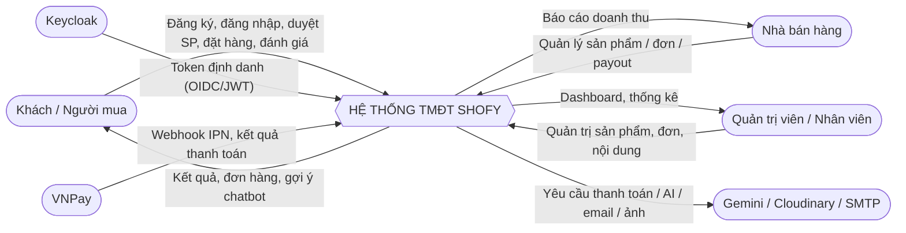

> **Hình 2.3 DFD mức 1.**

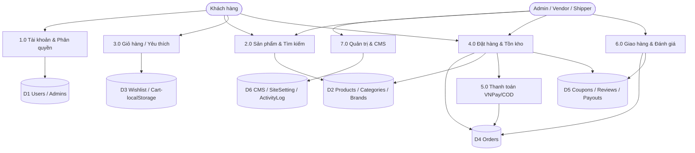

## 2.2 Kiến trúc & quản trị hệ thống

Hệ thống gồm ba ứng dụng độc lập giao tiếp qua REST API và Socket.io, cùng các dịch vụ hạ tầng (MongoDB, Keycloak + PostgreSQL).

> **Hình 2.4 Kiến trúc tổng thể hệ thống.**

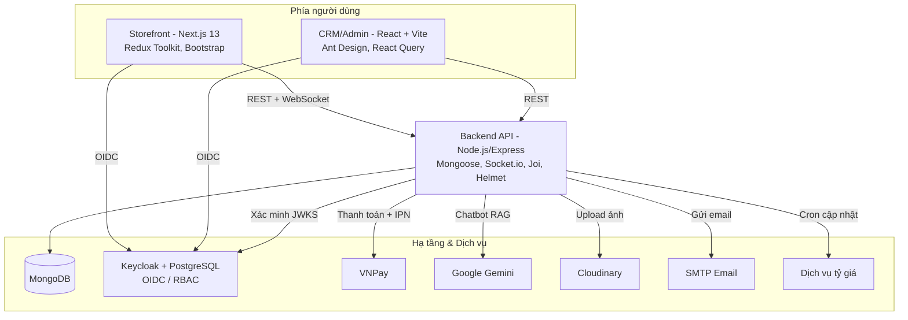

**Cơ chế quản trị & phân tuyến theo vai trò.** Khi đăng nhập, người dùng được Keycloak phát hành JWT (RS256). Backend trích `kid` từ token, lấy khóa công khai qua **JWKS** (có cache + rate-limit), xác minh chữ ký và issuer, rồi đồng bộ tài khoản về MongoDB (tự tạo nếu lần đầu). Vai trò trong token được chuẩn hóa và sắp theo thứ tự ưu tiên: `admin > manager > staff > shipper > vendor > user`. Tùy vai trò chính, FE/CRM điều hướng người dùng vào luồng phù hợp (mua hàng, gian hàng vendor, hay trang quản trị).

## 2.3 Cơ sở dữ liệu

Hệ thống dùng **MongoDB** truy cập qua **Mongoose (ODM)**. Toàn bộ schema có `timestamps` (`createdAt`, `updatedAt`) và đặt chỉ mục cho các truy vấn nóng. Có **20 collection**; nhóm cốt lõi gồm: `User`, `Product`, `Category`, `Brand`, `Order`, `Review`, `Coupon`, `Wishlist`. Nhóm nâng cao gồm: `ChatSession`, `ChatFeedback`, `BlogPost`, `Page`, `Menu`, `Banner`, `EmailTemplate`, `SiteSetting`, `ActivityLog`, `ExchangeRate`, `Payout`, `Admin`.

Một số quyết định thiết kế quan trọng:

- **Snapshot đơn hàng:** `Order.items[]` lưu lại tên, ảnh, giá, biến thể của sản phẩm tại thời điểm mua → lịch sử đơn không bị sai lệch khi sản phẩm bị sửa/ngừng bán.
- **Số hóa đơn tự tăng:** `Order.invoice` tăng dần từ 1000 qua hook `pre('save')`.
- **Xóa mềm & trạng thái:** dùng trường `status`/enum thay vì xóa cứng (`Product.status = discontinued`, `User.status = blocked`, `Review.status = pending/approved/rejected`…).
- **Đa nhà bán hàng:** `Product.vendor`, `Order.items[].vendor`, `Order.parentOrder/splitOrders`, và `Payout` cho đối soát hoa hồng.
- **Hỗ trợ chatbot RAG:** `Product.embedding`, `BlogPost.embedding` lưu vector nhúng (Gemini) để tìm kiếm tương tự (mặc định `select:false`).

## 2.4 Ngôn ngữ lập trình và công nghệ

**Bảng 2.1 Công nghệ sử dụng trong dự án (Tech stack)**

| Tầng | Công nghệ | Vai trò |
|---|---|---|
| Frontend (storefront) | Next.js 13 (Pages Router), React 18, Redux Toolkit + RTK Query, Bootstrap 5/SCSS, React Hook Form + Yup, i18next, Socket.io-client, keycloak-js | Xây dựng SPA/SSR, phân tuyến, quản lý trạng thái, gọi API, đa ngôn ngữ |
| CRM / Admin | Vite + React 19 + TypeScript, Ant Design 6, React Query (TanStack) + Zustand, React Router 7, Recharts, Axios | Trang quản trị, dashboard biểu đồ, CRUD nghiệp vụ |
| Backend | Node.js (≥16), Express 4, Mongoose 7 | REST API, xử lý nghiệp vụ, kết nối MongoDB |
| Cơ sở dữ liệu | MongoDB 7 | Lưu trữ dữ liệu dạng tài liệu |
| Định danh & phân quyền | Keycloak (OIDC), jwks-rsa, jsonwebtoken (RS256) | SSO, phát hành/xác minh token, RBAC |
| Bảo mật | Helmet, express-mongo-sanitize, express-rate-limit, Joi | Cấu hình HTTP an toàn, chống injection, giới hạn tần suất, kiểm tra đầu vào |
| Thanh toán | VNPay (HMAC-SHA512), COD, chuyển khoản | Tạo link thanh toán, nhận & đối soát webhook IPN |
| Thời gian thực | Socket.io 4 | Cập nhật trạng thái đơn & truyền luồng chatbot |
| AI / Chatbot | Google Gemini (`@google/generative-ai`) | Tư vấn sản phẩm theo dữ liệu cửa hàng (RAG, tool-calling) |
| Lưu trữ ảnh & Email | Cloudinary, Nodemailer (SMTP) | Upload ảnh, gửi email giao dịch |
| Tác vụ nền | node-cron | Cập nhật tỷ giá, hàng đợi nhúng vector |
| Tài liệu & Kiểm thử | Swagger (OpenAPI), Jest + Supertest | Tài liệu API, kiểm thử backend |
| Hạ tầng | Docker Compose, Nginx, PostgreSQL (cho Keycloak) | Đóng gói, triển khai, reverse proxy |

<div style="page-break-after: always;"></div>

# CHƯƠNG 3. PHÂN TÍCH THIẾT KẾ HỆ THỐNG

## 3.1 Phân tích thiết kế CSDL

### 3.1.1 Biểu đồ thực thể – quan hệ (ERD)

ERD dưới đây mô tả các thực thể cốt lõi và quan hệ giữa chúng. Để dễ đọc, một số thực thể CMS/nâng cao (`BlogPost`, `Page`, `Menu`, `Banner`, `EmailTemplate`, `SiteSetting`, `ActivityLog`, `ExchangeRate`, `ChatSession`, `ChatFeedback`) được mô tả riêng ở Bảng 3.1.

> **Hình 3.1 Biểu đồ thực thể – quan hệ (ERD) – các thực thể cốt lõi.**

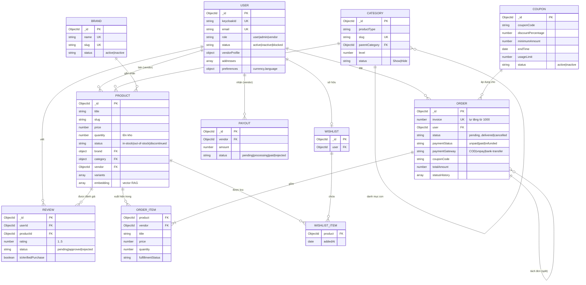

### 3.1.2 Đặc tả các thực thể

**Bảng 3.1 Đặc tả các thực thể (collection) chính**

| Collection | Khóa/Index đáng chú ý | Mục đích thiết kế |
|---|---|---|
| **User** | `email` unique; `keycloakId` unique-sparse; index `(role,status)` | Tài khoản người mua/vendor/admin; hồ sơ giao hàng; cấu hình ngôn ngữ–tiền tệ; hồ sơ gian hàng (vendorProfile) |
| **Product** | text-index `(title,description,tags)`; index `price`, `sellCount`, `vendor` | Nguồn dữ liệu sản phẩm & tồn kho; hỗ trợ biến thể, SEO, vector RAG; xóa mềm qua `status` |
| **Category** | `slug` unique-sparse; `parentCategory`, `level` | Danh mục phân cấp (tự tham chiếu) kèm breadcrumb `ancestors` |
| **Brand** | `name` unique; `slug` unique-sparse | Thương hiệu, gom nhóm sản phẩm |
| **Order** | `invoice` unique (auto từ 1000); index `paymentStatus`, `createdAt`, `items.vendor` | Đơn hàng, lịch sử trạng thái, snapshot sản phẩm, hỗ trợ tách đơn đa vendor |
| **Review** | index `status`, `rating`, `isVerifiedPurchase` | Đánh giá có kiểm duyệt; chỉ người đã mua mới được đánh giá |
| **Coupon** | index `usedBy.userId`, `applicableProducts/Categories` | Mã giảm giá theo %/cố định; giới hạn thời gian, lượt dùng, phạm vi |
| **Wishlist** | `user` unique | Mỗi người dùng một danh sách yêu thích |
| **Payout** | index `vendor`, `status`, `requestedAt` | Đối soát hoa hồng cho nhà bán hàng |
| **ChatSession / ChatFeedback** | `(userId,updatedAt)`; TTL 30 ngày | Lịch sử hội thoại chatbot & phản hồi (like/dislike) |
| **BlogPost / Page / Menu / Banner** | `slug` unique; index `status`, `location` | Hệ quản trị nội dung (CMS) song ngữ |
| **SiteSetting** | document đơn (singleton) | Cấu hình toàn site: liên hệ, vận chuyển, thanh toán, thuế, chatbot |
| **ActivityLog** | TTL 90 ngày; index `actor.id`, `resource.type` | Nhật ký hoạt động cho kiểm toán |
| **ExchangeRate** | – | Tỷ giá quy đổi đa tiền tệ (cron cập nhật) |
| **Admin** | `email` unique; `keycloakId` unique-sparse | Tài khoản nhân sự nội bộ (vai trò Admin/Manager/CEO…) |

**Bảng 3.2 Trạng thái đơn hàng và trạng thái thanh toán**

| Nhóm | Giá trị | Ý nghĩa |
|---|---|---|
| `Order.status` | pending → confirmed → processing → shipped → delivered; cancelled | Vòng đời xử lý & giao hàng |
| `Order.paymentStatus` | unpaid, paid, refunded, partially-refunded | Trạng thái thanh toán |
| `Order.paymentGateway` | COD, bank-transfer, vnpay, momo, stripe | Phương thức/cổng thanh toán (vnpay là cổng chính đã triển khai) |
| `items[].fulfillmentStatus` | pending, packed, shipped, delivered | Trạng thái giao theo từng nhà bán hàng |

## 3.2 Phân tích thiết kế chức năng

### 3.2.1 Luồng đăng ký & đăng nhập

Hệ thống dùng **Keycloak** làm máy chủ định danh. Người dùng đăng ký/đăng nhập trên Keycloak (hoặc qua form được ủy quyền), nhận JWT, sau đó backend xác minh và đồng bộ tài khoản về MongoDB.

> **Hình 3.2 Biểu đồ tuần tự chức năng đăng ký tài khoản.**

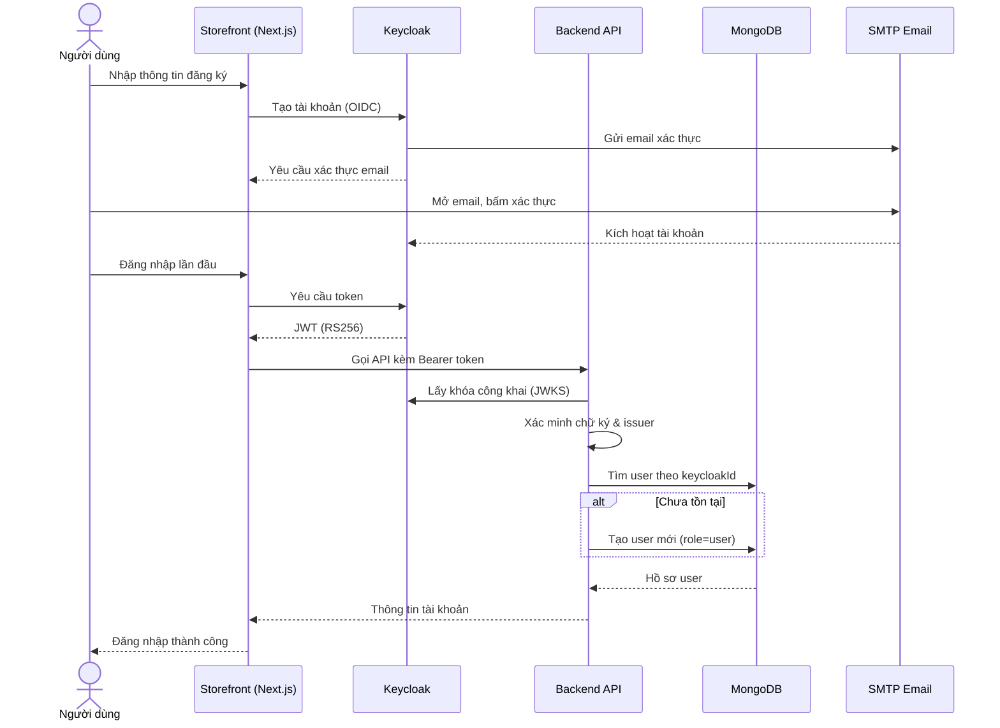

> **Hình 3.3 Biểu đồ tuần tự chức năng đăng nhập (Keycloak SSO).**

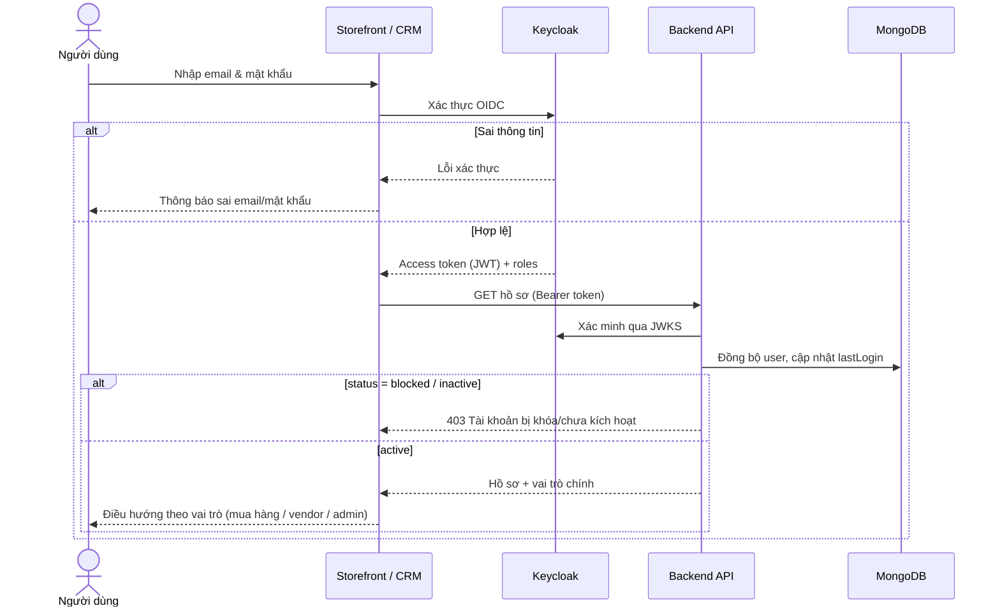

### 3.2.2 Luồng giỏ hàng, yêu thích

Giỏ hàng, danh sách yêu thích, so sánh và thông tin mã giảm giá được lưu **localStorage** ở phía frontend (quản lý bằng Redux Toolkit). Khi đăng nhập, danh sách yêu thích được đồng bộ về máy chủ (`Wishlist`); giỏ hàng được chốt lại tại bước đặt hàng.

> **Hình 3.4 Biểu đồ tuần tự thêm sản phẩm vào giỏ hàng.**

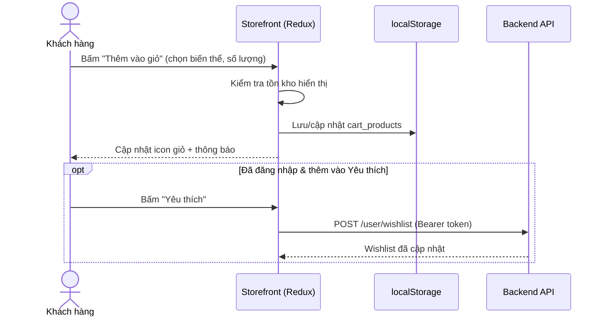

### 3.2.3 Luồng đặt hàng, thanh toán và giao hàng

Khi đặt hàng, backend kiểm tra dữ liệu (Joi), tính tổng (tạm tính + phí ship − giảm giá), sinh số hóa đơn, kiểm tra/trừ tồn kho và tạo `Order`. Với **COD**, đơn ở trạng thái `pending`, chờ admin xác nhận. Với **VNPay**, backend tạo link thanh toán; sau khi khách thanh toán, VNPay gọi **webhook IPN**, backend xác thực chữ ký HMAC-SHA512, đối chiếu số tiền và cập nhật `paymentStatus=paid`, `status=confirmed`.

> **Hình 3.5 Biểu đồ tuần tự đặt hàng (COD).**

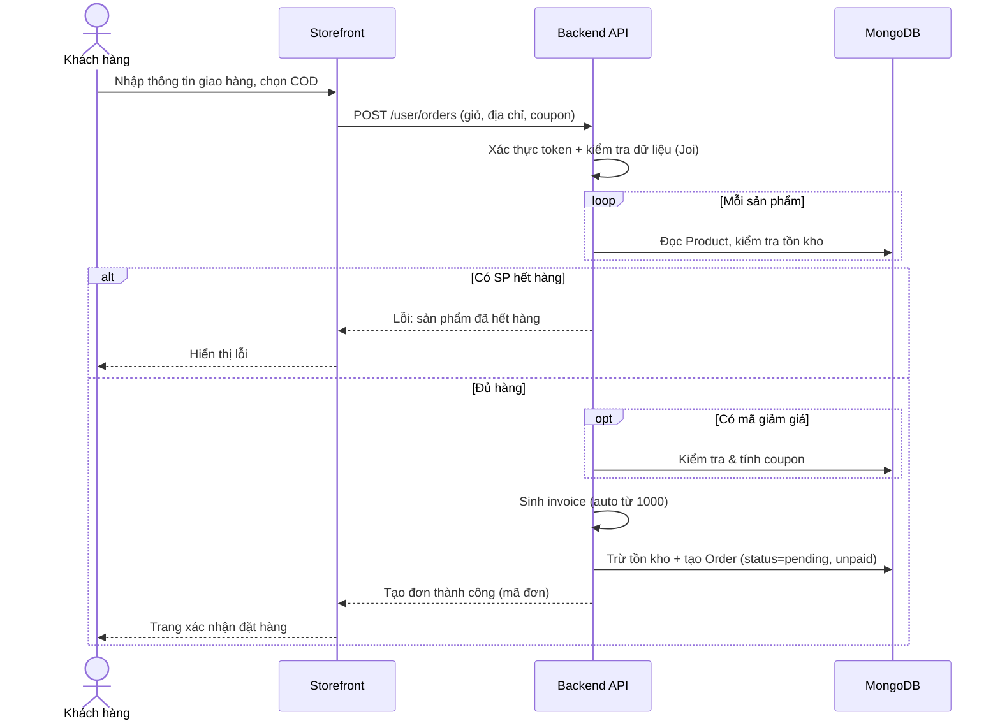

> **Hình 3.6 Biểu đồ tuần tự thanh toán trực tuyến qua VNPay.**

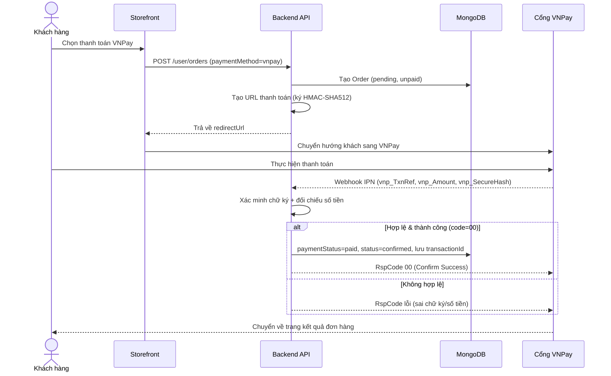

### 3.2.4 Luồng đánh giá sản phẩm

Hệ thống chỉ cho phép đánh giá khi người dùng đã mua sản phẩm (kiểm tra qua tổng hợp dữ liệu `Order`). Mỗi cặp (người dùng, sản phẩm) chỉ đánh giá một lần; đánh giá được kiểm duyệt (`pending → approved/rejected`) trước khi hiển thị công khai.

> **Hình 3.7 Biểu đồ tuần tự đánh giá sản phẩm.**

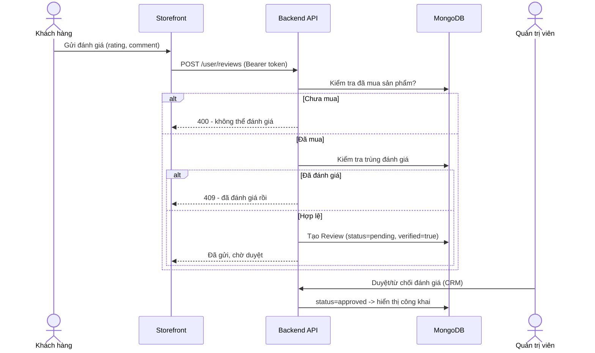

### 3.2.5 Luồng quản lý sản phẩm và tìm kiếm

Các endpoint công khai (`/store/products...`) trả về danh sách, chi tiết, tìm kiếm toàn văn, gợi ý, sản phẩm liên quan, nổi bật, đang giảm giá, bán chạy. Các thao tác ghi (tạo/sửa/xóa) yêu cầu vai trò `admin`/`manager`; xóa là **xóa mềm** (đặt `status`).

> **Hình 3.8 Biểu đồ tuần tự tìm kiếm & lọc sản phẩm.**

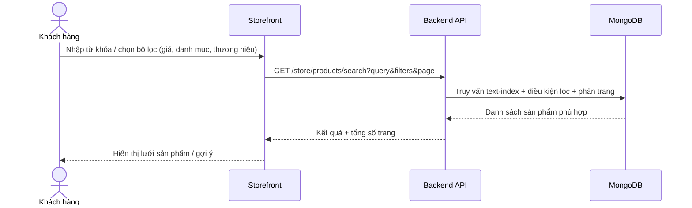

> **Hình 3.9 Biểu đồ tuần tự quản trị viên quản lý sản phẩm (thêm/sửa/xóa).**

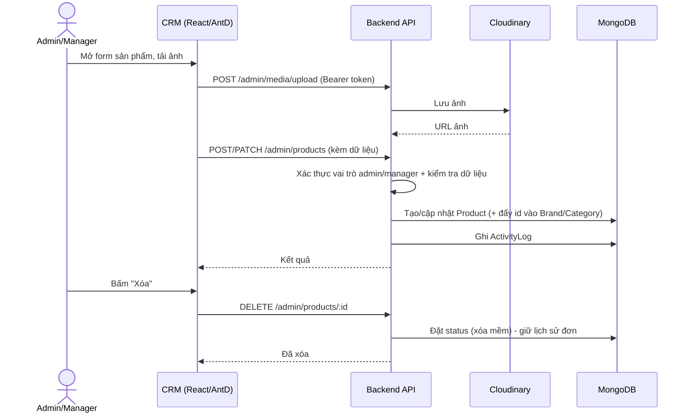

### 3.2.6 Luồng quản lý đơn hàng

Quản trị viên xem danh sách đơn (lọc theo trạng thái/thanh toán/thời gian), xem chi tiết, cập nhật trạng thái (kèm `statusHistory`), gán shipper và hủy đơn. Shipper chỉ truy cập được nhóm endpoint đơn hàng được phép.

> **Hình 3.10 Biểu đồ tuần tự quản trị viên xử lý đơn hàng.**

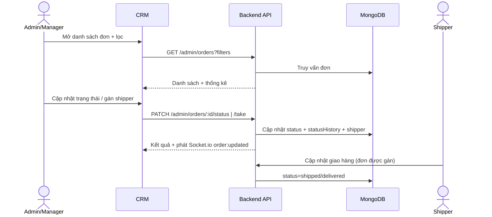

### 3.2.7 Luồng kiểm tra & áp dụng mã giảm giá

> **Hình 3.11 Biểu đồ tuần tự kiểm tra & áp dụng mã giảm giá.**

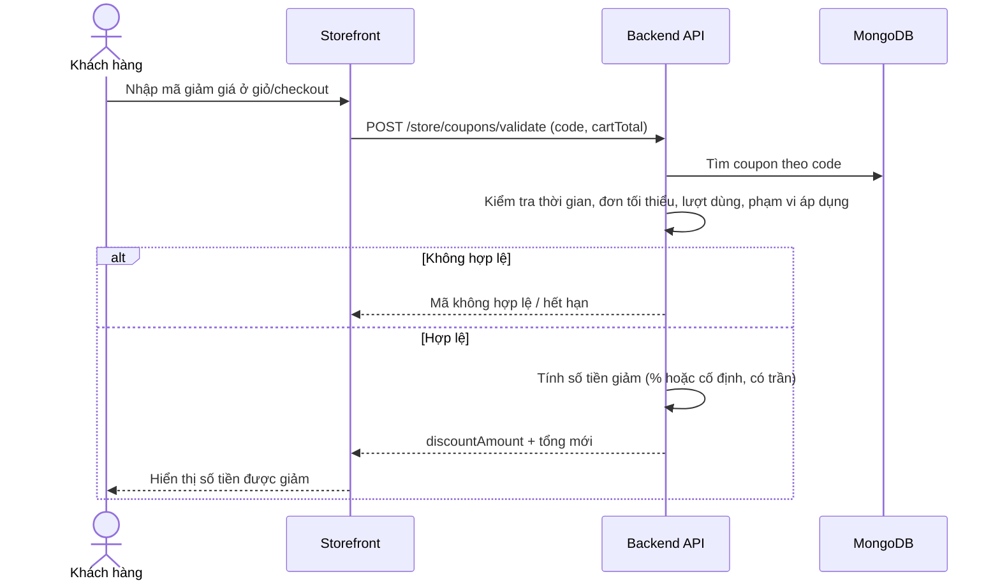

### 3.2.8 Luồng chatbot AI (tính năng nâng cao)

Chatbot nhận tin nhắn + ngữ cảnh (giỏ hàng, sản phẩm vừa xem), nhúng câu hỏi và **truy hồi (RAG)** các sản phẩm/bài viết liên quan trong MongoDB, sau đó gọi **Gemini** với các *tool* (tìm sản phẩm, tra đơn, kiểm tra coupon…). Phản hồi được truyền theo luồng qua **Socket.io** và lưu vào `ChatSession`.

> **Hình 3.12 Biểu đồ tuần tự chatbot AI (RAG).**

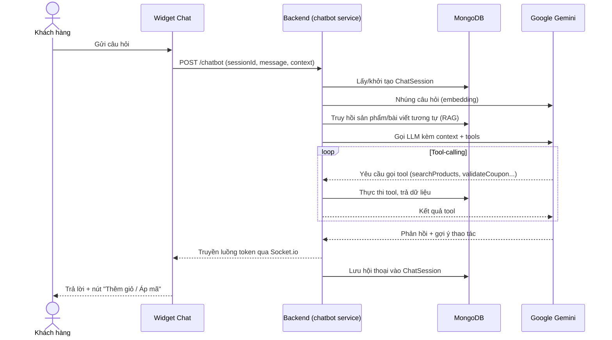

### 3.2.9 Luồng đa nhà bán hàng (tính năng nâng cao)

> **Hình 3.13 Biểu đồ tuần tự quy trình đa nhà bán hàng (vendor).**

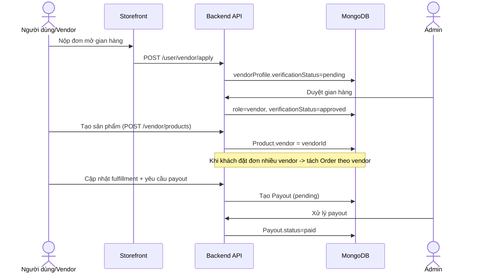

### 3.2.10 Thiết kế phân quyền

Backend phân các nhóm endpoint theo miền nghiệp vụ và bảo vệ bằng middleware `verifyToken` + `authorization(roles...)`.

**Bảng 3.3 Thiết kế phân quyền theo vai trò**

| Nhóm endpoint | Tiền tố | Quyền yêu cầu | Phạm vi |
|---|---|---|---|
| Public / Store | `/api/v1/store`, `/api/v1/auth` | Không cần đăng nhập | Sản phẩm, danh mục, thương hiệu, coupon (validate), banner, blog, cấu hình site, tra cứu đơn, webhook VNPay |
| Người mua | `/api/v1/user` | JWT (role bất kỳ) | Hồ sơ, sổ địa chỉ, giỏ/đơn của mình, đặt hàng, đánh giá, yêu thích, nộp đơn vendor |
| Nhà bán hàng | `/api/v1/vendor` | JWT + role `vendor` | Hồ sơ gian hàng, sản phẩm/đơn của mình, analytics, payout |
| Quản trị | `/api/v1/admin` | JWT + role `admin`/`manager`/`staff`/`shipper` | CRUD sản phẩm/danh mục/đơn/người dùng/coupon, CMS, analytics, nhật ký; thao tác nhạy cảm yêu cầu `admin`/`manager`; shipper chỉ truy cập nhóm đơn hàng |

<div style="page-break-after: always;"></div>

# CHƯƠNG 4. CÀI ĐẶT VÀ HƯỚNG DẪN SỬ DỤNG

## 4.1 Cài đặt CSDL

Cài **MongoDB** (cục bộ hoặc MongoDB Atlas). Cấu hình `MONGO_URI` trong `backend/.env`, ví dụ:

```
MONGO_URI=mongodb://127.0.0.1:27017/shofy
```

Sau khi MongoDB chạy, vào thư mục `backend`, cài đặt phụ thuộc rồi nạp dữ liệu mẫu:

```bash
cd backend
npm install
npm run seed       # ⚠️ Xóa sạch toàn bộ collection rồi nạp dữ liệu mẫu — KHÔNG chạy trên production
```

Dữ liệu mẫu gồm: thương hiệu, danh mục, sản phẩm, mã giảm giá, đơn hàng, người dùng, đánh giá và tài khoản quản trị (mật khẩu admin mặc định: `123456`). CRM có script seed riêng (`cd crm && npm run seed`) với tài khoản mặc định `admin@shofy.com / password123`.

## 4.2 Cài đặt và giả lập môi trường server

Có thể chạy bằng Docker Compose (khuyến nghị) hoặc chạy thủ công từng dịch vụ.

**Bảng 4.1 Thành phần cài đặt hệ thống**

| Thành phần | Lệnh chạy (dev) | Địa chỉ mặc định |
|---|---|---|
| Backend API | `cd backend && npm install && npm run start-dev` | http://localhost:7001 |
| Storefront (Next.js) | `cd frontend && npm install && npm run dev` | http://localhost:3000 (hoặc 3001) |
| CRM/Admin | `cd crm && npm install && npm run dev` | http://localhost:8080 |
| Keycloak | (Docker) | http://localhost:8180 |
| MongoDB | (Docker `mongo:7`) | mongodb://localhost:27017 |
| Health check | `GET /health` | Trả về `ok` + uptime |
| Tài liệu API | Swagger UI | `/api-docs` |

Chạy nhanh ở thư mục gốc:

```bash
npm run install:all     # cài đặt cho cả backend + frontend
npm run dev             # chạy đồng thời backend + frontend
docker compose up -d    # hoặc dựng toàn bộ ngăn xếp (mongo, postgres, keycloak, backend, crm, frontend)
```

**Bảng 4.2 Biến môi trường chính**

| Ứng dụng | Biến môi trường |
|---|---|
| Backend (`.env`) | `MONGO_URI`, `PORT`, `NODE_ENV`, `TOKEN_SECRET`, `JWT_SECRET_FOR_VERIFY`, `EMAIL_USER`, `EMAIL_PASS`, `HOST`, `EMAIL_PORT`, `CLOUDINARY_NAME`, `CLOUDINARY_API_KEY`, `CLOUDINARY_API_SECRET`, `STORE_URL`, `ADMIN_URL`, các biến `KEYCLOAK_*`, `VNPAY_*`, `GEMINI_API_KEY` |
| Frontend (`.env.local`) | `NEXT_PUBLIC_API_BASE_URL`, cấu hình Keycloak, khóa ISR |
| CRM (`.env`) | `MONGO_URI` (mặc định `…/shofy_ecommerce`), `CRM_PORT` (mặc định 8080), `FRONTEND_MONGO_URI` |

## 4.3 Giao diện người dùng (User)

> _Chụp màn hình các trang dưới đây từ storefront đang chạy và chèn vào báo cáo (đặt số hình theo thứ tự, ví dụ Hình 4.1, 4.2…)._

- **[HÌNH 4.x — Trang chủ]** Hero/banner, sản phẩm nổi bật, danh mục, blog.
- **[HÌNH 4.x — Trang sản phẩm `/shop`]** Lưới sản phẩm + bộ lọc (giá, danh mục, thương hiệu, màu, kích cỡ), sắp xếp, phân trang.
- **[HÌNH 4.x — Chi tiết sản phẩm `/product-details/[id]`]** Ảnh/biến thể, giá, đánh giá, sản phẩm liên quan.
- **[HÌNH 4.x — Tìm kiếm `/search`]** Gợi ý & kết quả tìm kiếm.
- **[HÌNH 4.x — Đăng ký `/register` & Đăng nhập `/login`]**
- **[HÌNH 4.x — Giỏ hàng `/cart`]** Danh sách sản phẩm, số lượng, ô mã giảm giá.
- **[HÌNH 4.x — Thanh toán `/checkout`]** Địa chỉ giao hàng, phương thức thanh toán (COD/Chuyển khoản/VNPay), tóm tắt đơn.
- **[HÌNH 4.x — Xác nhận đặt hàng thành công]**
- **[HÌNH 4.x — Đơn hàng của tôi & Chi tiết đơn `/order/[id]`]**
- **[HÌNH 4.x — Tra cứu đơn công khai `/track-order`]**
- **[HÌNH 4.x — Yêu thích `/wishlist`, So sánh `/compare`, Mã giảm giá `/coupon`]**
- **[HÌNH 4.x — Hồ sơ `/profile`]** Dashboard, sổ địa chỉ, lịch sử đơn, đăng ký vendor.
- **[HÌNH 4.x — Blog `/blog` & chi tiết, Liên hệ `/contact`]**
- **[HÌNH 4.x — Trợ lý ảo (Chatbot AI)]** Cửa sổ chat + nút gợi ý thao tác.
- **[HÌNH 4.x — Gian hàng nhà bán hàng `/vendor/[slug]`]**
- **[HÌNH 4.x — Giao diện mobile]** Trang chủ, sản phẩm, giỏ hàng, checkout, chatbot trên thiết bị di động.

## 4.4 Giao diện quản trị (Admin/CRM)

> _Chụp màn hình các trang quản trị dưới đây và chèn vào báo cáo._

- **[HÌNH 4.x — Đăng nhập quản trị]** (qua Keycloak)
- **[HÌNH 4.x — Dashboard]** KPI doanh thu, đơn, khách, sản phẩm; biểu đồ doanh thu/đơn theo trạng thái/top sản phẩm; đơn gần đây.
- **[HÌNH 4.x — Quản lý sản phẩm]** Bảng danh sách + bộ lọc; modal thêm/sửa (thông tin, giá, ảnh/biến thể, SEO).
- **[HÌNH 4.x — Kiểm toán tiền tệ sản phẩm]**
- **[HÌNH 4.x — Quản lý danh mục]** Cây danh mục + CRUD.
- **[HÌNH 4.x — Quản lý đơn hàng]** Bảng đơn + bộ lọc; drawer chi tiết (khách, sản phẩm theo vendor, vận chuyển, dòng thời gian trạng thái).
- **[HÌNH 4.x — Quản lý khách hàng]** Bảng + drawer chi tiết; khóa/mở khóa, phân quyền.
- **[HÌNH 4.x — Quản lý nhà bán hàng]** Duyệt/từ chối/tạm ngưng, hoa hồng, payout.
- **[HÌNH 4.x — Kiểm duyệt đánh giá]**
- **[HÌNH 4.x — Quản lý mã giảm giá]**
- **[HÌNH 4.x — CMS: Banner & Blog]**
- **[HÌNH 4.x — Cấu hình: Chung / Thanh toán / Vận chuyển / Thuế]**
- **[HÌNH 4.x — Phân tích chatbot AI]**
- **[HÌNH 4.x — Nhật ký hoạt động (Activity Log)]**
- **[HÌNH 4.x — Giao diện CRM trên mobile]** Dashboard, sản phẩm, đơn hàng.

<div style="page-break-after: always;"></div>

# CHƯƠNG 5. KẾT LUẬN & HƯỚNG PHÁT TRIỂN

## 5.1 Kết luận

Dự án **Shofy** đã xây dựng được một hệ thống thương mại điện tử tương đối hoàn chỉnh, tách bạch ba ứng dụng: cửa hàng trực tuyến (Next.js), máy chủ nghiệp vụ (Express + MongoDB) và trang quản trị (React + Ant Design). Hệ thống đáp ứng đầy đủ các nghiệp vụ TMĐT cốt lõi: quản lý tài khoản, sản phẩm, danh mục, thương hiệu, giỏ hàng, đặt hàng, thanh toán, đơn hàng, đánh giá, mã giảm giá và quản trị – thống kê.

Bên cạnh phần cốt lõi, nhóm đã tích hợp nhiều **tính năng nâng cao** mang tính thực tế cao: đăng nhập một lần và phân quyền tập trung qua **Keycloak**; thanh toán trực tuyến qua **VNPay** với xác thực webhook; **chatbot AI** dùng Gemini kết hợp RAG; **mô hình đa nhà bán hàng** với đối soát hoa hồng; **CMS** quản trị nội dung; hỗ trợ **đa ngôn ngữ và đa tiền tệ**; cùng các yếu tố phi chức năng như bảo mật (Helmet, rate limit, chống injection), tài liệu API (Swagger), cập nhật thời gian thực (Socket.io), nhật ký hoạt động và đóng gói bằng Docker.

Trong quá trình thực hiện, nhóm đã vận dụng kiến thức về phân tích – thiết kế hệ thống (BFD, DFD, ERD, biểu đồ tuần tự), thiết kế CSDL hướng tài liệu, phát triển ứng dụng web theo mô hình client–server, xây dựng RESTful API, xác thực – phân quyền và tích hợp dịch vụ bên thứ ba.

Hệ thống vẫn còn một số hạn chế: việc sinh số hóa đơn dựa trên hook `pre-save` có thể gặp rủi ro cạnh tranh khi tải cao (nên dùng counter nguyên tử); một số cổng thanh toán (Stripe/MoMo) mới ở mức khung; phần kiểm thử tự động còn hạn chế và hệ thống chưa được đánh giá ở quy mô người dùng lớn.

## 5.2 Hướng phát triển

- Thay cơ chế sinh số hóa đơn bằng counter nguyên tử (`findOneAndUpdate` + `$inc`) và bọc nghiệp vụ đặt hàng trong transaction để tránh oversell.
- Hoàn thiện thêm cổng thanh toán (Stripe, MoMo) và tích hợp đơn vị vận chuyển (GHN, GHTK, ViettelPost) với cập nhật trạng thái tự động.
- Nâng cấp chatbot: tìm kiếm theo intent, cá nhân hóa gợi ý theo lịch sử, mở rộng bộ công cụ (tool) và đánh giá chất lượng phản hồi.
- Phát triển hệ thống gợi ý sản phẩm cá nhân hóa dựa trên hành vi và lịch sử mua hàng.
- Bổ sung thông báo thời gian thực (email/WebSocket) cho thay đổi trạng thái đơn; cơ chế tích điểm khách hàng thân thiết.
- Tối ưu hiệu năng bằng bộ nhớ đệm (Redis), phân trang/đánh chỉ mục nâng cao và tìm kiếm vector (Atlas Vector Search).
- Viết kiểm thử tự động cho các luồng quan trọng: xác thực, đặt hàng, coupon, webhook VNPay, vendor/payout và đánh giá.

<div style="page-break-after: always;"></div>

# TÀI LIỆU THAM KHẢO

[1] Meta (Facebook) Inc., "React Documentation," https://react.dev/.
[2] Vercel, "Next.js Documentation," https://nextjs.org/docs.
[3] OpenJS Foundation, "Node.js Documentation," https://nodejs.org/docs/latest/api/.
[4] OpenJS Foundation, "Express.js Documentation," https://expressjs.com/.
[5] MongoDB Inc., "MongoDB Documentation," https://www.mongodb.com/docs/.
[6] MongoDB Inc., "Mongoose Documentation," https://mongoosejs.com/docs/.
[7] Red Hat, "Keycloak Documentation," https://www.keycloak.org/documentation.
[8] VNPay, "Tài liệu tích hợp cổng thanh toán VNPay," https://sandbox.vnpayment.vn/apis/.
[9] Google, "Gemini API Documentation," https://ai.google.dev/.
[10] Redux Toolkit, "Redux Toolkit & RTK Query," https://redux-toolkit.js.org/.
[11] Ant Design, "Ant Design Components," https://ant.design/.
[12] Socket.IO, "Socket.IO Documentation," https://socket.io/docs/.
[13] Cloudinary, "Cloudinary Documentation," https://cloudinary.com/documentation.
[14] Auth0, "JSON Web Tokens Introduction," https://jwt.io/introduction.

<div style="page-break-after: always;"></div>

# PHÂN CÔNG CÔNG VIỆC

| STT | Mã SV | Họ và tên | Công việc | Xác nhận |
|---|---|---|---|---|
| 1 | [Mã SV 1] | [Họ và tên 1] | [Ví dụ: Xây dựng backend & CSDL, tích hợp Keycloak/VNPay/chatbot, trang quản trị CRM] | X |
| 2 | [Mã SV 2] | [Họ và tên 2] | [Ví dụ: Xây dựng storefront (frontend), UI/UX, phân tích yêu cầu, vẽ BFD/DFD/ERD, viết báo cáo] | X |

<!-- Hết báo cáo -->
